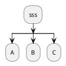
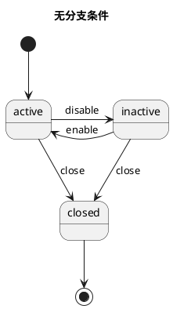
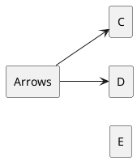
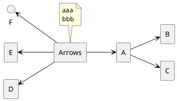
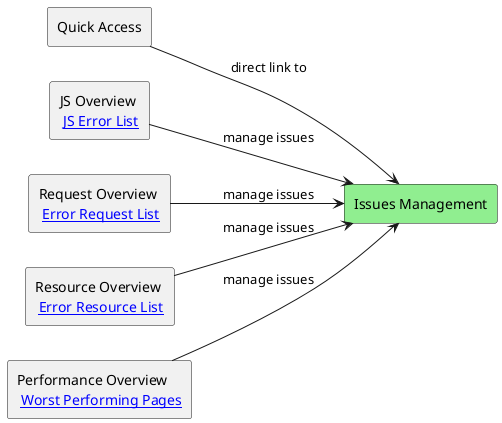
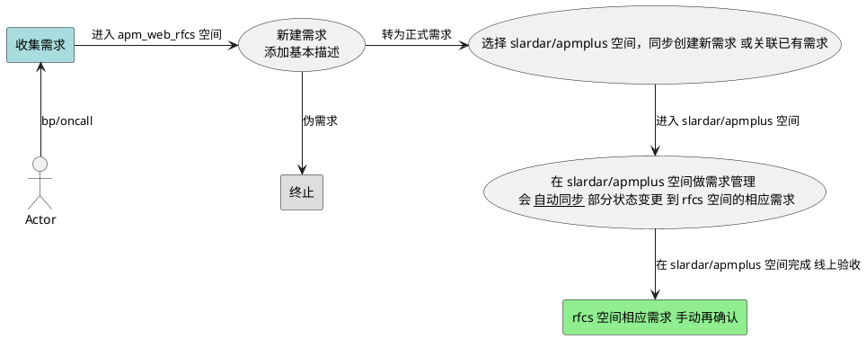
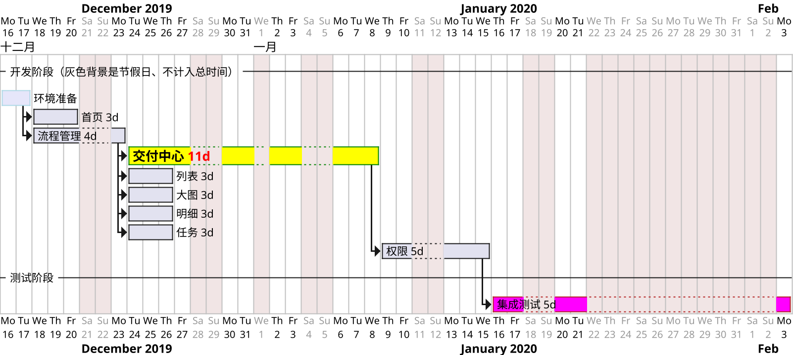

**自动化 work and life !!!**

markdown 表情 :+1: :smile: :smiley: :laughing:
- 可直接复制 https://emoji8.com/zh-hans/
- [emoji-cheat-sheet](https://www.webpagefx.com/tools/emoji-cheat-sheet/)
- [Emoji Unicode Tables](http://www.unicode.org/emoji/charts/full-emoji-list.html)
- [asciiart](https://asciiart.website) [figlet](http://www.figlet.org/examples.html) [text-to-ascii-art](https://www.asciiart.eu/text-to-ascii-art)
[学英语](https://earthworm.cuixueshe.com/)


# bash

> 2021 ~ 2024

- Unix 遵循的原则是 KISS (Keep it simple, stupid) do one thing and do it well。
- Linux 严格区分大小写。所有内容以文件形式保存，包括硬件。如：键盘 /dev/stdin 显示器 /dev/stdout
- Linux 不靠扩展名区分文件类型，靠权限区分。（.gz .tgz .sh等文件扩展名只是为了方便管理员查看）
- shell 是一个命令行解释器。shell 是壳，kernel 是内核。shell 把用户敲进去的命令、翻译为 linux 内核能识别的语言。
- sh: Bourne Shell 的缩写，可以说是目前所有 Shell 的祖先。 bash : Bourne Again Shell 的缩写，是 sh 的一个进阶版本。[Zsh 和 Bash 的不同](https://xshell.net/shell/bash_zsh.html)

bash 处理复杂数据
- 在 Bash 3 中，不能直接在函数内部引用或修改外部数组。

## 片段

想在 mac 上双击可执行(调用系统terminal)，需要去掉文件后缀名
终端调用 bash 脚本里的某个函数 `./my_script.sh my_function`

test.sh

```sh
#!/bin/bash
echo "Start session $1 $2"
/bin/zsh
```

环境 & 基础
```sh
# 不同平台安装包
brew install jq  # macOS
sudo apt-get install jq  # Ubuntu/Debian
sudo yum install jq  # CentOS/Fedora

# 一个脚本调用另一个脚本里的函数
bash ./scripts/build-utils.sh # 这么做无效
[ -s "./scripts/build-utils.sh" ] && \. "./scripts/build-utils.sh"

local str="long...\
实际不换行"
local str1="第一行
第二行"
local num=1
local num="$num"2  # 或 num=${num}2
local new_msg="Merged $(($num-1)) $((${num}-1)) commits"
echo $str $str1 $num $new_msg

local blank_path="/Applications/Google\" \"Chrome.app/Contents/MacOS/Google\" \"Chrome"
local blank_path=/Applications/Google\ Chrome.app/Contents/MacOS/Google\ Chrome
local blank_path="/Applications/Google Chrome.app/Contents/MacOS/Google Chrome"
local escaped_blank_path=${blank_path////\\/}
echo $escaped_blank_path
echo * xxx # 其中的 * 是特殊字符、需要处理。
```

unix diff 不同目录内容

```sh
#!/bin/bash
# 临时存储排除的路径
excludes=()
# 读取.gitignore 文件，提取路径模式并添加到 excludes 数组
while IFS= read -r line || [[ -n "$line" ]]; do
    excludes+=("--exclude=$line")
done <.gitignore
# 获取要比较的两个目录
dir1=$1
dir2=$2
# 执行 diff 命令，应用排除参数
diff -r "${excludes[@]}" "$dir1" "$dir2"
```

函数的返回值和错误处理

```sh
#!/bin/bash
first_function() {
  return "$1"  # 返回传入的参数作为状态码
}
second_function() {
  first_function "$1" || return 1  # 如果 first_function 失败，立即返回 1
  echo "first_function succeeded, continuing..."
  return $?  # 直接返回 first_function 的状态码
}
second_function 0  # 传入 0
second_function 1  # 传入 1
echo "Return value of second_function: $?"

my_function() {
  return 1  # 模拟失败
}
my_function
if [ $? -ne 0 ]; then
  echo "Error: Function failed!"
  exit 1  # 或者根据需要退出脚本
fi
# command && success_action: 当 command 成功时执行 success_action
# command || failure_action: 当 command 失败时执行 failure_action
my_function || echo "Function failed!"
get_message() {
  echo "Hello, World!"
}
check_status() {
  if [ "$1" -eq 1 ]; then
    return 0  # 成功
  else
    return 1  # 失败
  fi
}
# 错误处理
trap 'echo "Error occurred on line $LINENO"; exit 1' ERR
message=$(get_message)
echo "Message: $message"
check_status 0 && echo "Status check passed" || echo "Status check failed"
echo $? # 获取 函数 return 返回值
# 使用 set -e 会使脚本在任何命令返回非零状态时立即退出
set -e
check_status 0
echo "This will run because check_status passed."
check_status 2  # 这会导致脚本退出，因为 set -e 会触发
echo "This won't be displayed."
```


获取 git log 的 第一条 最后一条 总数 等信息，放到 bash 数组里

```sh
branch_name="$1"
if [ -z "$1" ]; then
  # 设为 current_branch
  branch_name=$(git symbolic-ref --short HEAD)
fi
echo $branch_name

all_commits_num=$(git rev-list --count HEAD)
all_commits=$(git log $branch_name --format=%H:%an:%s)
all_commits=$(git log $branch_name --pretty=%H)
latest_commit=$(git log $branch_name -1 --pretty=%H)
skip_latest_commit=$(git log --skip=1 --pretty=%H)
first_commit=$(git log $branch_name --reverse --skip=1 $latest_commit --pretty=%H | head -n 1)
first_commit=$(git rev-list --max-parents=0 HEAD)
echo $latest_commit
echo $first_commit

declare -a commits_info

# 使用 while 循环读取 git log 输出，并将信息追加到数组中
while IFS= read -r line; do
  commits_info+=("$line")
done < <(echo "$all_commits")

echo "commits count: "${#commits_info[@]}

for info in "${commits_info[@]}"; do
  if [[ "$info" != "$first_commit" ]]; then
    echo "$info"
    # echo "${info%%:*}, ${info#*:}"
    # do sth
    # git cherry-pick $info
  else
    echo first_commit: "$first_commit"
  fi
done
```

gitRegulation 修改 master~当前分支，所有commit里面非合规 email username

```sh
#!/bin/bash
git fetch origin master:master
CURRENT_BRANCH=$(git rev-parse --abbrev-ref HEAD)
echo "正在处理当前分支: $CURRENT_BRANCH"
git update-ref -d refs/original/refs/heads/$CURRENT_BRANCH 2>/dev/null || true
# 使用git filter-branch来修改历史
git filter-branch -f --msg-filter 'sed -e "s/pinduoduo//g" -e "s/pdd//g"' -- master..HEAD
git filter-branch -f --env-filter '
    OLD_EMAIL_PATTERN="pinduoduo|pdd_waterdrop_bot"  # 要替换的邮箱的正则表达式
    NEW_EMAIL=""        # 新的邮箱地址
    NEW_NAME=""        # 新的邮箱地址
    if echo "$GIT_AUTHOR_EMAIL" | grep -q -E "$OLD_EMAIL_PATTERN"
    then
        export GIT_AUTHOR_EMAIL="$NEW_EMAIL"
    fi
    if echo "$GIT_COMMITTER_EMAIL" | grep -q -E "$OLD_EMAIL_PATTERN"
    then
        export GIT_COMMITTER_EMAIL="$NEW_EMAIL"
    fi
    if echo "$GIT_AUTHOR_NAME" | grep -q -E "$OLD_EMAIL_PATTERN"
    then
        export GIT_AUTHOR_NAME="$NEW_NAME"
    fi
    if echo "$GIT_COMMITTER_NAME" | grep -q -E "$OLD_EMAIL_PATTERN"
    then
        export GIT_COMMITTER_NAME="$NEW_NAME"
    fi
' -- master..HEAD
echo "修改完成!"
```

兼容 bash 和 zsh 颜色和换行

```sh
# 依赖特定 Shell 的转义序列
echo -e "\033[31mRed text\033[0m"
# 换行 (Zsh 的一些插件和配置 可能会影响换行的显示效果)
echo -e "Line 1\nLine 2"
# printf 命令结合 \n 转义序列 较为通用
printf "Line 1\nLine 2"

# 使用 tput 命令，不依赖特定 Shell 的转义序列
RED=$(tput setaf 1)
RESET=$(tput sgr0)
echo "${RED}Red text${RESET}"

# 检测不同的 shell 分别设置
if [ -n "$BASH_VERSION" ]; then
  RED='\033[31m'
  RESET='\033[0m'
elif [ -n "$ZSH_VERSION" ]; then
  RED='%F{red}'
  RESET='%f'
else
  echo "Unknown shell. Color support may not work."
  RED=''
  RESET=''
fi
echo "${RED}Red text${RESET}"
```

检查是否是 git 仓库

```sh
# directory_path="/path/to/directory"
# git -C "$directory_path" rev-parse --is-inside-work-tree > /dev/null 2>&1
is_git_repo=0
if git rev-parse --is-inside-work-tree > /dev/null 2>&1; then
  is_git_repo=1
  echo -e "\033[31mgit status:\033[0m
  "$(git status)
else
  echo "当前不是 git 仓库"
fi
if [ "$is_git_repo" != "1" ]; then
  echo "不是 git 仓库"
  exit 1
fi
```

删除 git 仓库的 tag

```sh
#!/bin/bash
# 功能
# bash 处理 git ls-remote --tags origin 和 git tag -l 获取到的字符串列表，并正则匹配到字符串里 refs/tags/ 之后的部分
# 回答: 豆包 错误  kimi/gpt 正确
remote_tags=$(git ls-remote --tags origin)
remote_tags=$(git ls-remote --tags origin | awk '{print $2}' | sed 's#refs/tags/##')
remote_tags=$(git ls-remote --tags origin | sed 's/.*refs\/tags\/\(.*\)/\1/')
local_tags=$(git tag -l)
# local_tags=$(git tag -l | sed -n 's/.*\///p')
function process_tags() {
  # if [[ $tag_info =~ refs/tags/(.+) ]]; then
  #   tag=${BASH_REMATCH[1]}
  # fi
  for tag_info in $1; do
    tag=$tag_info
    echo "Matched tag: $tag"
    # git tag -d "$tag"
    # git push origin --delete "$tag"
  done
}
process_tags "$remote_tags"
process_tags "$local_tags"

exit

# 先 git tag -l > tags.txt
# 再运行本脚本
while read -r line; do
  git tag -d "$line"
  # git push origin --delete "$line"
done < tags.txt
```

显示系统进程

```sh
# # 无限循环，持续显示进程信息
# while true; do
#   clear
#   ps aux | awk '{print $2, $3, $11}' | sort -k2 -nr | head -n 10
#   sleep 2
# done
```

读取用户输入

```sh
read answer
if [[ $answer = "" ]] || [[ $answer = "y" ]]; then
 echo "created or override the _file.txt"
else
 echo You quite
 exit
fi
```

system_login 系统脚本

```sh
#!/bin/bash
exists(){
  command -v "$1" >/dev/null 2>&1
}
# use forever as joke server manager
if exists forever; then
  echo 'MY_Info: forever has been installed'
else
  echo 'MY_Info: execute "npm install forever -g"'
  npm install forever -g
fi
JOKE_PATH=~/inner/xx
if [ -d "$JOKE_PATH"/node_modules ]; then
  echo "MY_Info: the node_modules folder already exists in $JOKE_PATH"
else
  echo "MY_Info: execute 'npm install' command in $JOKE_PATH"
  cd $JOKE_PATH
  npm install
fi
ls
printf "\n"
read -n1 -rsp $'Press any key to exit...\n'
```

2014 ssh 登录

```sh
# ssh & scp
scp -r ~/Downloads/build/ root@118.31.47.xx:/home/admin/nginx/
ssh root@118.31.47.xx xyxyxy
cd /home/admin/nginx/
cp -r ./build ./build-back1

echo "进行 xx 操作 \n\r" \
&& cd ~/my/work/project/xx \
&& spm build && spm deploy \
# 对引号进行转义
expect -c "spawn ssh admin@xx.net
expect \"password:\"
send \"password22\r\"
send \"cd ccbin && ./ccupdate.sh \n\"
interact "
```


## ttyd

安装 web shell [ttyd](https://github.com/tsl0922/ttyd) 基于 xtermjs

```sh
brew install ttyd
# http://localhost:7681 默认端口 打开 zsh/bash
ttyd -W -a zsh / bash
# http://localhost:9999 自动运行 top 命令
ttyd -p 9999 -W top
ttyd -p 9999 -W --once top  # 网页关闭 命令也自动停止
# 测试参数
ttyd -p 9999 -W -a ./test.sh
# http://localhost:9999/?disableLeaveAlert=true&arg=aa&arg=bb
ttyd -p 9999 -W -a zsh
# http://localhost:9999/?disableLeaveAlert=true&arg=./test.sh&arg=aa&arg=bb
```

使用 nohup 和 & 后台运行命令

```sh
#!/bin/sh
# nohup long_running_command &
nohup ttyd -p 9999 -W top &  # 后台运行
timeout 3600 some-command
```


进程守护工具 supervisor
> https://soulteary.com/2023/03/12/stable-web-terminal-services-using-docker-nginx-and-ttyd.html
> https://gist.github.com/fadhlirahim/78fefdfdf4b96d9ea9b8
> https://gist.github.com/Pezhvak/297b058d9c449b39d321409cd041899c
> https://github.com/Supervisor/supervisor/issues/1514

- `mkdir /usr/local/etc/supervisor.d && touch $_/my_conf.ini`
- `(open -e)code /usr/local/etc/supervisor.d/my_conf.ini` 文件内容如下：
```sh
[program:ttyd]
directory = /Users/hua/
command = ttyd -W -a zsh
autostart = true
startsecs = 10
autorestart = true
startretries = 100000
stdout_logfile = /tmp/ttyd.log
```
- 运行 `sudo supervisorctl reread && sudo supervisorctl update`
- 验证 `ps -ef | grep ttyd`
- 电脑重启后运行 `sudo supervisord -c /usr/local/etc/supervisord.conf`


## vim

[vim 键盘图](https://zos.alipayobjects.com/rmsportal/MOPJrAnojdFvAToZkESi.gif) 常用命令

```sh
# vi编辑器使用color-scheme
:colo desert
:w
:wq  # 保存修改并退出
:q!  # 强制退出，放弃修改
```

vi ~/.vimrc 内容
```sh
colo desert
syntax on
```


# 代理
> 2015 ~ 2024

多设备共享vpn网络：
- 代理模式 https://www.youtube.com/watch?v=xTzubV8-PwM
- 手机当网关路由 https://www.youtube.com/watch?v=H4g1y3ZMWaw
- [安卓手机充当软路由](https://www.youtube.com/watch?v=r6nXCgYkXTQ) [网络链路](https://how-did-i-get-here.net/)

## 终端代理

```sh
# 直接在 ClashX 菜单里复制
export https_proxy=http://127.0.0.1:7890 http_proxy=http://127.0.0.1:7890 all_proxy=socks5://127.0.0.1:7890
# 设置别名
alias proxy="export http_proxy=http://127.0.0.1:1087;export https_proxy=http://127.0.0.1:1087;"
```

测试代理是否成功: `curl -v x.com` 不能用 ping
> ping 使用的是ICMP协议，ICMP处于网络层(第三层)，而SOCKS5是传输层代理协议(第四层)，HTTP和HTTPS是应用层协议(第五层或者第七层)，协议层不同是无法代理的。

> 可选: 终端代理 `brew install proxychains-ng` 修改 /usr/local/etc/proxychains.conf 配置文件“末尾”部分内容 `#socks4  127.0.0.1 9050` 改为 `socks5  127.0.0.1 1080`。 使用 `proxychains4 -q curl https://www.google.com` 测试是否成功，不成功则需要关闭 sip
> SwitchyOmega 自动刷新后 二次访问成功，[问题跟踪](https://github.com/FelisCatus/SwitchyOmega/issues/1511#issuecomment-433313269)


## clash

[clash文档](https://a76yyyy.github.io/clash/zh_CN/)
> 远程控制：菜单 -> 控制台 -> 右键 -> 检查元素 -> 查看网络 -> 端口和秘钥 (或者 设置 -> Api端口/秘钥)
> 在浏览器打开 `http://127.0.0.1:58147/ui/#/proxies`

绕过微信客户端网络限制/相关域名ip走proxy:
- 先设为“全局模式”,点击Clash“控制台”,查看“日志”。
- 在微信客户端里 发送文字和图片，查看抓包的相关域名和ip，用 https://db-ip.com 验证微信ip网段
  - 登录和收发文字: qq.com / wechat.com / tenpay.com
  - 收发图片: 43.153.165.235:80 / 43.175.127.21:443
  - 豆包搜索"xx.0到xx.255怎么配置IP-CIDR"，或者[ip网段计算器](https://www.calculator.net/ip-subnet-calculator.html)
  - 最终规则类似 `SRC-IP-CIDR,43.175.127.0/24,Proxy`
- 在Clash配置文件"rules"添加规则。


获取 DNS服务器 设置:
```sh
scutil --dns
cat /etc/resolv.conf
networksetup -getdnsservers Wi-Fi
networksetup -getdnsservers Ethernet
```

code ~/.config/clash/config.yaml

```yaml
# port: 7890
# socks-port: 7891
mixed-port: 7890
allow-lan: false
mode: Rule
log-level: info
external-controller: 127.0.0.1:9090
secret: ""
dns:
  enable: true
  ipv6: false
  # 内网地址设为 DIRECT 也无法访问，通过设置 nameserver 和 use-hosts 解决
  use-hosts: true  # 使用本机的系统 DNS
  # 前两个地址为公司内网 DNS服务器 地址，通过 cat /etc/resolv.conf 获取
  nameserver: ['10.89.54.2', '10.89.54.3', 'https://doh.pub/dns-query', 'https://dns.alidns.com/dns-query']
  default-nameserver: [223.5.5.5, 119.29.29.29]
  enhanced-mode: fake-ip
  fake-ip-range: 198.18.0.1/16
  fallback: ['https://doh.dns.sb/dns-query', 'https://dns.cloudflare.com/dns-query', 'https://dns.twnic.tw/dns-query', 'tls://8.8.4.4:853']
  fallback-filter: { geoip: true, ipcidr: [240.0.0.0/4, 0.0.0.0/32] }
  # nameserver:
  #   - 223.5.5.5
  #   - 180.76.76.76
  #   - 119.29.29.29
  #   - 117.50.11.11
  #   - 117.50.10.10
  #   - 114.114.114.114
  #   - https://dns.alidns.com/dns-query
  #   - https://doh.360.cn/dns-query
  # fallback:
  #   - 8.8.8.8
  #   - tls://dns.rubyfish.cn:853
  #   - tls://1.0.0.1:853
  #   - tls://dns.google:853
  #   - https://dns.rubyfish.cn/dns-query
  #   - https://cloudflare-dns.com/dns-query
  #   - https://dns.google/dns-query
  # fallback-filter:
  #   geoip: true
  #   ipcidr:
  #     - 240.0.0.0/4
  #     - 0.0.0.0/32
  #     - 127.0.0.1/32
  #   domain:
  #     - +.google.com
  #     - +.facebook.com
  #     - +.youtube.com
  #     - +.xn--ngstr-lra8j.com
  #     - +.google.cn
  #     - +.googleapis.cn
  #     - +.gvt1.com
rules:
  # 微信客户端
  - DOMAIN-SUFFIX,weixin.qq.com,Proxy
  - DOMAIN-SUFFIX,qq.com,Proxy
  - DOMAIN-SUFFIX,wechat.com,Proxy
  - DOMAIN-SUFFIX,tenpay.com,Proxy
  - SRC-IP-CIDR,43.175.127.0/24,Proxy
  - SRC-IP-CIDR,43.153.165.0/24,Proxy
  # 其他
  - DOMAIN-SUFFIX,yuque.com,Proxy
  - DOMAIN-SUFFIX,baidu.com,DIRECT
  - DOMAIN-SUFFIX,local,DIRECT
  - DOMAIN-SUFFIX,cn,DIRECT
  - DOMAIN-SUFFIX,stat.com,REJECT
  - 'DOMAIN-KEYWORD,google,Proxy'
  - DOMAIN-KEYWORD,umeng,REJECT
  - DOMAIN-KEYWORD,-cn,DIRECT
  - DOMAIN-KEYWORD,amazon,Proxy
  - DOMAIN-KEYWORD,android.com,Proxy
  - DOMAIN-KEYWORD,google,Proxy
  - DOMAIN-KEYWORD,gmail,Proxy
  - DOMAIN-KEYWORD,youtube,Proxy
  - DOMAIN-KEYWORD,facebook,Proxy
  - DOMAIN-KEYWORD,github,Proxy
  - DOMAIN-KEYWORD,twitter,Proxy
  - DOMAIN-KEYWORD,instagram,Proxy
  - DOMAIN-KEYWORD,whatsapp,Proxy
  - DOMAIN,e.crashlytics.com,REJECT
  - DOMAIN,safebrowsing.urlsec.qq.com,DIRECT
  - DOMAIN,cdn.hockeyapp.net,DIRECT
  - IP-CIDR,91.108.4.0/22,Proxy,no-resolve
  - IP-CIDR,91.108.8.0/22,Proxy,no-resolve
  - IP-CIDR,91.108.12.0/22,Proxy,no-resolve
  - IP-CIDR,91.108.16.0/22,Proxy,no-resolve
  - IP-CIDR,91.108.56.0/22,Proxy,no-resolve
  - IP-CIDR,149.154.160.0/22,Proxy,no-resolve
  - IP-CIDR,149.154.164.0/22,Proxy,no-resolve
  - IP-CIDR,149.154.168.0/22,Proxy,no-resolve
  - IP-CIDR,149.154.172.0/22,Proxy,no-resolve
  - IP-CIDR,127.0.0.0/8,DIRECT
  - IP-CIDR,172.16.0.0/12,DIRECT
  - IP-CIDR,192.168.0.0/16,DIRECT
  - IP-CIDR,10.0.0.0/8,DIRECT
  - IP-CIDR,100.64.0.0/10,DIRECT
  - IP-CIDR,17.0.0.0/8,DIRECT
  - GEOIP,CN,DIRECT
  - MATCH,Proxy
proxies:
  - name: 有效期2025/07/03,剩余:94.71GB
    type: trojan
    server: iplc-hk-beta1.trojanwheel.com
    port: 5001
    password: t35s7HJckbpEZb7N6t
    alpn:
      - h2
      - http/1.1
    skip-cert-verify: true
  - name: 香港-IPLC-HK-BETA1-流量倍率:1.0
    type: trojan
    server: iplc-hk-beta1.trojanwheel.com
    port: 5001
    password: t35s7HJckbpEZb7N6t
    alpn:
      - h2
      - http/1.1
    skip-cert-verify: true
  - name: 香港-IPLC-HK-BETA2-流量倍率:1.0
    type: trojan
    server: iplc-hk-beta2.trojanwheel.com
    port: 5002
    password: t35s7HJckbpEZb7N6t
    alpn:
      - h2
      - http/1.1
    skip-cert-verify: true
  - name: 香港-IPLC-HK-BETA3-流量倍率:1.0
    type: trojan
    server: iplc-hk-beta3.trojanwheel.com
    port: 5003
    password: t35s7HJckbpEZb7N6t
    alpn:
      - h2
      - http/1.1
    skip-cert-verify: true
proxy-groups:
  - name: Proxy
    type: select
    proxies:
      - Auto
      - 有效期2025/07/03,剩余:94.71GB
      - 香港-IPLC-HK-BETA1-流量倍率:1.0
      - 香港-IPLC-HK-BETA2-流量倍率:1.0
      - 香港-IPLC-HK-BETA3-流量倍率:1.0
  - name: Auto
    type: url-test
    url: http://www.gstatic.com/generate_204
    interval: 300
    proxies:
      - 有效期2025/07/03,剩余:94.71GB
      - 香港-IPLC-HK-BETA1-流量倍率:1.0
      - 香港-IPLC-HK-BETA2-流量倍率:1.0
      - 香港-IPLC-HK-BETA3-流量倍率:1.0
```


# vscode
> 2020 ~ 2024

- 按`cmd shift p` 输入 code zoom reload(未知错误) diplay(修改语言) 等命令。
- 在查找(替换)框里按 ctrl + enter 支持多行。
- 端口 [转发](https://code.visualstudio.com/docs/editor/port-forwarding) 实现 [内网穿透](https://51.ruyo.net/18562.html)，目前已被 [国内禁用](https://github.com/microsoft/vscode-remote-release/issues/9438)
- 所有内置命令(built-in commands)
  - https://code.visualstudio.com/api/references/commands
  - https://code.visualstudio.com/docs/getstarted/keybindings
  - https://gist.github.com/skfarhat/4e88ef386c93b9dceb98121d9457edbf

[tab group 建议](https://github.com/microsoft/vscode/issues/100335#issuecomment-964358943)
扩展 [推荐](https://github.com/viatsko/awesome-vscode):
- plantuml(设置指定server) / Auto Hide / Live Preview / Markdown All in One / markdown-pdf / marp / GitLens / pangu / Hungry Delete / Template String Converter
- Code Runner / Terminal Keeper / Commands(usernamehw) / Todo Tree / Excalidraw / npm-dependency-links / Bookmarks / Diff Folders / Editor Group Minimizer Plus / favorites

```json
// 快捷键 设置
[
  { "key": "cmd+d", "command": "editor.action.copyLinesDownAction" },
  { "key": "alt+`", "command": "terminal.open" }
]
// markdown-pdf 扩展设置
{
  "markdown-pdf.displayHeaderFooter": false,
  "markdown-pdf.margin.bottom": "0.01cm",
  "markdown-pdf.margin.top": "0.01cm",
  "markdown-pdf.margin.left": "0.5cm",
  "markdown-pdf.margin.right": "0.5cm"
}
```

常用设置
`xxProj/.vscode/settings.json`
```json
{
  "editor.tabSize": 2,
  "prettier.singleQuote": true,
  "typescript.tsdk": "node_modules/typescript/lib",
  "search.exclude": {
    "**/dist": true,
  }
}
```
tasks `xxProj/.vscode/tasks.json`
代码片段 `xxProj/.vscode/my.code-snippets`、
Bookmarks扩展 `xxProj/.vscode/bookmarks.json`


## extension

```json
{
  "version": "0.0.1",
  "name": "ext-hlv",
  "displayName": "aa-ext-hlv",
  "publisher": "warmhug",
  "activationEvents": [
    "onStartupFinished"
  ],
  "main": "./dist/extension.js",
  "contributes": {
    "commands": [
      {
        "command": "warmhug.demo",
        "title": "warmhug: demo"
      }
    ],
    "menus": {
      "editor/title": [
        {
          "when": "editorLangId == markdown",
          "menuPath": "navigation/jumptobookmark",
          "group": "z_commands",
          "command": "warmhug.simpleBookmark.list",
          "title": "%(arrow-right) Jump To Bookmark"
        }
      ]
    },
    "keybindings": [],
    "definitions": {
      "terminalItem": {
        "type": "object",
        "required": ["cwd"],
        "default": {
          "cwd": "/Users/hua/"
        },
        "properties": {
          "cwd": {
            "type": "string",
            "description": "terminal tab cwd",
            "default": "/Users/hua/inner/"
          },
          "name":{
            "type": "string",
            "description": "terminal tab name",
            "default": "~"
          }
        }
      }
    },
    "configuration": {
      "type": "object",
      "title": "aa-ext-hlv",
      "properties": {
        "refDemo": {
          "anyOf": [
            {
              "type": "object",
              "$ref": "#/definitions/terminalItem"
            },
            {
              "type": "array",
              "items": { "$ref": "#/definitions/terminalItem" }
            }
          ]
        }
      }
    }
  }
}
```

## settings.json
> 用户或项目目录

插件 Commands(usernamehw)

```js
{
  "commands.commands": {
    // 运行内置的 task 命令
    "Run task": {
      "command": "workbench.action.tasks.runTask",
      "args": "run-my-shell",
    },
    "reloadWindow": {
      "command": "workbench.action.reloadWindow"
    },
    "SecondarySideBar": {
      "command": "workbench.action.toggleAuxiliaryBar",
      // "command": "workbench.action.togglePanel",
      "statusBar": {
        "text": "SecondaryBar",
        "color": "yellow",
        "alignment": "left",
        "priority": -9999,
      },
    },
    // "Focus terminal named 'foobar'": {
    //   "command": "commands.focusTerminal",
    //   "args": {
    //     "target": "newest",// focus newest matching terminal; create new if no match
    //     "name": "foobar",// if no match, assign a name to the new terminal
    //   },
    // },
    // "Terminal: Run Watch": {
    //   "command": "workbench.action.terminal.sendSequence",
    //   "args": {
    //     "text": "npm run watch\r",
    //   },
    // },
    // "Organize imports": {
    //     "command": "editor.action.codeAction",
    //     "args": {
    //       "kind": "source.organizeImports",
    //     },
    // },
    // "Insert snippet": {
    //   "command": "editor.action.insertSnippet",
    //   "args": {
    //     "snippet": "$BLOCK_COMMENT_START ${0:?} $BLOCK_COMMENT_END",
    //   },
    // },
  },
}
```

## tasks.json

```js
{
  // See https://code.visualstudio.com/docs/editor/tasks
  // 变量 https://code.visualstudio.com/docs/editor/variables-reference#_input-variables
  "version": "2.0.0",
  "tasks": [
    {
      "label": "run-my-shell",
      "type": "shell",
      "problemMatcher": [],
      "command": "echo  ${workspaceFolder} ${fileDirname} ${file} ",
      // "command": "./scripts/test.sh",
      // 命令面板 reload 即可运行
      // "runOptions": { "runOn": "folderOpen" },
    }
  ]
}
```

## my.code-snippets

```js
{
  // Place your snippets for markdown here. Each snippet is defined under a snippet name and has a prefix, body and description. The prefix is what is used to trigger the snippet and the body will be expanded and inserted. Possible variables are:
	// $1, $2 for tab stops, $0 for the final cursor position, and ${1:label}, ${2:another} for placeholders. Placeholders with the same ids are connected.
	// 自动生成 https://snippet-generator.app/?description=&tabtrigger=&snippet=&mode=vscode
	"Print to console": {
		"prefix": "log",
		"body": [
			"console.log('$1');",
			"$2"
		],
		"description": "Log output to console"
	},
  "import": {
    "prefix": "imp",
    "body": [
      "import $1 from '$1';"
    ],
    "description": "import"
  },
  "setTimeout": {
    "prefix": "sto",
    "body": [
      "setTimeout(() => {}, 1000);"
    ],
    "description": "setTimeout"
  },
  "python server": {
    "scope": "shellscript",
    "prefix": "pys",
    "body": [
      "python3 -m http.server 3000"
    ],
    "description": "start python server"
  },
	"Add link": {
		"prefix": "[]",
		"body": [
			"[]($1)",
			"$2"
		],
		"description": "add link"
	},
  // from slardar snippets
  "useState snippet": {
    "prefix": "ust",
    "body": "const [${1}, set${1/(^[a-zA-Z])(.*)/${1:/upcase}${2}/}] = useState(${2:default${1/(^[a-zA-Z])(.*)/${1:/upcase}${2}/}});",
    "description": "use state but it camel cases"
  },
  "reduck action": {
    "scope": "typescript",
    "prefix": "raction",
    "body": ["$1 : (state$2) => {", "$0", "", "}"],
    "description": "reduck action 快速创建"
  },
  "React unit test basic render": {
    "scope": "typescriptreact",
    "prefix": "reacttest",
    "body": [
      "import React from 'react';",
      "import { render, screen } from '@slardar/common-utils';",
      "import ${TM_DIRECTORY/^.+\\/(.*)$/$1/} from './${TM_DIRECTORY/^.+\\/(.*)$/$1/}';",
      "",
      "describe('${TM_DIRECTORY/^.+\\/(.*)$/$1/}', () => {",
      "  test('should be able to render', () => {",
      "    render(<${TM_DIRECTORY/^.+\\/(.*)$/$1/} />, { testId: 'node' });",
      "    expect(screen.getByTestId('node')).toBeDefined();",
      "  });",
      "});",
      ""
    ],
    "description": "React unit test skeleton basic component rendering"
  },
  "byted form生成": {
    "scope": "typescriptreact",
    "prefix": "bform",
    "body": [
      "import React, { useCallback } from 'react';",
      "import { Form } from '@slardar/byted';",
      "",
      "const FormItem = Form.Item;",
      "const FormControl = Form.Control;",
      "",
      "interface I${1:${TM_FILENAME_BASE}}Props {}",
      "",
      "const ${1:${TM_FILENAME_BASE}}: React.FC<I${1:${TM_FILENAME_BASE}}Props> = params => {",
      "  return (",
      "    <FormItem>",
      "      <FormControl field=\"\"></FormControl>",
      "    </FormItem>",
      "  );",
      "};",
      "",
      "export default ${1:${TM_FILENAME_BASE}}",
      ""
    ],
    "description": "byted form生成"
  },
  "react组件模版": {
    "scope": "typescriptreact",
    "prefix": "rcfc",
    "body": [
      "import React from 'react';",
      "import styled from 'styled-components';",
      "",
      "interface I$1Props {}",
      "",
      "const $1: React.FC<I$1Props> = () => {",
      "  return (",
      "    <>$0</>",
      "  );",
      "};",
      "",
      "export default $1"
    ],
    "description": "react组件模版"
  },
}
```

## my.code-workspace

```js
// [可选]创建 配置 Multi-root Workspaces
// 或者在 Multi-root Workspaces 的 .vscode/settings.json
// 修改 typescript 编译器， 工作区修改 lint 配置
{
  "folders": [
    { "name": "ROOT", "path": "./" },
    { "name": "slardar", "path": "./slardar" },
  ],
  "settings": {
    "typescript.tsdk": "slardar/node_modules/typescript/lib"
    "eslint.workingDirectories": [{"mode": "auto"}]
  }
}
```


# macOS
> 2022 ~ 2024

```sh
# [Run shortcuts from the command line](https://support.apple.com/en-gb/guide/shortcuts-mac/apd455c82f02/mac)
shortcuts run 获取时间  # list

```


## Chrome

[Bookmarklet](https://en.wikipedia.org/wiki/Bookmarklet)
- https://make-bookmarklets.com/
- 需要保存为书签 javascript:(function(){var baseUrl="https://web.archive.org/web/*/",urlmod=document.URL;window.location.href=baseUrl+urlmod;}());


## scrcpy adb

电脑控制手机 https://www.zhihu.com/question/46795475 、 anydesk 体验不错、但不能远程操作iPhone，国产抄袭版 todesk 会卡死，Wormhole虫洞 利用 iPhone 的辅助功能-触控 能被三方控制功能实现远程操作、但体验很差。

- https://github.com/Genymobile/scrcpy/blob/master/doc/shortcuts.md
- https://github.com/Genymobile/scrcpy/blob/master/doc/connection.md#tcpip-wireless
- 第一次电脑和手机需要usb线链接，手机打开“开发者选项和usb调试”。
- 手机开发者选项: 建议打开 停用adb授权超时功能(disable ADB authorization timeout)。

```sh
# scrcpy --tcpip  # 插入usb线时、先设置无线连接，之后不用插入usb线、通过具体ip地址链接。
# scrcpy --tcpip=10.94.62.181  # 如果ip正确但也连不上 删掉ip 插上线。
scrcpy --shortcut-mod=lctrl --stay-awake --turn-screen-off -m1024 -b2M --tcpip=10.94.62.181
```

- 其他选项 --select-usb  --max-fps 15 --max-size 960
- 快捷键: ctrl p(开电源) o(关屏幕) h(主屏幕) ↑(音量) nn(通知/设置)
- 其他 https://github.com/Uj947nXmRqV2nRaWshKtHzTvckUUpD/ethernally

adb 自动化: https://blog.ferstar.org/post/use-tasker-do-some-funny-things/

```sh
#!/bin/bash

# adb 解锁 android 手机
# https://stackoverflow.com/questions/30402582/how-to-verify-android-device-screen-on-or-off-using-adb-shell-command

screenState=$(adb shell dumpsys nfc | grep -e 'mScreenState=' -e 'Screen State:' | tr : = | cut -d '=' -f2)
if [ "$screenState" == "OFF_LOCKED" ] ; then
    echo "Screen is off. Turning on."
    adb shell input keyevent 26 # wakeup
    sleep 0.8
    adb shell input touchscreen swipe 540 1000 540 500 # unlock bottom->top
    sleep 0.8
    adb shell input text 0000 # pin
    echo "OK, should be on now."
else
    echo "Screen is already on. Locking."
    adb shell input keyevent 26 # sleep
fi
```


## AppleScript

- call-another-programs-functions: [Accessibility APIs](https://stackoverflow.com/a/866389/2190503) [NSWorkspace](https://stackoverflow.com/q/20874893/2190503)

```sh
#!/bin/bash

# [open app using bash](https://stackoverflow.com/questions/55100327/how-to-open-and-close-apps-using-bash-in-macos)
osascript -e 'tell application "Safari" to activate'
osascript -e 'activate app "Safari"'
osascript -e 'quit app "Safari"'

# https://stackoverflow.com/questions/2296812/how-to-activate-mac-os-x-application-with-a-given-process-id
# Pass the PID as the 1st (and only) argument.
activateByPid()
{
  osascript -e "
    tell application \"System Events\"
      set frontmost of the first process whose unix id is ${1} to true
    end tell
  "
}
# activateByPid $(pgrep -x 'ClashX')
# activateByPid 83570

# https://apple.stackexchange.com/questions/103621/run-applescript-from-bash-script
osascript <<EOD
  tell application "Google Chrome"
      activate
  end tell
  tell application "System Events"
      key down {command}
      keystroke "f"
      key up {command}
  end tell
EOD
```

Finder 列表模式 展开所有子文件夹

```sh
#!/usr/bin/osascript
# 如果没有以上标记，存储为 .scpt 后缀的文件

tell application "Finder"
    activate
    set theFolder to (folder of the front window) -- 当前打开的文件夹
    my expandAll(theFolder)
end tell

on expandAll(theFolder)
    tell application "Finder"
        set expanded of every folder of theFolder to true
        repeat with subfolder in (every folder of theFolder)
            my expandAll(subfolder)
        end repeat
    end tell
end expandAll
```

```sh
#!/usr/bin/osascript

# 调用 osascript /path/to/xx.scpt
# 键盘码 https://eastmanreference.com/complete-list-of-applescript-key-codes

tell application "System Events" to keystroke "r" using {option down, command down}

tell application "System Events" to keystroke "l" using command down & shift down

tell application "System Events"
  key code {123, 124} using {shift down, command down} -- ⇧⌘←, ⇧⌘→
  keystroke "c" using command down -- keystroke "C" would be treated as ⇧C
end tell

# -- Command Shift N
tell application "System Events"
	tell application "Safari" to activate
	key code 45 using {command down, shift down}
end tell

# 打开 Chrome 的第一个标签页
tell application "System Events"
	tell application "Google Chrome" to activate
	key code 18 using command down
end tell

# https://stackoverflow.com/questions/16492839/applescript-on-clicking-menu-bar-item-via-gui-script
tell application "System Events" to tell process "ClashX"
  tell menu bar item 1 of menu bar 2
    # delay 1
    click
    # -- Command O
    # key code 31 using command down
    # -- Command R
    key code 15 using command down
    # click menu item "更多设置" of menu 1
  end tell
end tell

# 打开子菜单 https://stackoverflow.com/questions/2111736/applescript-or-automator-to-click-on-menus-in-an-application
set targetApp to "app_name"
set theMenu to "menu_name"
set theItem to "menu_item_name"
set theSubItem to "sub_item_name"
tell application targetApp
    activate
    tell application "System Events"
        tell application process targetApp
            tell menu bar 1
                tell menu bar item theMenu
                    tell menu theMenu
                        tell menu item theItem
                            tell menu theItem
                                click menu item theSubItem
                            end tell
                        end tell
                    end tell
                end tell
            end tell
        end tell
    end tell
end tell

# https://stackoverflow.com/questions/14386167/os-x-accessing-the-main-menu-of-the-frontmost-application
tell application "System Events"
    set frontProcess to name of first process whose frontmost = true
    tell process frontProcess
        get every menu item of menu 1 of menu bar item 2 of menu bar 1
    end tell
end tell
```


## Apache

```sh
# Apache
# 出现 403 You dont have permission to access 错误， 修改 路径下 各级目录 权限 everyone 为 “只读”，再重启
# 访问：http://localhost http://localhost:9999
httpd -v  # find the Apache version
sudo apachectl restart / start / stop   # 开关重启
code /etc/apache2/httpd.conf  # 编辑 Apche 的配置文件


# 在 Indexes 前，加 + 代表允许目录浏览；加 – 代表禁止目录浏览。
#DocumentRoot "/Library/WebServer/Documents"
# 在 index template 里插入自定义 meta. http://httpd.apache.org/docs/2.4/mod/mod_autoindex.html
IndexHeadInsert "<meta name=\"viewport\" content=\"width=device-width, initial-scale=1\" />"
DocumentRoot "/Users/hua/inner"
<Directory "/Users/hua/inner">
    Options Indexes FollowSymLinks MultiViews
    MultiviewsMatch Any
    AllowOverride None
    Require all granted
    Header set Access-Control-Allow-Origin "*"
    Header set Access-Control-Allow-Headers "Origin, X-Requested-With, Content-Type, Accept"
    Header set Access-Control-Allow-Methods "GET, POST, OPTIONS, PUT, DELETE"
    Header set Access-Control-Allow-Credentials: true
</Directory>
<VirtualHost *:80>
  <FilesMatch "\.(md|cpp|php)$">
    AddDefaultCharset utf-8
    Header always set Content-Type "text/plain; charset: utf-8"
  </FilesMatch>
</VirtualHost>

Listen 9999
<Directory "/Users/hua/Downloads">
    Options Indexes FollowSymLinks MultiViews
    MultiviewsMatch Any
    AllowOverride None
    Require all granted
</Directory>
<VirtualHost *:9999>
    DocumentRoot "/Users/hua/Downloads"
    ServerName me.com
</VirtualHost>
```

## git 配置

生成 ssh key 推拉代码
```sh
ssh-keygen -t ed25519 -C hualei.hl@xx-inc.com
ssh-add ~/.ssh/id_ed25519
# 再把 ~/.ssh/id_ed25519.pub 文件内容添加到 gitlab

# 配置 ssh 走 clash 代理， code ~/.ssh/config
Host github.com
  ProxyCommand nc -X connect -x 127.0.0.1:7890 %h %p
```

全局默认设置 code ~/.gitconfig  内部 name email
```sh
[alias]
  st = status
  co = checkout
  ci = commit
  br = branch
[user]
  name = 然则
  email = hualei.hl@xx-inc.com
[includeIf "gitdir:~/inner/-/"]
    path = .gitconfig-github
```
code ~/.gitconfig-github 文件 给特定目录 设置个人 name email
```sh
[user]
  name = warmhug
  email = hualei5280@gmail.com
```

## zsh(rc)

`code ~/.zshrc` 文件

- zsh模版 https://github.com/robbyrussell/oh-my-zsh/blob/master/templates/zshrc.zsh-template
- 参考 git 插件 https://github.com/ohmyzsh/ohmyzsh/blob/master/plugins/git/git.plugin.zsh
- 覆盖内部命令 https://github.com/ohmyzsh/ohmyzsh/wiki/Customization#overriding-internals
  - 比如 lib/directories.zsh 里的 alias 1='cd -1' 不需要

```sh
#export PS1="\u \w$"
ZSH_DISABLE_COMPFIX="true"
export ZSH=$HOME/.oh-my-zsh
ZSH_THEME="ys"  # Look in ~/.oh-my-zsh/themes/
# plugins=(git)  # Look in ~/.oh-my-zsh/plugins/*
source $ZSH/oh-my-zsh.sh
# brew install autojump
# [ -f /usr/local/etc/profile.d/autojump.sh ] && . /usr/local/etc/profile.d/autojump.sh

export PATH=$HOME/bin:/usr/local/bin:$PATH
export EDITOR='vim'

export HOMEBREW_BOTTLE_DOMAIN=http://7xkcej.dl1.z0.glb.clouddn.com  # homebrew 加速
export PATH="/usr/local/opt/ruby/bin:$PATH"

export NVM_DIR="$HOME/.nvm"
[ -s "$NVM_DIR/nvm.sh" ] && \. "$NVM_DIR/nvm.sh"  # This loads nvm
[ -s "$NVM_DIR/bash_completion" ] && \. "$NVM_DIR/bash_completion"  # This loads nvm bash_completion

# 不建议用 source https://github.com/ohmyzsh/ohmyzsh/wiki/FAQ
# alias sz='source ~/.zshrc'
alias sz='exec zsh'
alias cz='code ~/.zshrc'
[ -s "$HOME/inner/-/aa/_sh" ] && \. "$HOME/inner/-/aa/_sh"
```


## 抓包
> 2019 2024

### whistle

[whistle](https://wproxy.org/) 规则配置: `https://aa.bb.xx 127.0.0.1:28064 excludeFilter://^/service`

### Charles

- 注意
  - 公司里默认安装的vpn软件、公司wifi的代理选项默认会打开“自动发现代理”的配置，需要关闭后、才能使用Charles代理。
  - 使用没有 被设置代理的 浏览器（比如 Chrome **翻墙代理需要关掉**）
- HTTPs 支持：
   - Help -> SSL Proxying -> Install Charles Root Certificate (挨着的 **模拟器** / **手机 **证书都装)
      - 注意：**手机上安装的 证书 和 连接的 mac 电脑要匹配。使用新电脑需要重新给手机安装证书。**
   - 在 macOS 钥匙串访问 里信任证书，iOS 设置里信任证书。
   - 菜单 Proxy -> Proxy Setting -> Port: 8888 /
   - 菜单 Proxy -> SSL Proxying Settings -> SSL Proxying -> add -> Host: *  Port: 443
   - 在 iOS (**不用连数据线**) WiFi 设置 HTTP 代理，服务器输入 电脑 ip、端口 8888
- 其他：
   - 关闭 mac 端包的抓取：菜单 Proxy 将 maxOS Proxy 取消选中 （这样 iOS 模拟器里也抓不了）
   - 抓取支付宝 RPC 请求：支付宝 可切换环境包 设置关闭 mmtp 开关
   - 映射本地 js 文件、调试代码：菜单 Tools -> Map Remote / Map Local…
   - 拦截请求：菜单 Tools -> Rewrite -> 勾选 Enable Rewrite -> Add -> Add -> Rewrite Rule -> Type 选 URL, Where 勾选 Request, Match Value 填 `http(s?):\/\/aa.bb.xx\/(?!(service)\/)`勾选Regex , Replace value 填 `https://127.0.0.1:28064/` 勾选 Replace all
   - （点击配置框的问号、发现是使用的 Perl-style regular expressions）


# Android automate
> 2023 2024

https://llamalab.com/automate/

权限设置：开启无障碍 允许后台弹出界面 显示悬浮窗 桌面快捷方式。
添加桌面图标：在flow beginning里 install home screen shortcut

语法：
拼接变量 `"my string" ++ myVar` 或 `mystring{myVar}`。
正则表达式(java版本): `matches(txt, "(?s)\\s*+(?:https?://)?+(?:www\\.)?+(?:m\\.)?+(.+?)/?+\\s*+")[1]`。
函数: `contains(txt, "https://")` 等。
Content view 组件的 Content MIME type: `video/mp4` 等类型。
一些 APP 的 Package 和 Activity class:
`com.android.chrome` / `com.google.android.apps.chrome.Main`

社区优秀应用：Search Engine 、 Tab Browser 、 Text to Speech 、Web dialogs (inspect layout, better support) 、 Microsoft Rewards Auto-Search

### 通过分享使用 百度/Google 搜索

情况分析：
- 从普通软件分享的文字是 `你好` 这样的纯文本。
- 从 edge 浏览器bing网站菜单栏的“分享按钮”直接点击分享的文字是 `https://cn.bing.com/search?q=test&qs=HS` 这种纯粹的url。
- 从 edge 浏览器bing搜索结果网页内选中文字后、弹出的分享按钮点击是 `"你好" https://cn.bing.com/search?q=test&qs=HS` 这种 纯文本+URL，需要去掉其中的链接。

实现：
1. 使用 Content shared 组件，设置 Content MIME type 为 Any / Text，Content text 为 txt。
2. 上一步 txt 值可能是 `纯文本、纯文本+URL、纯URL` 三者中的某一种，使用 Expression true 组件来做 if 判断。
   1. 先判断是否为http开头的纯URL、if语句为 `#txt < 4 ? 0 : slice(txt, 0, 4) = "http"` 如果值为真、这时只是bing(或者你自己的默认)搜索引擎链接，用表达式 `matches(txt, ".*([?&])q=(.*?)&.*")[1]` 提取 url 后边的 q 参数值。
   2. 否则再判断是否是 `纯文本+URL`(注意文本和URL之间有换行符)，设置中间变量 txt1 为 `matches(txt, "\"(.*)\"([\\s\\S]*)http.*")[1]` 这个正则能匹配换行符、并提取出了其中的纯文本文字。
   3. 再使用 Expression true 组件判断 `txt1 != ""` 值为真、则使用 Variable set 组件、设置 txt 为 txt1。不为真、则是 `纯文本` 的情况、直接返回 txt 即可。
3. 最终打开的链接: `"https://www.google.com/search?q=" ++ txt` 和 `"https://www.baidu.com/s?wd=" ++ txt`


### 直接打开 天猫精灵-我的设备 页面

使用 App start 组件，package 选择 `com.alibaba.ailabs.tg` Activity class 选择 `com.alibaba.ailabs.tg.home.MyIotHomeActivity`


### 处理 onedriver 里 txt 文件
使用 Dialog choice 组件，在 Choices 输入框输入
```json
{
  "content://com.microsoft.skydrive.content.external/Drive/ID/1/Item/RID/4B2D0681F143BB23%216901/Stream/1/Property/_life.txt": "life",
  "content://com.microsoft.skydrive.content.external/Drive/ID/1/Item/RID/4B2D0681F143BB23%216902/Stream/1/Property/_misc.txt": "misc"
}
```
勾选 Show window 选项、才能弹出弹窗。
> 其中 json 里的 URL 来自 小米默认浏览器 打开 onedriver txt 文件时的路径，使用这个路径、也可以在 automate 这里打开。
再使用 App start 组件，package 选择 `cn.wps.moffice_eng.xiaomi.lite` Activity class 选择 `cn.wps.moffice.plugin.app.entrance.WriterEntranceActivity`


### 亮度升高
set screen brightness 为 0.4，因为 小米改动了系统默认亮度、这里0.5是最亮的。


### 复制日期时间
设置变量 dt "{Now;dateFormat;yyyy-MM-dd_HH-mm}" 设置 clipboard 为 dt。


# iOS Scriptable
> 2022 ~ 2023

[mac scriptable](https://scriptable.app/mac-beta/)
[scriptable docs](https://docs.scriptable.app/)
[reddit 社区](https://www.reddit.com/r/Scriptable/)
[automators 社区](https://talk.automators.fm/t/file-bookmarks-sync/5729)
https://github.com/dersvenhesse/awesome-scriptable
https://github.com/evilbutcher/Scriptables
https://routinehub.co/

[捷径汇总](https://www.jianshu.com/p/ec131155c58d)
https://ifttt.com/ 通过获取“智能开关、iOS提醒事项日历”等各类服务的API、再设置 if.then 逻辑、在手机上打开才能运行。注意：没有像“iOS快捷指令”app的系统权限、不能调用其他app。

iOS<=16 版本，小组件里列表内容 没有click等点击事件、只可以通过url打开Safari或其他app。

[icon_themer & Fancy Icon Maker](https://www.reddit.com/r/shortcuts/comments/p30bnu/icon_themer_alternative/) 新版 iOS 已失效。

iOS内容限制：转到“设置” > “屏幕时间” > “内容和隐私限制” > 选择“内容限制”-”网页内容“。

[appintents](https://developer.apple.com/documentation/appintents/)

学习

```js
// 通过查看 APP 里的 Gallery 示例代码，能全面了解各种功能和写法。

console.log(config);
// 输入参数
let input = (args.widgetParameter == null) ? 'no' : args.widgetParameter;
console.log(input);

// 桌面 widget 设置
let widget = new ListWidget()
let wTxt = widget.addText('显示的文字')
wTxt.textColor = Color.white();
widget.setPadding(16,16,16,0)
widget.spacing = -3
let gradient = new LinearGradient()
gradient.colors = [new Color("FF6F91"), new Color("FF9671")]
gradient.locations = [0.5, 1]
widget.backgroundGradient = gradient
Script.setWidget(widget)

// DocumentPicker 不能在 widget 里运行
let fileURLs = await DocumentPicker.open(["public.plain-text"])
let txt = FileManager.local().readString(fileURLs[0])
console.log(txt);

// 在 iCloud Scriptable 目录里创建 _my_note.txt
let fm = FileManager.iCloud()
fm.writeString(fm.joinPath(fm.documentsDirectory(), '_my_note.txt'), 'aa');

// https://talk.automators.fm/t/read-icloud-file-outside-scriptable-directory/3959
// 由于沙箱机制，只能读取 scripable 所在目录内的文件，iCloud 内其他目录文件读取不了。
let fm = FileManager.iCloud()
let dirPath = fm.documentsDirectory()
console.log(dirPath)
console.log(fm.joinPath(dirPath, "test.txt"))
console.log(fm.libraryDirectory())
// 文件书签 https://www.macstories.net/stories/beyond-the-tablet/9/
// APP 设置 -> File Bookmarks 添加 file 或 direction 之后可以读取
// 可以 writeString 编程修改，也可以直接手动修改关联的原文件、修改后自动更新。
console.log(fm.bookmarkExists('test.txt'))
console.log(fm.readString(fm.bookmarkedPath('test.txt')))
let wr = fm.writeString(fm.bookmarkedPath('test.txt'), 'aa\nbb\ncc')
let raw = fm.readString(fm.bookmarkedPath('test.txt'))
console.log(wr);
console.log(raw);
console.log(fm.allFileBookmarks())

// 读取剪贴板 注意 console log 的参数只能一个
var clipboardContents = Pasteboard.paste();
console.log(`Clipboard contents: ${clipboardContents}`);

// widget 里只能配置 url, 不能调用 Safari 等系统APP的API
if (config.runsInWidget) {
  let widget = createWidget(items)
  Script.setWidget(widget)
  Script.complete()
} else {
  //QuickLook.present(createWidget(items));
  Safari.open(appURL)
}
```

应用

```js
// 参考 gallery 里的 News Widget 小组件
// 增加打开 shortcuts 相应指令的功能
function addItem(container, { date, url, text }) {
  const item = container.addStack();
  item.url = url;
  item.setPadding(4,4,4,4);

  const textObj = item.addText(text);
  textObj.font = Font.mediumSystemFont(13);
  textObj.textColor = Color.darkGray();
  textObj.lineLimit = 1;
}
function createUI(container, wData) {
  const out = container.addStack();
  wData.forEach(items => {
    const col = out.addStack();
    col.layoutVertically();
    items.forEach(item => {
      addItem(col, item);
    });
    out.addSpacer(10);
  });
}
function cURL(name) {
  let scUrl = new CallbackURL("shortcuts://x-callback-url/run-shortcut");
  scUrl.addParameter("name", name);
  return scUrl.getURL();
}
const data = [
  [
    { url: 'scriptable://', text: 'scriptable' },
    { url: cURL('卧室关灯'), text: '卧室关灯' },
    { url: cURL('开插座'), text: '开插座' },
    { url: cURL('关插座'), text: '关插座' },
  ],
  [
    { url: 'shortcuts://', text: 'shortcuts' },
    { url: cURL('获取时间'), text: '获取时间' },
    { url: cURL('番茄计时'), text: '番茄计时' },
    { url: cURL('豆瓣实时'), text: '豆瓣实时' },
  ],
  [
    { url: cURL('打开keep'), text: '打开keep' },
    { url: 'weread://', text: '微信读书' },
    { url: 'googletranslate://', text: 'Google翻译' },
    { url: 'googlechrome://www.google.com.hk/#newwindow=1', text: 'Chrome搜索' },
  ],
];
const widget = new ListWidget();
createUI(widget, data)
Script.setWidget(widget);
widget.presentMedium();
Script.complete();
```


```js
// 参考自 https://talk.automators.fm/t/reading-contents-of-a-file/8865/2
// Random number generator
function getRndInteger(min, max) {
  return Math.floor(Math.random() * (max - min) ) + min;
}
let fm = FileManager.iCloud()
let raw = fm.readString(fm.joinPath(fm.documentsDirectory(), '_my_note.txt'))
// let raw = fm.readString(fm.bookmarkedPath('_my_note'))
let quotes = raw.split("\n").filter(item => item && item != '========');
//console.log(quotes)
let lines = quotes.length;
let idx = getRndInteger(2, lines);
let widget = new ListWidget()
let wTxt = widget.addText(`[${(idx / lines).toFixed(2)}] ${quotes[idx]}`);
wTxt.minimumScaleFactor = 0.8;
widget.backgroundColor = new Color('dddddd');
Script.setWidget(widget);
widget.presentMedium();
Script.complete();
```


```js
// 主文件内容。加载远程文件 remote.js 并执行其中代码。
const codeFilename = "remote"
const gitHubUrl = "http://localhost:9999/remote.js"
// Determine if the user is using iCloud.
let files = FileManager.local()
const iCloudInUse = files.isFileStoredIniCloud(module.filename)
// If so, use an iCloud file manager.
files = iCloudInUse ? FileManager.iCloud() : files
// Determine if the Weather Cal code exists and download if needed.
const pathToCode = files.joinPath(files.documentsDirectory(), codeFilename + ".js")
if (!files.fileExists(pathToCode)) {
  const req = new Request(gitHubUrl)
  const codeString = await req.loadString()
  files.writeString(pathToCode, codeString)
}
// Import the code.
if (iCloudInUse) { await files.downloadFileFromiCloud(pathToCode) }
const code = importModule(codeFilename)
// Run the initial setup or settings menu.
let preview
if (config.runsInApp) {
  preview = await code.runSetup(Script.name(), iCloudInUse)
  console.log(preview);
  if (!preview) return
}
const widget = new ListWidget();
widget.refreshAfterDate = new Date(Date.now()+1000*60*60*24*30*12);
const text = widget.addText('aaa bbb');
text.textColor = new Color('C5EA9C');
widget.backgroundColor = new Color('FFFFA1');
Script.setWidget(widget);
// If we're in app, display the preview.
if (config.runsInApp) {
  if (preview == "small") { widget.presentSmall() }
  else if (preview == "medium") { widget.presentMedium() }
  else { widget.presentLarge() }
}
Script.complete();


// 远程文件 remote.js 作为主文件的 module 被 import 进去
module.exports = {
  // Initialize shared properties.
  initialize(name, iCloudInUse) {
    this.name = name
    this.fm = iCloudInUse ? FileManager.iCloud() : FileManager.local()
    this.bgPath = this.fm.joinPath(this.fm.libraryDirectory(), this.name)
    this.now = new Date()
    this.data = {}
    this.initialized = true
  },
  async runSetup(name, iCloudInUse, codeFilename, gitHubUrl) {
    if (!this.initialized) this.initialize(name, iCloudInUse)
    const backgroundSettingExists = this.fm.fileExists(this.bgPath)
    console.log(this.bgPath);
    console.log(backgroundSettingExists);
    await this.generatePrompt("Weather Cal is set up.", 'message', ["Continue"])
    return await this.setWidgetBackground()
  },
  async setWidgetBackground() {
    return 'large';
  },
  // Generic implementation of an alert.
  async generatePrompt(title,message,options) {
    const alert = new Alert()
    alert.title = title
    if (message) alert.message = message
    const buttons = options || ["OK"]
    for (button of buttons) { alert.addAction(button) }
    console.log(alert);
    // if (!options) await alert.present()
    return alert
  },
};
```


```js
// 创建目录、解析远程json
// https://github.com/wa91/quote-widget/blob/main/Quote
let fm = FileManager.iCloud();
let cachePath = fm.joinPath(fm.documentsDirectory(), "subDir");
console.log(cachePath);
if(!fm.fileExists(cachePath)){
  fm.createDirectory(cachePath)
}
const date = new Date();
let raw = new Date(Number(fm.readString(fm.joinPath(cachePath, "lastread"))));
let past= new Date(new Date(date.getTime()) - (60 * 60 * 1000));
console.log(past)
console.log(raw)
if (raw<past) {
let req = new Request('https://zenquotes.io/api/random');
  let json = await req.loadJSON();
  fm.writeString(fm.joinPath(cachePath, "lastread"), String(date.getTime()));
  fm.writeString(fm.joinPath(cachePath, "quote"), json[0].q);
  fm.writeString(fm.joinPath(cachePath, "author"), json[0].a);
}
let quote = fm.readString(fm.joinPath(cachePath, "quote"));
let author = fm.readString(fm.joinPath(cachePath, "author"));
var size =14;
if (quote.length > 80) {
  size= 10;
}
```


# plantuml
> 2022



















```plantuml
' a 不能变成 :a:
a -> b
if "a" then
  -->[true] "Some Action"
else
  ->[false] "Something else"
endif
```



