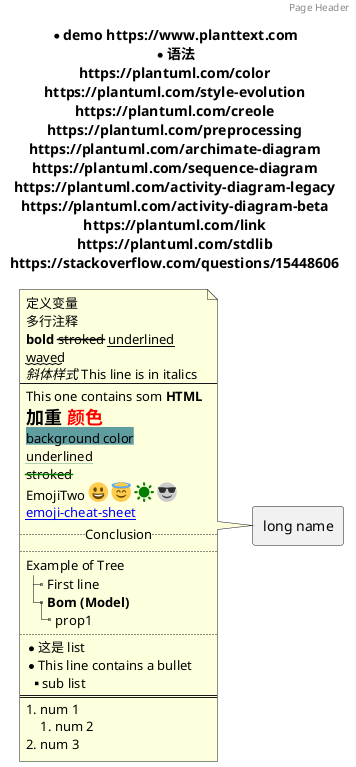
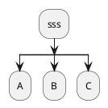
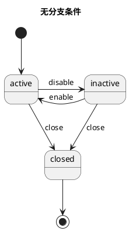
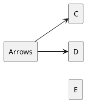
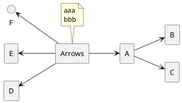
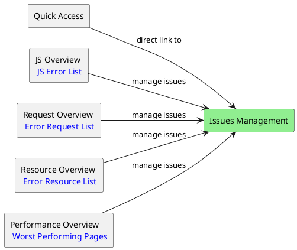
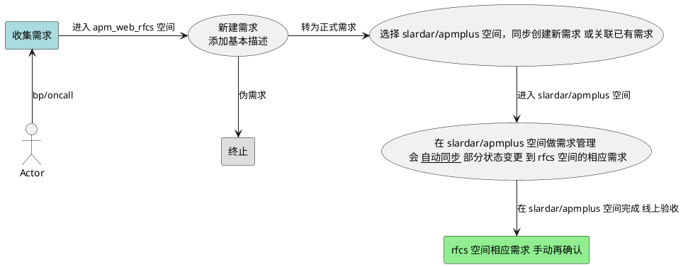
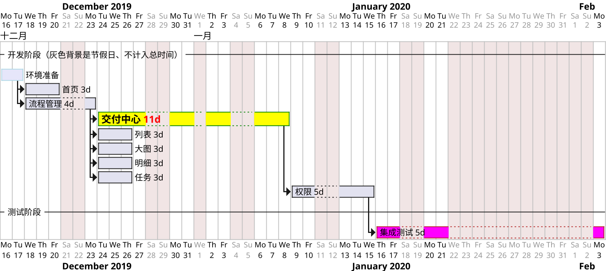

# misc

Excel 模糊匹配 <http://club.excelhome.net/thread-1048885-1-1.html>

- [GitHub search?q=stars](https://github.com/search?q=stars:%3E1&s=stars&type=Repositories)、[GitHub topics/javascript](https://github.com/topics/javascript)
- [搜 issue](https://help.github.com/articles/searching-issues/)
  - 搜索“某repo”里有“某个评论者”参与的包含的“某个词”的 issue: [warmhug + ant-design-mobile](https://github.com/search?utf8=%E2%9C%93&q=xxxx+commenter%3Awarmhug+repo%3Aant-design%2Fant-design-mobile&type=Issues)
  - 搜索“某user”里有“某个评论者”参与的包含的“某个词”的 issue: [warmhug + xxxx](https://github.com/search?utf8=%E2%9C%93&q=xxxx+commenter%3Awarmhug+user%3Aant-design&type=Issues)
  - 搜索“某人”创建的在“body”里包含“某个词”的 issue: [warmhug + xx](https://github.com/search?utf8=%E2%9C%93&q=xx+in%3Abody+author%3Awarmhug&type=Issues)


---------

# Scriptable

[mac scriptable](https://scriptable.app/mac-beta/)
[scriptable docs](https://docs.scriptable.app/)
[reddit 社区](https://www.reddit.com/r/Scriptable/)
[automators 社区](https://talk.automators.fm/t/file-bookmarks-sync/5729)
https://github.com/dersvenhesse/awesome-scriptable
https://github.com/evilbutcher/Scriptables
https://routinehub.co/

https://ifttt.com/ 通过获取“智能开关、iOS提醒事项日历”等各类服务的API、再设置 if.then 逻辑、在手机上打开才能运行。注意：没有像“iOS快捷指令”app的系统权限、不能调用其他app。

iOS<=16 版本，小组件里列表内容 没有click等点击事件、只可以通过url打开Safari或其他app。

[icon_themer & Fancy Icon Maker](https://www.reddit.com/r/shortcuts/comments/p30bnu/icon_themer_alternative/) 新版 iOS 已失效。

iOS内容限制：转到“设置” > “屏幕时间” > “内容和隐私限制” > 选择“内容限制”-”网页内容“。

[appintents](https://developer.apple.com/documentation/appintents/)

学习

```js
// 通过查看 APP 里的 Gallery 示例代码，能全面了解各种功能和写法。

console.log(config);
// 输入参数
let input = (args.widgetParameter == null) ? 'no' : args.widgetParameter;
console.log(input);

// 桌面 widget 设置
let widget = new ListWidget()
let wTxt = widget.addText('显示的文字')
wTxt.textColor = Color.white();
widget.setPadding(16,16,16,0)
widget.spacing = -3
let gradient = new LinearGradient()
gradient.colors = [new Color("FF6F91"), new Color("FF9671")]
gradient.locations = [0.5, 1]
widget.backgroundGradient = gradient
Script.setWidget(widget)

// DocumentPicker 不能在 widget 里运行
let fileURLs = await DocumentPicker.open(["public.plain-text"])
let txt = FileManager.local().readString(fileURLs[0])
console.log(txt);

// 在 iCloud Scriptable 目录里创建 _my_note.txt
let fm = FileManager.iCloud()
fm.writeString(fm.joinPath(fm.documentsDirectory(), '_my_note.txt'), 'aa');

// https://talk.automators.fm/t/read-icloud-file-outside-scriptable-directory/3959
// 由于沙箱机制，只能读取 scripable 所在目录内的文件，iCloud 内其他目录文件读取不了。
let fm = FileManager.iCloud()
let dirPath = fm.documentsDirectory()
console.log(dirPath)
console.log(fm.joinPath(dirPath, "test.txt"))
console.log(fm.libraryDirectory())
// 文件书签 https://www.macstories.net/stories/beyond-the-tablet/9/
// APP 设置 -> File Bookmarks 添加 file 或 direction 之后可以读取
// 可以 writeString 编程修改，也可以直接手动修改关联的原文件、修改后自动更新。
console.log(fm.bookmarkExists('test.txt'))
console.log(fm.readString(fm.bookmarkedPath('test.txt')))
let wr = fm.writeString(fm.bookmarkedPath('test.txt'), 'aa\nbb\ncc')
let raw = fm.readString(fm.bookmarkedPath('test.txt'))
console.log(wr);
console.log(raw);
console.log(fm.allFileBookmarks())

// 读取剪贴板 注意 console log 的参数只能一个
var clipboardContents = Pasteboard.paste();
console.log(`Clipboard contents: ${clipboardContents}`);

// widget 里只能配置 url, 不能调用 Safari 等系统APP的API
if (config.runsInWidget) {
  let widget = createWidget(items)
  Script.setWidget(widget)
  Script.complete()
} else {
  //QuickLook.present(createWidget(items));
  Safari.open(appURL)
}
```

应用

```js
// 参考 gallery 里的 News Widget 小组件
// 增加打开 shortcuts 相应指令的功能
function addItem(container, { date, url, text }) {
  const item = container.addStack();
  item.url = url;
  item.setPadding(4,4,4,4);

  const textObj = item.addText(text);
  textObj.font = Font.mediumSystemFont(13);
  textObj.textColor = Color.darkGray();
  textObj.lineLimit = 1;
}
function createUI(container, wData) {
  const out = container.addStack();
  wData.forEach(items => {
    const col = out.addStack();
    col.layoutVertically();
    items.forEach(item => {
      addItem(col, item);
    });
    out.addSpacer(10);
  });
}
function cURL(name) {
  let scUrl = new CallbackURL("shortcuts://x-callback-url/run-shortcut");
  scUrl.addParameter("name", name);
  return scUrl.getURL();
}
const data = [
  [
    { url: 'scriptable://', text: 'scriptable' },
    { url: cURL('卧室关灯'), text: '卧室关灯' },
    { url: cURL('开插座'), text: '开插座' },
    { url: cURL('关插座'), text: '关插座' },
  ],
  [
    { url: 'shortcuts://', text: 'shortcuts' },
    { url: cURL('获取时间'), text: '获取时间' },
    { url: cURL('番茄计时'), text: '番茄计时' },
    { url: cURL('豆瓣实时'), text: '豆瓣实时' },
  ],
  [
    { url: cURL('打开keep'), text: '打开keep' },
    { url: 'weread://', text: '微信读书' },
    { url: 'googletranslate://', text: 'Google翻译' },
    { url: 'googlechrome://www.google.com.hk/#newwindow=1', text: 'Chrome搜索' },
  ],
];
const widget = new ListWidget();
createUI(widget, data)
Script.setWidget(widget);
widget.presentMedium();
Script.complete();
```


```js
// 参考自 https://talk.automators.fm/t/reading-contents-of-a-file/8865/2
// Random number generator
function getRndInteger(min, max) {
  return Math.floor(Math.random() * (max - min) ) + min;
}
let fm = FileManager.iCloud()
let raw = fm.readString(fm.joinPath(fm.documentsDirectory(), '_my_note.txt'))
// let raw = fm.readString(fm.bookmarkedPath('_my_note'))
let quotes = raw.split("\n").filter(item => item && item != '========');
//console.log(quotes)
let lines = quotes.length;
let idx = getRndInteger(2, lines);
let widget = new ListWidget()
let wTxt = widget.addText(`[${(idx / lines).toFixed(2)}] ${quotes[idx]}`);
wTxt.minimumScaleFactor = 0.8;
widget.backgroundColor = new Color('dddddd');
Script.setWidget(widget);
widget.presentMedium();
Script.complete();
```


```js
// 主文件内容。加载远程文件 remote.js 并执行其中代码。
const codeFilename = "remote"
const gitHubUrl = "http://localhost:9999/remote.js"
// Determine if the user is using iCloud.
let files = FileManager.local()
const iCloudInUse = files.isFileStoredIniCloud(module.filename)
// If so, use an iCloud file manager.
files = iCloudInUse ? FileManager.iCloud() : files
// Determine if the Weather Cal code exists and download if needed.
const pathToCode = files.joinPath(files.documentsDirectory(), codeFilename + ".js")
if (!files.fileExists(pathToCode)) {
  const req = new Request(gitHubUrl)
  const codeString = await req.loadString()
  files.writeString(pathToCode, codeString)
}
// Import the code.
if (iCloudInUse) { await files.downloadFileFromiCloud(pathToCode) }
const code = importModule(codeFilename)
// Run the initial setup or settings menu.
let preview
if (config.runsInApp) {
  preview = await code.runSetup(Script.name(), iCloudInUse)
  console.log(preview);
  if (!preview) return
}
const widget = new ListWidget();
widget.refreshAfterDate = new Date(Date.now()+1000*60*60*24*30*12);
const text = widget.addText('aaa bbb');
text.textColor = new Color('C5EA9C');
widget.backgroundColor = new Color('FFFFA1');
Script.setWidget(widget);
// If we're in app, display the preview.
if (config.runsInApp) {
  if (preview == "small") { widget.presentSmall() }
  else if (preview == "medium") { widget.presentMedium() }
  else { widget.presentLarge() }
}
Script.complete();


// 远程文件 remote.js 作为主文件的 module 被 import 进去
module.exports = {
  // Initialize shared properties.
  initialize(name, iCloudInUse) {
    this.name = name
    this.fm = iCloudInUse ? FileManager.iCloud() : FileManager.local()
    this.bgPath = this.fm.joinPath(this.fm.libraryDirectory(), this.name)
    this.now = new Date()
    this.data = {}
    this.initialized = true
  },
  async runSetup(name, iCloudInUse, codeFilename, gitHubUrl) {
    if (!this.initialized) this.initialize(name, iCloudInUse)
    const backgroundSettingExists = this.fm.fileExists(this.bgPath)
    console.log(this.bgPath);
    console.log(backgroundSettingExists);
    await this.generatePrompt("Weather Cal is set up.", 'message', ["Continue"])
    return await this.setWidgetBackground()
  },
  async setWidgetBackground() {
    return 'large';
  },
  // Generic implementation of an alert.
  async generatePrompt(title,message,options) {
    const alert = new Alert()
    alert.title = title
    if (message) alert.message = message
    const buttons = options || ["OK"]
    for (button of buttons) { alert.addAction(button) }
    console.log(alert);
    // if (!options) await alert.present()
    return alert
  },
};
```


```js
// 创建目录、解析远程json
// https://github.com/wa91/quote-widget/blob/main/Quote
let fm = FileManager.iCloud();
let cachePath = fm.joinPath(fm.documentsDirectory(), "subDir");
console.log(cachePath);
if(!fm.fileExists(cachePath)){
  fm.createDirectory(cachePath)
}
const date = new Date();
let raw = new Date(Number(fm.readString(fm.joinPath(cachePath, "lastread"))));
let past= new Date(new Date(date.getTime()) - (60 * 60 * 1000));
console.log(past)
console.log(raw)
if (raw<past) {
let req = new Request('https://zenquotes.io/api/random');
  let json = await req.loadJSON();
  fm.writeString(fm.joinPath(cachePath, "lastread"), String(date.getTime()));
  fm.writeString(fm.joinPath(cachePath, "quote"), json[0].q);
  fm.writeString(fm.joinPath(cachePath, "author"), json[0].a);
}
let quote = fm.readString(fm.joinPath(cachePath, "quote"));
let author = fm.readString(fm.joinPath(cachePath, "author"));
var size =14;
if (quote.length > 80) {
  size= 10;
}
```


# plantuml





```plantuml
title 基本元素示例
'skinparam actorStyle awesome
' hide footbox
' box SBCP

[bb]
(usecase)
' participant "First" as F
' participant "Second" as S
boundary Boundary
actor b #pink;line:red;line.bold;text:red
usecase c #palegreen;line:green;line.dashed;text:green
usecase UC1 as "You can use
several lines."

User --> (Use)
User --> (UseCase) : A small label \n new line
User --> (bar1) #line:red;line.bold;text:red  : red bold

' U -> F  : "start"
' F -> S

```


```plantuml
' left to right direction

title 综合示例
skinparam class {
  ArrowColor red
}
skinparam rectangle {
  BorderColor Blue
}
circle jaAlias as ja #red
rectangle "u u u" as Up #line.dashed
rectangle Down

ja -u[#green,dashed]-> Up
ja -d[dotted]-> Down

' #green:(A)
' #red:Drink Homebrew;
' #AAA:结束;
' kill

' |#dee4e8|swimlanes|
' start
' |#daf0fe|swimlanes1|
' end

```


---
应用



















```plantuml
' a 不能变成 :a:
a -> b
if "a" then
  -->[true] "Some Action"
else
  ->[false] "Something else"
endif
```





# markdown 语法

:+1: :smile: :smiley: :laughing:
- [emoji-cheat-sheet](https://www.webpagefx.com/tools/emoji-cheat-sheet/)
- [Emoji Unicode Tables](http://www.unicode.org/emoji/charts/full-emoji-list.html)

任务 `- [] 跑步` 或 `- [x] 吃饭`；普通链接 [test](http://example.net "optional") 。图片 。

| Item      |    Value | Qty  |
| :-------- | --------:| :--: |
| Computer  | 1600 USD |  5   |

<details>
  <summary>Is this production ready?</summary>
  Next.js has been powering `https://zeit.co` since its inception.
</details>


# Linux / Unix


```sh
# man 查看命令帮助文档。 例如：使用 man ascii 来查看 ASCII 表。
ctrl + w      # 删除前一个单词
ctrl + u / k  # 清除光标到 行首 / 行尾 的内容
ctrl + a / e  # 移动到所在 行首 / 行尾
esc + b / f   # 移动到所在单词的 词首 / 词尾
ctrl + c      # 退出某进程（不是 command）
ctrl + r      # 查找输入过的命令
cammand + k / ctrl + l / clear  # 清屏

d  # 向后滚动 n 行，比如 `git diff` / `man less` 显示很多内容、可快速查看
u  # 向前滚动 n 行
G  # 直接跳到最后一行
h  # 显示帮助

mv ./filename ./filename  # 移动文件/目录，重命名文件
echo ttt > ./file.txt  # 覆盖文件原内容并重新输入内容，若文件不存在则创建文件
echo ttt >> ./file.txt  # 向文件追加内容，原内容将保存
true > ./file.txt  # 清空 file.txt 文件内容
> file.txt  # 创建一个空文件，比 touch 短
cat error.txt >> acc.txt  # 把 error.txt 文件内容输出到 acc.txt 文件中

cat [-n] filename  # 由第一行开始显示档案内容, n 显示行号
more filename # 一页一页的显示档案内容. less 与 more 类似，而且可以往前翻页
history 10 # 列出最近执行过10条的命令，默认放在 .bash_history 文件中，默认保存1000条(可以修改)
history | more # 逐屏列出所有的历史记录，!99 执行历史清单中的第99条命令

head/tail filename  # 只看 头/尾 几行(默认10行)
head/tail -n 20 ~/.bashrc  # 显示头二十行

which java  # 查看 java bin 所在的路径，如果是 `/usr/bin/..` 说明是软连接、再运行 ls -l `which java` 即可
chmod u+x test.sh    # 修改权限，脚本可执行
chmod +x demo.py    # 修改权限，脚本可执行

dig [IP地址/域名] +short  # 查询 DNS 包括 NS 记录，A 记录，MX 记录等相关信息的工具
nslookup [IP地址/域名]  # 查询一台机器的 IP 地址和其对应的域名
# 诊断路由节点问题，如丢包、网站访问慢、结合了 "traceroute" 和 "ping" 功能。下载地址 http://rudix.org/packages/mtr.html
# 以报告模式显示：从我的主机到目标主机经过的路由节点以及到各节点数据包的丢包率和 ping 命令的最短/最长时间和标准偏差。
# mtr 详细：https://meiriyitie.com/2015/05/26/diagnosing-network-issues-with-mtr/
mtr -r [IP地址/域名]

alias # 查看系统里别名
w / who # 列出当前登录的所有用户
whoami # 显示当前正进行操作的用户名
tty # 显示终端或伪终端的名称
last # 查看系统最后登录
date # 显示系统的当前日期和时间
say hello world  # 说话

# 软连接可以跨文件系统，硬连接不可以。软连接可以对一个不存在的文件名进行连接。软连接可以对目录进行连接。硬链接下修改源文件或者连接文件任何一个的时候，其他的文件都会做同步的修改。
ln -s source_file dist        # 建立软连接 #若权限不足加 sudo
ln -s ../source/*.bar .        # 建立软连接，在当前目录
ln source_file dist           # 建立硬连接
# 在桌面生成软连接（快捷方式）
ln -s /Applications/Xcode.app/Contents/Developer/Applications/Simulator.app ~/Desktop
ln -sv ~/Library/Mobile\ Documents/com~apple~CloudDocs/ ~/iCloud\ Drive
# 或者加入到 zsh/bash 中
alias simulator='open /Applications/Xcode.app/Contents/Developer/Applications/Simulator.app'
```

### ssh & scp

scp -r ~/Downloads/build/ root@118.31.47.xx:/home/admin/nginx/
ssh root@118.31.47.xx xyxyxy
cd /home/admin/nginx/
cp -r ./build ./build-back1

### curl

与服务器交互数据的工具，支持 http,https,ftp,ftps,telnet 等多种协议，常被用来抓取网页和监控Web服务器状态。
[命令详解](http://aiezu.com/article/linux_curl_command.html)

格式：`curl [-i带header | -I只输出header ] [URL...]`

```sh
curl https://twitter.com/  # 直接打印内容
curl 'https://api.github.com/user/repos?page=2&per_page=100'  # 有特殊字符需要用引号包裹

curl https://www.baidu.com -o xx.html  # 下载页面到 xx.html 里
# 下载文件并显示简单进度条
curl -# -o centos6.8.iso http://mirrors.aliyun.com/centos/6.8/isos/x86_64/CentOS-6.8-x86_64-minimal.iso
# 断点续传：继续完成上次终止的未完成的下载
curl -# -o centos6.8.iso -C - http://mirrors.aliyun.com/centos/6.8/isos/x86_64/CentOS-6.8-x86_64-minimal.iso

curl https://api.github.com?callback=foo   # jsonp
curl -i "https://api.github.com/repos/vmg/redcarpet/issues?state=closed"  # 输出 header + 内容
curl -i https://api.github.com -H "Origin: http://example.com"  # 设置 CORS
```

### grep

[grep](http://www.cnblogs.com/peida/archive/2012/12/17/2821195.html) 搜索文件内容，会对文件的每一行按照给定的 pattern 进行匹配查找。

格式：`grep [-r递归 -n行号 -i忽略大小写 -I忽略二进制文件] 搜索字符串/正则表达式 [filename]`

```sh
grep -rn 'grep' *  # 以 字符串 grep 来搜索 当前目录及子目录 的所有文件内容
grep grep$ she*.md  # 以 正则表达式 grep$ 来搜索 当前目录下 文件名匹配 she*.md 的内容

# 注意，-r 递归搜索时，使用 *.md 的 filename 无效。
grep -r --include=\*.{cpp,h} pattern ./
grep -rn --include="*.js" pattern *

grep -r --exclude-dir=node_modules pattern /path
grep -r --exclude-dir=node_modules --exclude-dir=dev pattern /path
grep -rI --exclude-dir="\.svn" "pattern" *   # 忽略二进制文件和svn隐藏目录
grep -r --color --exclude-dir={custom,lib,scripts} --exclude={*.xml,error_log} "beta" *

cat test.txt | grep ^u   # 找出以 u开头 的行内容
cat test.txt | grep hat$  # 输出以 hat结尾 的行内容
cat test.txt | grep -E "ed|at"  # 显示包含 ed或者at 字符的内容行
```

### find

[find](http://www.binarytides.com/linux-find-command-examples/) 命令是根据文件的属性进行查找，如文件名，文件大小，所有者，所属组，是否为空，访问时间，修改时间等。
[exclude directory](https://stackoverflow.com/questions/13460482/exclude-a-sub-directory-using-find)

```sh
find  # 在 当前目录以及子目录 列出所有文件
find /etc -name httpd.conf  # 在 /etc 目录下文件 httpd.conf
find . -name '*bash*'    # 在 当前目录以及子目录 下查找文件名中含有字符串 bash 的文件
find . -name "*.js" -not -path "*node_modules*"  # 排除路径中含有 node_modules 的文件
find . -name "*.js" -not -path "*node_modules*" -not -path "*js-css-html*" # 排除多个路径
find . \( -name "*.py" -o -name "*.js" \) -not -path "*node_modules*"  # 查找多个文件类型

find / -amin -10   # 查找在系统中最后10分钟访问的文件(access time)
find / -mmin -5   # 查找在系统中最后5分钟里修改过的文件(modify time)
find / -size -1000k   #查找出小于1000KB的文件

find . -name '*.DS_Store' -type f -delete   # 删除某目录及子目录下的 .DS_Store 文件
```

vim 是 vi 的增强版本。相比vi添加了显示颜色等功能。


```sh
# 编辑模式
输入 i 再输入其他字符。 按 esc 退出，切回命令模式

# 命令模式
导航：h j k space键
ctrl-f  上翻一页
ctrl-b  下翻一页
^     跳至行首
$     跳至行尾
gg    跳至文件的第一行
G     到文件的最后一行
:w   保存
:wq  :x  shift zz 保存修改并退出
:q!  强制退出，放弃修改
u     撤销
ctrl+r   重做（撤销一个撤销）
.     重复上一个编辑命令
==     自动缩进当前行
dd 删除光标所在行， dw 删除一个字(word) ，D 删除到行末
x 删除当前字符，  X 删除前一个字符
yy 复制一行，此命令前可跟数字，标识复制多行，如6yy，表示从当前行开始复制6行
yw 复制一个字 ， y$ 复制到行末
p 粘贴内容到当前行的下面 ，P 粘贴内容到当前行的上面
复制 粘贴（如果粘贴外部内容，在i模式下，直接cmd+v）
按 v 进入可视模式；移动光标键选定内容！w选择单词，y复制(或gy)，p粘贴，x删除，d删除后边

tail -n10 path/filename 查看文件最后10行
?pattern  /pattern     向前后搜索字符串pattern
:s/vivian/sky/g 替换当前行所有 vivian 为 sky
:%s/source_pattern/target_pattern/g  全局替换

[vi编辑器使用color-scheme](http://alvinalexander.com/linux/vi-vim-editor-color-scheme-colorscheme)
```

Unix 遵循的原则是 KISS (Keep it simple, stupid) do one thing and do it well。
Linux 分为内核版、发行版。比较常用的发行版有 redhat、ubuntu 等。服务器端大多使用 redhat\centos，没有图形界面，因为图形界面占用更多系统资源，造成不稳定，被攻击的可能性更大。

- Linux 严格区分大小写。所有内容以文件形式保存，包括硬件。如：键盘 /dev/stdin 显示器 /dev/stdout
- Linux 不靠扩展名区分文件类型，靠权限区分。（.gz .tgz .sh等文件扩展名只是为了方便管理员查看）

shell 是一个命令行解释器。shell 是壳，kernel 是内核。shell 把用户敲进去的命令、翻译为 linux 内核能识别的语言。
linux 下有些命令是 shell 自带的，有些命令是别人写好装进来的(如 ls )，用 `whereis ls` 来区别。
sh: Bourne Shell 的缩写，可以说是目前所有 Shell 的祖先。 bash : Bourne Again Shell 的缩写，是 sh 的一个进阶版本。bash 是目前大多数 Linux 发行版和苹果的 Mac OS X 操作系统的默认 Shell。
[bash-guide](https://github.com/Idnan/bash-guide)
[mac-shell 介绍](http://ntop001.github.io/2015/06/06/mac-shell/)、
[Zsh 和 Bash 的不同](https://xshell.net/shell/bash_zsh.html)，在 zsh 的 terminal 里运行 bash 脚本，可能有兼容问题，需要用 `emulate bash/sh` 切换为仿真模式。
安装 CentOS (min 版) 后，登录系统会显示 `localhost login:` 填入 root 、然后输入安装时设置的密码。

```sh
# shell 变量声明：
变量名=变量值 (等号前后不能有空格) # 例如 NODE_ENV='PRODUCTION' gulp build
echo $变量名
echo $PATH  # 查看PATH环境变量
echo $SHELL # csh 是 C Shell。bash，sh，zsh 是 Bourne Shell 的变种。
env / printenv JAVA_HOME  # 打印环境变量

>  >>  &>  &>>  2>&1  # 输出重定向
# 管道符 |

# shell 变量叠加：
x=123
x="$x"456  (或 x=${x}456)
echo $x

$n $* $@ $#    # 位置参数变量
$? $$ $!   # 预定义变量

符号：单引号、双引号、反引号、$()、$、#、\
通配符、正则表达式 是不同的东西。正则是包含匹配，通配符是完全匹配。正则匹配文件内容字符串，通配符匹配文件名。

#!/bin/sh  # 如果文件开头的 shebang 为 `#!/bin/bash` 会使用 bash 执行命令，而不管系统默认的 shell 是否为 bash。如果没写 shebang，那么此脚本文件会被用户当前的 Shell 所执行。

echo "进行 xx 操作 \n\r" \
&& cd ~/my/work/project/xx \
&& spm build && spm deploy \
# 对引号进行转义
expect -c "spawn ssh admin@xx.net
expect \"password:\"
send \"password22\r\"
send \"cd ccbin && ./ccupdate.sh \n\"
interact "
```

```sh
# Windows Dos cmd 里操作技巧： 命令帮助 /? 例如：md /? ，for /?

echo ... > A.txt    # 重定向输出，此时创建文本文件 A.txt;
echo ... >> A.txt   # 向 A.txt 文件中追加信息...
del *.txt # 删除文件

chcp 65001  # 换成UTF-8代码页
chcp 936 # 可以换回默认的GBK

# 环境变量
set  # 查看当前可用的所有环境变量（=系统变量+用户变量）
set PATH  # 查看某个环境变量，如PATH
set xxx=aa  # 添加环境变量，如xxx=aa
set PATH=%PATH%;d:\xxx  # 在某个环境变量（如PATH）后添加新的值（如d:\xxx）

echo %cd%  # %cd% 可用在 批处理文件中 或 命令行中，其内容为命令的执行路径或批处理文件的执行路径
%0  # 代指批处理文件自身
%~d0   # 是指批处理所在的盘符
%~dp0   # 是盘符加路径，只可以用在批处理文件中，由它所在的批处理文件的目录位置决定
cd %~dp0  # 进入批处理所在目录
```


### system_login 系统脚本

```sh
#!/bin/bash

exists(){
  command -v "$1" >/dev/null 2>&1
}

# use forever as joke server manager
if exists forever; then
  echo 'MY_Info: forever has been installed'
else
  echo 'MY_Info: execute "npm install forever -g"'
  npm install forever -g
fi

JOKE_PATH=~/inner/__/js-css-html/joke
if [ -d "$JOKE_PATH"/node_modules ]; then
  echo "MY_Info: the node_modules folder already exists in $JOKE_PATH"
else
  echo "MY_Info: execute 'npm install' command in $JOKE_PATH"
  cd $JOKE_PATH
  npm install
fi

ls
printf "\n"
read -n1 -rsp $'Press any key to exit...\n'
```
