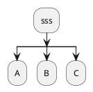
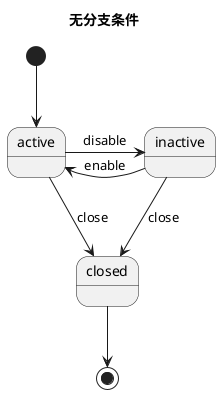
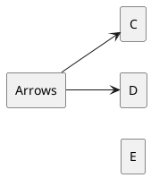
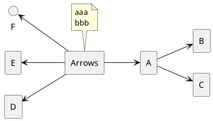
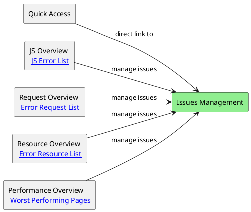
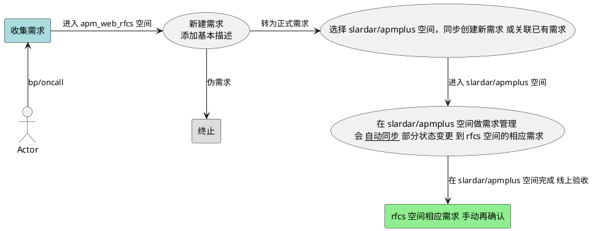
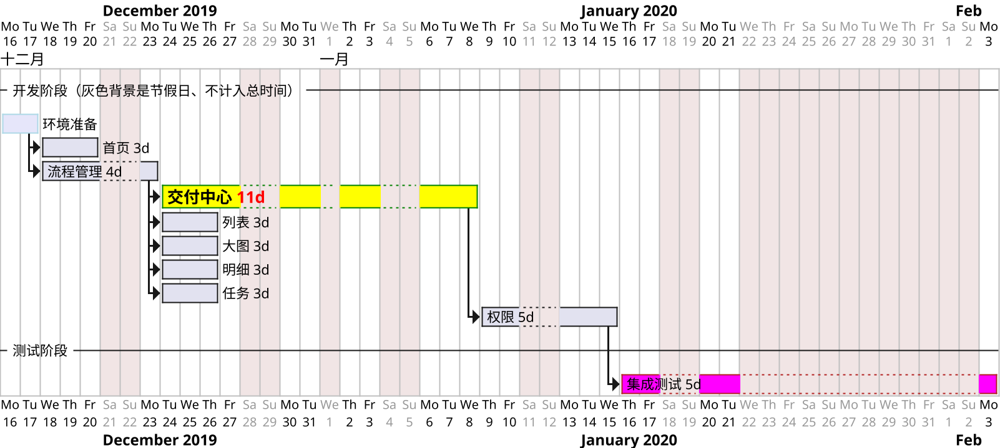

# bash

- Unix 遵循的原则是 KISS (Keep it simple, stupid) do one thing and do it well。
- Linux 严格区分大小写。所有内容以文件形式保存，包括硬件。如：键盘 /dev/stdin 显示器 /dev/stdout
- Linux 不靠扩展名区分文件类型，靠权限区分。（.gz .tgz .sh等文件扩展名只是为了方便管理员查看）
- shell 是一个命令行解释器。shell 是壳，kernel 是内核。shell 把用户敲进去的命令、翻译为 linux 内核能识别的语言。
- sh: Bourne Shell 的缩写，可以说是目前所有 Shell 的祖先。 bash : Bourne Again Shell 的缩写，是 sh 的一个进阶版本。[Zsh 和 Bash 的不同](https://xshell.net/shell/bash_zsh.html)
- [vim 键盘图](https://zos.alipayobjects.com/rmsportal/MOPJrAnojdFvAToZkESi.gif) vi编辑器使用color-scheme `:colo desert` 或者 配置 `~/.vimrc` 为 `colo desert` + `syntax on` 。
- 不同平台安装包 macOS `brew install jq` Ubuntu/Debian `sudo apt-get install jq` CentOS/Fedora `sudo yum install jq`

## 语法

```sh
#!/bin/bash
# bash 文件 想在 mac 上双击可执行(调用系统terminal)，需要去掉文件后缀名。
# bash 处理复杂数据：在 Bash 3 中，不能直接在函数内部引用或修改外部数组。

# 一个脚本调用另一个脚本里的函数
bash ./scripts/script.sh # 这么做无效
[ -s "./scripts/script.sh" ] && \. "./scripts/script.sh"

# 命令行 或 npm script 执行 bash 脚本里的函数
source script.sh && fn_name
bash script.sh && fn_name
bash script.sh fn_name  # 需要在脚本里 $1 为 fn_name 时手动执行一下
bash -c '. script.sh && fn_name'
zsh -c "source script.sh; fn_name"

echo * xxx # 其中的 * 是特殊字符、需要处理。

local str="long...\
实际不换行"
local str1="第一行
第二行"
local num=1
local num="$num"2  # 或 num=${num}2
local new_msg="Merged $(($num-1)) $((${num}-1)) commits"
echo $str $str1 $num $new_msg

local blank_path="/Applications/Google\" \"Chrome.app/Contents/MacOS/Google\" \"Chrome"
local blank_path=/Applications/Google\ Chrome.app/Contents/MacOS/Google\ Chrome
local blank_path="/Applications/Google Chrome.app/Contents/MacOS/Google Chrome"
local escaped_blank_path=${blank_path////\\/}
echo $escaped_blank_path
printf "这是要写入文件的内容\n"

# 数组
myArray=("apple" "banana" "cherry")
myArray+=("grape")
myArray+=("element1" "element2" "element3")
newMyArray=("${myArray[@]}")
echo "${myArray[0]}"
echo "${myArray[1]}"
echo "${myArray[@]}"

cd /path/to/dir || { echo "路径无效"; exit 1; }
data_str="master-"$(date +"%Y%m%d-%H%M%S")

# 输入输出
# 使用 eval 不安全，也难解决命令参数 含有空格和引号 的情况
eval "ls -l" >> "/tmp/a_log.txt"
eval "ls -l" 2>&1 | tee -a "/tmp/a_log.txt"
(exec eval "ls -l" 2>&1 | tee -a "/tmp/a_log.txt") >/dev/null
eval "$command" >> "$file" 2>&1

# 读取用户输入
read -n1 -rsp $'Press any key to exit...\n'
read answer
if [[ $answer = "" ]] || [[ $answer = "y" ]]; then
 echo "created or override the _file.txt"
else
 echo You quite
 exit
fi

# 兼容 bash 和 zsh 颜色和换行
# 依赖特定 Shell 的转义序列
echo -e "\033[31mRed text\033[0m"
# 换行 (Zsh 的一些插件和配置 可能会影响换行的显示效果)
echo -e "Line 1\nLine 2"
# printf 命令结合 \n 转义序列 较为通用
printf "Line 1\nLine 2"

# 使用 tput 命令，不依赖特定 Shell 的转义序列
RED=$(tput setaf 1)
RESET=$(tput sgr0)
echo "${RED}Red text${RESET}"
# 检测不同的 shell 分别设置
if [ -n "$BASH_VERSION" ]; then
  RED='\033[31m'
  RESET='\033[0m'
elif [ -n "$ZSH_VERSION" ]; then
  RED='%F{red}'
  RESET='%f'
else
  echo "Unknown shell. Color support may not work."
  RED=''
  RESET=''
fi
echo "${RED}Red text${RESET}"

exists(){
  command -v "$1" >/dev/null 2>&1
}
if exists forever; then
  echo 'MY_Info: forever has been installed'
fi

# base64 加解密敏感词
input_string="your string to encode"
encoded_string=$(echo -n "$input_string" | base64)
decoded_string=$(echo -n "$encoded_string" | base64 --decode)

# 2014 ssh 登录 ssh & scp
scp -r ~/Downloads/build/ root@118.31.47.xx:/home/admin/nginx/
ssh root@118.31.47.xx xyxyxy
cd /home/admin/nginx/
cp -r ./build ./build-back1

echo "进行 xx 操作 \n\r" \
&& cd ~/my/work/project/xx \
&& spm build && spm deploy \
# 对引号进行转义
expect -c "spawn ssh admin@xx.net
expect \"password:\"
send \"password22\r\"
send \"cd ccbin && ./ccupdate.sh \n\"
interact "
```

函数的返回值和错误处理

```sh
first_function() {
  return "$1"  # 返回传入的参数作为状态码
}
second_function() {
  first_function "$1" || return 1  # 如果 first_function 失败，立即返回 1
  echo "first_function succeeded, continuing..."
  return $?  # 直接返回 first_function 的状态码
}
second_function 0  # 传入 0
second_function 1  # 传入 1
echo "Return value of second_function: $?"

my_function() {
  return 1  # 模拟失败
}
my_function
if [ $? -ne 0 ]; then
  echo "Error: Function failed!"
  exit 1  # 或者根据需要退出脚本
fi
# command && success_action: 当 command 成功时执行 success_action
# command || failure_action: 当 command 失败时执行 failure_action
my_function || echo "Function failed!"
get_message() {
  echo "Hello, World!"
}
check_status() {
  if [ "$1" -eq 1 ]; then
    return 0  # 成功
  else
    return 1  # 失败
  fi
}
# 错误处理
trap 'echo "Error occurred on line $LINENO"; exit 1' ERR
message=$(get_message)
echo "Message: $message"
check_status 0 && echo "Status check passed" || echo "Status check failed"
echo $? # 获取 函数 return 返回值
# 使用 set -e 会使脚本在任何命令返回非零状态时立即退出
set -e
check_status 0
echo "This will run because check_status passed."
check_status 2  # 这会导致脚本退出，因为 set -e 会触发
echo "This won't be displayed."
```

## mac

```sh
# [Run shortcuts from the command line](https://support.apple.com/en-gb/guide/shortcuts-mac/apd455c82f02/mac)
shortcuts run 获取时间  # list

printenv HOME  # 打印环境变量
echo "system: $HOME $PATH $SHELL"
ls /usr/bin  # 有 env
ls /usr/local/bin  # 有 node npm npx
ls $HOME/bin  # 一般不存在

open -a Activity\ Monitor # 打开活动监视器 或者 "Activity Monitor"
top # 或 top -o cpu 按 q 退出.  man top
ps -ax
ps -ef | grep adb  # 有时候 adb devices 没反应 需要杀掉进程重启
lsof -i:8087   # 查找出占用了某个端口的程序和其对应的PID
kill 3747(进程id)  # 杀掉后台进程
kill -9 $(lsof -ti:3000,3001)  # 杀掉端口占用的进程
kill -9 *pid*  # 强制杀掉进程

zsh_stats  # 命令使用状态

# brew 国内源 https://www.jianshu.com/p/bea984d27cd2
cd/ls/tree "$(brew --repo)"
brew config
# 更换 home-bottles
export HOMEBREW_BOTTLE_DOMAIN=http://mirrors.aliyun.com/homebrew/homebrew-bottles
brew install tree

xcode-select --install  # 安装 git gcc
# 阻止电脑睡眠 同时按住 shift、control、电源键，关闭显示器
# pmset noidle

# defaults read com.apple.screencapture  # 查看系统截图设置
# 将系统截屏后图片保存为 jpg 格式，体积比原 png 格式显著缩小
defaults write com.apple.screencapture type jpg
# 修改截屏图片保存路径
defaults write com.apple.screencapture location ~/Downloads/

sips -z height width [file]
# 批量修改 宽或高 最大值 保持宽高比
sips -Z 640 *.jpg

# zip加解密 https://www.jianshu.com/p/bf4a6244180f
zip -e output.zip ~/xx.txt

# 查看状态
csrutil status
# 关闭 sip 关机、按住电源键(非m1按下`Cmd R`) 选择实用工具->终端
# csrutil disable

# 允许安装”任何来源“的软件，解决 Movist.app已损坏 问题
sudo spctl --master-disable
# macOS 14.4 以上版本，需要运行此命令后 再右键打开
xattr -cr /Applications/Movist.app

# 查看本机内网IP
ifconfig
# 查看本机公网IP
curl ipinfo.io/json  # curl ifconfig.me

# 查看域名路由 或 `ping baidu.com`
traceroute baidu.com

# 持续显示进程信息
while true; do
  clear
  ps aux | awk '{print $2, $3, $11}' | sort -k2 -nr | head -n 10
  sleep 2
done
```


## 文件/目录

```sh
# 同步文件和目录
# 报错 cp: --exclude=a.txt is not a directory
cp -r test/* test1 --exclude=a --exclude='a.txt'
# 加引号 避免路径中间有空格
# 报错 cp: illegal option -- -
cp -r --exclude=a --exclude='a.txt' test/* test1

# 会排除掉 所有子目录 含有的同名 a.txt 文件
rsync -av --exclude='a.txt' --exclude='a/' test/ test1
# 在目标端删除源端不存在的文件
rsync -av --exclude='a.txt' --delete --dry-run test/ test1
rsync --version  # v2 不支持通配符
# 使用 .rsync-filter 文件配置
rsync -avF .rsync-filter test/ test1

# ls 命令默认只显示文件名
ls -d $PWD/*
ls -la
mkdir -p ~/inner/aa && touch $_/file.txt  # 创建目录并能生成文件
history 10 # 列出10条

more filename # 一页一页的显示档案内容.
head/tail -n 20 ~/.zsh_history  # 只看 头/尾 几行(默认10行)
mv fname rename / cat -n fname / say hello / type -a node(pwd) / ln -s source_file dist
env / w / who / whoami / tty / last / nettop / nslookup / mtr -r

# 创建一个临时目录用于存储 other-branch 的文件
mkdir /tmp/other
diff -r . /tmp/other
diff -rq . /tmp/other  # -q 只报告哪些文件不同
diff -r --exclude=".git" . /tmp/other
# 使用 --exclude="{.git,.svn}" 好像不正确
diff -r --exclude=".git" --exclude=".svn" dir1 dir2
diff -r --exclude=".git" dir1 dir2 dir3 > diff_output.txt
diff -r --exclude=".git" --exclude="node_modules" pro-components pro-componentsk > diff_output.txt

grep -rn 'grep' *  # 以 字符串 grep 来搜索 当前目录及子目录 的所有文件内容
grep grep$ she*.md  # 以 正则表达式 grep$ 来搜索 当前目录下 文件名匹配 she*.md 的内容
grep -r --include=\*.{cpp,h} pattern ./
grep -r --exclude-dir=node_modules pattern ~/

find . -name '*bash*'
find . -name "*.js" -not -path "*node_modules*" -not -path "*js-css-html*"
find . -name '*.DS_Store' -type f -delete   # 删除某目录及子目录下的 .DS_Store 文件
# find / -mmin -5   # 查找在系统中最后5分钟里修改过的文件(modify time)

# 如果文件存在则追加内容，否则创建并写入内容
# [ -f "$file" ] && echo "$content" >> "$file" || echo "$content" > "$file"
printf '\n%.0s' {1..10} >> $file

# unix diff 使用
function diff_gitignore() {
  gitignore=()
  GITIGNORE_FILE=".gitignore"
  if [ ! -f "$GITIGNORE_FILE" ]; then
    echo ".gitignore file not found in the current directory!"
    exit 1
  fi
  while IFS= read -r line; do
    # 移除行首尾的空白字符
    stripped_line=$(echo "$line" | tr -d '[:space:]')
    # 跳过空行和以 '#' 开头的注释行
    if [ -n "$stripped_line" ] && [ "${stripped_line:0:1}" != "#" ]; then
      # echo "$stripped_line"
      gitignore+=("--exclude=$line")
    fi
  done < "$GITIGNORE_FILE"
  # echo "${gitignore[@]}"
  for item in "${gitignore[@]}"; do echo "$item"; done
  # diff 的 exclude 参数 不认识 .gitignore 文件里的 **/**/es/** 这种写法
  # diff -rq --exclude=.git --exclude=**/**/es/** . /tmp/pro-components > diff.txt
}

# 获取当前路径和父路径
current_path=$(/bin/pwd)
get_parent_dir() {
  local current_dir=$(basename "$current_path")
  local parent_dir="${current_path%$current_dir}"
  echo $parent_dir
}
parent_dir=$(get_parent_dir)
```

## node npm

```sh
# [npm源](http://registry.npmjs.org/esbuild/0.21.4)
# [腾讯源](https://mirrors.cloud.tencent.com/npm/esbuild/0.21.4)
# https://docs.npmjs.com/cli/v10/commands/npm  (version publish query)
# https://pnpm.io/cli/add  (workspaces patch )
# pnpm v7 文档 https://github.com/pnpm/pnpm.io/blob/v7/docs/workspaces.md

# --loglevel silly --yes --no-commit-hooks
# --include-merged-tags --no-push --no-git-tag-version
npx lerna diff
npx lerna changed
npx lerna changed --include-merged-tags
npx lerna version patch --exact
npx lerna version patch --exact --message '🎨 chore(release): Publish' --conventional-commits
npx lerna version prerelease --preid beta
npx lerna publish prerelease --preid rc --dist-tag rc
npx lerna publish from-git --preid rc --dist-tag rc
npx lerna publish from-package

npx lerna ls --since="master"
npx lerna ls --include-merged-tags
npx lerna ls --since --include-merged-tags
npx lerna exec --since --include-merged-tags -- ls -la
npx lerna exec --include-merged-tags --concurrency 1 -- "pwd && ls -la"
npx lerna exec --scope @afe/pro-form -- pnpm version 0.1.5-alpha.0 --no-git-tag-version

# 使用 lerna version 前必读 https://docs.npmjs.com/cli/v10/commands/npm-version
# 根目录是 monorepo 在根目录运行
npm version 0.1.5 --workspaces --no-git-tag-version --allow-same-version=true
npm version patch --workspace=packages/button --workspace=packages/card --no-git-tag-version --allow-same-version=true -f
# 如果只改某个子包版本号，进入到子包 设置 --workspaces=false
npm version patch --workspaces=false --no-git-tag-version
npm version prerelease --preid rc --no-git-tag-version

# pnpm 处理 workspaces ( pnpm>9.0 link-workspace-packages 默认为 false )
pnpm run script-name --filter workspace-name
pnpm add package-name --filter workspace-name --link-workspace-packages=true

# 注意 pnpm outdated 是检测 lock文件(不是package.json) 里的依赖版本号 是否过时
pnpm outdated -r
pnpm outdated "@afe/pro-*" --filter "@afe/pro-form" --json
# pnpm up package-name --filter workspace-name
pnpm up "@afe/pro-*" --filter "@afe/pro-form" --latest

pnpm up -r @afe/pro-form@0.2.0  # 更新不存在的版本号会报错
# 更新 包的版本号为 "@afe/pro-form": "workspace:0.1.3"
pnpm up -r "@afe/pro-*"  # 加 --workspace 作用一样
# 升级到 npm latest 指定的版本
# 如果 workspace 内部包 版本号大于npm最新版 则使用内部包版本号
pnpm up -r "@afe/pro-*" --latest
pnpm up -r "@afe/pro-*@beta"  # 升级到 beta rc

pnpm install --ignore-engines --ignore-platform
pnpm view @afe/pro-card --json --registry http://comm
npm view @huajs/lerna-demo1 --registry https://registry.npmjs.org

pnpm ls -r --json # 等效 npx lerna ls --graph
pnpm ls -r --depth -1 --json  # 等效 npx lerna ls --long 换成 npm 不行

npm ls node-sass  # 换 pnpm 不行
npm ls --all --json --loglevel silent
npm ls --all -g
npm ls -g
npm update package1 package2 --save
npm root -g
which npm/node  # 查看本地安装的模块

# npx 用法
npx ls  # 等同于 ls
npx mocha --version
npx http-server
# 忽略本地的同名模块 --no-install 强制使用本地模块
npx --ignore-existing http-server
# https://code.visualstudio.com/api/get-started/your-first-extension
npx --package yo --package generator-code -- yo code

npm exec -- node -e 'console.log(process.env)'

# 搜索组织下的包 https://www.npmjs.com/org/ant-design
npm --searchlimit=100 search @ant-design
npm config ls
npm config set registry https://registry.npmmirror.com -g
npm i --registry https://registry.npmmirror.com
npm i --registry https://registry.npmjs.org
```


## git 操作

```sh
git remote [-v add | set-url] origin git@xxx.git
git config -l  # --list
git pull --rebase       # 对当前分支 git fetch git rebase
git fetch --all
git fetch --all --tags
git fetch origin master
git branch -m newBranchName  # 重命名分支
git checkout HEAD~1 -- file1 dir1
git reset HEAD~1 file1 dir1

# 创建和 apply 补丁
# 当前为 branch-a 分支，想应用 branch-b 相对于 branch-a 的更改
git diff branch-a..branch-b > changes.patch
git diff branch-a..branch-b -- path/to/file > changes.patch
git apply changes.patch

git log master..feat-xx --oneline
git log -n 10
git log origin/master -- .npmrc package.json
git log --name-status # 显示文件增删状态
git log --graph
git log --oneline --decorate
git log --oneline --first-parent --reverse | tail -1
git log --graph --pretty="%Cred%h%Creset -%C(auto)%d%Creset %s %Cgreen(%ar) %C(bold blue)<%an>%Creset" --all
git log --graph --pretty="%Cred%h%Creset -%C(auto)%d%Creset %s %Cgreen(%ar) %C(bold blue)<%an>%Creset"

git diff master..feat-xx
git diff origin/master..origin/master -- .npmrc
git diff --name-only version1/branch1 version2/branch2
# 比较当前分支和 master 分支的实际不同的内容
git diff --name-only master..HEAD
git diff master..HEAD -b -w --ignore-blank-lines --ignore-space-change --ignore-all-space -p --stat [file/dir]
git diff master..HEAD -b -w --ignore-blank-lines --ignore-space-change --ignore-all-space --name-only
git diff @{upstream}

# HEAD = HEAD~0 = HEAD^0 当前提交
# HEAD~1 = HEAD^ 主线的上一次提交  HEAD~3 = HEAD^^^ 主线的上三次提交
# HEAD^1 主线提交（第一个父提交） HEAD^2 第2个并入的分支的最近一次的提交
# HEAD^2~3 第2个并入的分支 的最近第 4 次的提交
git diff HEAD^  # 比较 最新提交 和 其父提交 的差异

git show commitId:filepath
git cherry -v master feat-xx
git commit --amend  # 修改提交信息
# 压缩 commit
git merge --squash feature-branch
# 保留压缩前的所有commit信息 其中的 hash 修改记录 也会被保留
git add .
git commit --no-verify

# git merge 会产生重复无用的 Merge pull request pull_id from xx_branch 或者 Merge branch “branch_name” 信息，不利于 review 提交记录。
# git rebase 需要经常 reapply 其他提交的改动，commit 的时间顺序也会乱掉。只对自己的分支 commit 做 rebase，公共的分支不要 rebase. 其后续的 commit hash 将全部改变
git rebase -i [commit_id] # hash 换成 master
git rebase -i --root # 删除第一个提交
git rebase origin/master
git push --force-with-lease  # 强制提交 比 -f 安全

# cherry-pick 和 rebase 最终都会在操作完之后、修改同样提交的 commit hash 值
# 场景: 比如要 pick 的 来源分支的 commit 只是 HADE~1, 但 来源分支的 HEAD~5 和 目标分支的 HEAD~1 有相同的 commit_hash (即来源分支同步了最新的 master commit 但目标分支没有同步), 此时来源分支的 HADE~1到4 (而不是预期的只是HADE~1) 的 commit 都会 apply 到 目标分支, 并且在目标分支 同步过来的 HADE~1到4 的 commit hash 都会被重新修改。
git cherry-pick src_branch_commit_hash  # 切换到 目标分支
# 从另一个仓库的分支 pick 先 git fetch <other-repo-url> <other-branch>
git cherry-pick commit_hash # commit_hash 可以是其他仓库的hash

# --soft 不修改本地文件 --hard 本地的文件修改都被丢弃
git reset --[soft | hard] [origin/master | file | 057d]
git reset --hard && git clean --force -dfx # pristine
git reset --hard && git clean --force -df # wipe
git revert commit_id # 回滚代码 不抹掉 提交记录 产生新纪录
git reflog  # 撤销 reset 时 找到撤销前的 commit_id 再 git reset 即可

# 打 annotated tags
git tag -v @afe/pro-components@0.1.9-beta.0
git tag -a 0.0.1 -m 'Release version 0.0.1'
git push [origin] --tags    # 推送所有标签到服务器
git push origin --delete tag_name
# tag 只附在一个 commit 上、如果这个 commit 被 squash，但 tag 仍然存在。
# https://stackoverflow.com/questions/54281360/what-happens-to-tags-of-squashed-commits

# GitHub stars topics/javascript
# https://github.com/search?q=stars:%3E1&s=stars&type=Repositories
# https://github.com/topics/javascript

# 搜索 issues
# https://help.github.com/articles/searching-issues/
# https://github.com/search?type=Issues&q=xx+in:body+author:warmhug
# https://github.com/search?type=Issues&q=xx+commenter:warmhug+user:ant-design
# https://github.com/search?type=Issues&q=xx+commenter:warmhug+repo:ant-design/ant-design-mobile

# GitHub commit 或合并 MR 时，可以自动修改 issue 状态、关闭关联的 issue。
# 业内成熟的 GIT 分支模型 https://cloud.githubusercontent.com/assets/36899/7315642/015f534c-eaa2-11e4-9882-b7cc7535fb72.png
# GitHub Issues blog https://gitblog.io/

# 切换到 other-branch，并将其内容导出到临时目录
# git --work-tree=/tmp/other checkout other-branch -- .

cd "$(git rev-parse --show-toplevel || echo .)"
branch=$(git rev-parse --symbolic-full-name --abbrev-ref HEAD) && echo ${branch}

# 添加删除 remote repo
# 如果原来没有 kj 这里 remove 会报错 # fatal: No such remote: 'kj'
# git remote remove kj
local kj_remote=$(git config --get remote.kj.url)
[[ -z "$kj_remote" ]] && git remote add kj $kj_git
git remote -v
git fetch kj master || { echo "fetch kj 失败"; exit 1; }
```

获取 git log 的 第一条 最后一条 总数 等信息，放到 bash 数组里

```sh
branch_name="$1"
if [ -z "$1" ]; then
  # 设为 current_branch
  branch_name=$(git symbolic-ref --short HEAD)
fi
echo $branch_name

all_commits_num=$(git rev-list --count HEAD)
all_commits=$(git log $branch_name --format=%H:%an:%s)
all_commits=$(git log $branch_name --pretty=%H)
latest_commit=$(git log $branch_name -1 --pretty=%H)
skip_latest_commit=$(git log --skip=1 --pretty=%H)
first_commit=$(git log $branch_name --reverse --skip=1 $latest_commit --pretty=%H | head -n 1)
first_commit=$(git rev-list --max-parents=0 HEAD)
echo $latest_commit
echo $first_commit

declare -a commits_info

# 使用 while 循环读取 git log 输出，并将信息追加到数组中
while IFS= read -r line; do
  commits_info+=("$line")
done < <(echo "$all_commits")

echo "commits count: "${#commits_info[@]}

for info in "${commits_info[@]}"; do
  if [[ "$info" != "$first_commit" ]]; then
    echo "$info"
    # echo "${info%%:*}, ${info#*:}"
    # do sth
    # git cherry-pick $info
  else
    echo first_commit: "$first_commit"
  fi
done
```

检查是否是 git 仓库

```sh
# directory_path="/path/to/directory"
# git -C "$directory_path" rev-parse --is-inside-work-tree > /dev/null 2>&1
is_git_repo=0
if git rev-parse --is-inside-work-tree > /dev/null 2>&1; then
  is_git_repo=1
  echo -e "\033[31mgit status:\033[0m
  "$(git status)
else
  echo "当前不是 git 仓库"
fi
if [ "$is_git_repo" != "1" ]; then
  echo "不是 git 仓库"
  exit 1
fi
```

删除 git 仓库的 tag

```sh
remote_tags=$(git ls-remote --tags origin)
remote_tags=$(git ls-remote --tags origin | awk '{print $2}' | sed 's#refs/tags/##')
remote_tags=$(git ls-remote --tags origin | sed 's/.*refs\/tags\/\(.*\)/\1/')
local_tags=$(git tag -l)
# local_tags=$(git tag -l | sed -n 's/.*\///p')
function process_tags() {
  # if [[ $tag_info =~ refs/tags/(.+) ]]; then
  #   tag=${BASH_REMATCH[1]}
  # fi
  for tag_info in $1; do
    tag=$tag_info
    echo "Matched tag: $tag"
    # git tag -d "$tag"
    # git push origin --delete "$tag"
  done
}
process_tags "$remote_tags"
process_tags "$local_tags"

# 先 git tag -l > tags.txt
# 再运行本脚本
while read -r line; do
  git tag -d "$line"
  # git push origin --delete "$line"
done < tags.txt
```

git 修改 master~当前分支，所有commit里面非合规 email username

```sh
git fetch origin master:master
CURRENT_BRANCH=$(git rev-parse --abbrev-ref HEAD)
echo "正在处理当前分支: $CURRENT_BRANCH"
git update-ref -d refs/original/refs/heads/$CURRENT_BRANCH 2>/dev/null || true
# 使用git filter-branch来修改历史
git filter-branch -f --msg-filter 'sed -e "s/pinduoduo//g" -e "s/pdd//g"' -- master..HEAD
git filter-branch -f --env-filter '
    OLD_EMAIL_PATTERN="pinduoduo|pdd_waterdrop_bot"  # 要替换的邮箱的正则表达式
    NEW_EMAIL=""        # 新的邮箱地址
    NEW_NAME=""        # 新的邮箱地址
    if echo "$GIT_AUTHOR_EMAIL" | grep -q -E "$OLD_EMAIL_PATTERN"
    then
        export GIT_AUTHOR_EMAIL="$NEW_EMAIL"
    fi
    if echo "$GIT_COMMITTER_EMAIL" | grep -q -E "$OLD_EMAIL_PATTERN"
    then
        export GIT_COMMITTER_EMAIL="$NEW_EMAIL"
    fi
    if echo "$GIT_AUTHOR_NAME" | grep -q -E "$OLD_EMAIL_PATTERN"
    then
        export GIT_AUTHOR_NAME="$NEW_NAME"
    fi
    if echo "$GIT_COMMITTER_NAME" | grep -q -E "$OLD_EMAIL_PATTERN"
    then
        export GIT_COMMITTER_NAME="$NEW_NAME"
    fi
' -- master..HEAD
echo "修改完成!"
```

git 压缩提交

```sh
# 备份分支
function backup_branch() {
  if [ -z "$1" ]; then
    echo "请输入要备份的分支名"
    return 1
  fi
  local bk_branch_name=backup-$1
  local branch_exists=$(git branch | grep "$bk_branch_name")
  if [ -n "$branch_exists" ]; then
    echo -e "
    备份分支名 $bk_branch_name 已存在 请运行命令删除或改名
      git branch -D $bk_branch_name
    "
    return 1
  else
    # 做备份
    git checkout -b "${bk_branch_name}"
  fi
}

# 压缩分支的提交  使用 /bin/zsh 执行，不然显示有问题
function commits_squash() {
  local feature_branch="$1"
  local base_branch="$2"
  if [ -z "$1" ]; then
    local feature_branch=$(git symbolic-ref --short HEAD)
  fi
  if [ -z "$2" ]; then
    local base_branch="origin/master"
  fi
  # echo "参数 $1 $2 , $feature_branch $base_branch"

  local gitStatus=$(git status --porcelain)
  if [ "$gitStatus" != "" ]; then
    echo "Your git status is not clean"
    return 1
  fi

  backup_branch $feature_branch || return 1
  git pull

  echo "\033[32m
  合并 ${feature_branch} 成一个 commit，并归集所有待合并 commit 的 messages
  \033[0m"
  git checkout "${feature_branch}"

  calc_commits_num $base_branch $feature_branch
  local commits_num=$calc_commits_num_result
  echo $commits_num

  # 如果只有一个 commit，则无需合并
  if [ $commits_num -lt 2 ]; then
    echo "\033[32m
    只有一个提交，不需要压缩
    \033[0m"
    return 0
  fi

  # 收集所有待合并 commits 的 message
  local commits_message=""
  for ((i = commits_num - 1 ; i >= 0 ; i--)); do
    # MESSAGE=$(git log --format=%s HEAD~${i} -1)
    MESSAGE=$(git log --format='%h - %an - %ad %n %s' HEAD~${i} -1)
    commits_message+="${MESSAGE}

  "
  done
  local new_message="📦 chore: Squashed ${commits_num} commits:

  ${commits_message}"

  echo -e "\033[32m 请确认是否合并这些commits (y/n) : \033[0m"
  printf $new_message

  read answer
  [[ $answer = "n" ]] && return 1

  # 恢复到 base 分支的 最后一次提交
  git reset --soft $(git rev-parse HEAD~$commits_num)
  git add --all
  git commit -am "${new_message}"

  echo "
  建议再手动运行 git commit --amend 额外添加 commit 注释
  提交 git push --force-with-lease
  "
  # git log
  # git push origin "${feature_branch}" --force-with-lease
}
```

2016 自动 commit push

```sh
function commit() {
  # printf "\n"
  echo "\033[32m git op (y/n)?  \033[0m"
  read git_op
  [[ $git_op = "n" ]] && exit
  BASEDIR=$(dirname $0)
  ## echo $BASEDIR
  cd $BASEDIR
  echo "\033[32m git status \033[0m"
  git st
  echo "\033[32m git add -A \033[0m"
  git add -A
  echo "\033[32m git ci \033[0m"
  git ci -a -m 'autocommit'
  echo "\033[32m git push \033[0m"
  git push
  read -p "Press Return to Close..."
}
```


#
# fe

## TypeScript

> 2024

```ts
export type * as xTypes from 'x-editor'
export type { default as xTypes } from 'x-editor'

export type ProFormListItemProps = {
  onAfterAdd?: (...params: any) => any;
}

// next _document.tsx example
import Document, { Head, Main, NextScript } from "next/document";
export default class MyDocument extends Document<{ env: string; }> {
  static async getInitialProps(ctx) {
    const initialProps = await Document.getInitialProps(ctx);
    const { env } = await getXxxConfig(ctx);
    return { ...initialProps, env };
  }
  render() {
    const { __NEXT_DATA__, env, dangerousAsPath } = this.props;
    return (
      <html lang="zh">
        <Head>
          <meta charSet="utf-8" />
        </Head>
        <body id="cavalvy-container">
          <Main />
          <NextScript />
          body content
        </body>
      </html>
    );
  }
}

// Arrow function returning an array of numbers
const getArr2 = (): (string | number)[] => {
  return [1, '2', 3];
};
// arrow function
const getObj2 = async (): Promise<{ name: string; age: number: [key: string]: any; }> => {
  return { name: 'Bobby Hadz', age: 30, xx: 'any' };
};
// Readonly
function getTuple(): Readonly<[number, number]> {
  return [10, 100];
  // return [10, 100] as const;
}
```

> 2023

! 是 typescript 非空断言符，解决 ts 类型空提示问题。

void promise 函数返回值类型 `() => Promise<void>`。

ts高级用法 Omit Pick
```ts
import { INameProps } from './Name';
type IDashboardNameProps = {
  className?: string;
  style: React.CSSProperties;
} & Pick<INameProps, 'id' | 'onSaved'>;
```

vscode 里某个 tsx 文件的 IntelliSense 报错 `which is not compatible with the one in 'tslib'`
- 参考 [VSCode to use locally installed TypeScript](https://stackoverflow.com/questions/54810894/how-to-force-vscode-to-use-locally-installed-typescript)。 使用 `.vscode/settings.json` 本地文件配置 `"typescript.tsdk": "node_modules/typescript/lib"` （打开 vscode 设置，搜索 `tsdk` 参考）。 点击 vscode 底部状态栏右下角 `TypeScript JSX` 前的图标，找到 TypeScript Version 选择 Select Version 切换使用本地的 tsx 编译器。


## node.js

```js
// 2024
// js 文件 import mjs 文件方式
async function loadModule() {
  const module = await import('./xx.mjs');
  console.log('module: ', module);
}
loadModule();

const asyncExec = () => {
  // 注意，不支持 await child_process.exec
  return new Promise((resolve, reject) => {
    child_process.exec(
      // `git name-rev --name-only HEAD`,
      'git log --pretty=format:"%h - %an - %s" -n 5',
      { encoding: 'utf-8' },
      (error, stdout, stderr) => {
        console.log('exec stdout: ', error, stdout, stderr);
        error ? reject(error) : resolve(stdout)
      }
    );
  });
};
const asyncSpawn = () => {
  // 如果输出量非常大，exec 的缓冲区可能会溢出。在这种情况下，child_process.spawn 更适合处理大文件或长输出。
  return new Promise((resolve, reject) => {
    const child = child_process.spawn(
      // 使用字符串会报错
      // 'git log --pretty=format:"%h - %an - %s" -n 5',
      // 出错提示 Your git status is not clean. Aborting.
      // 'git', ['status', '--porcelain'],
      'git', ['log', '--pretty=format:"%h - %an - %s"'],
      { encoding: 'utf-8' },
    );
    // console.log('child: ', child);
    child.stdout.on('data', (data) => {
      console.log('data: ', data.toString());
      resolve();
      // 处理标准输出并将其转换为字符串
      // process.stdout.write(data.toString());
    });
    child.once('error', (err) => {
      console.log('err: ', err);
      reject(err);
    });
    // child.on('close', (code) => {
    child.once('close', (code) => {
      console.log('close: ', code);
    });
  });
};
await asyncExec();
await asyncSpawn();

const execa = require('execa');
execa.sync('npm', ['version', 'prerelease', '--preid', 'rc', '--no-git-tag-version']);
execa.sync('cd', ['../../']);

import chalk from 'chalk';
function printErrorAndExit(message) {
  console.error(chalk.blue(message));
  console.log("\x1b[31m This text will be red \x1b[0m");
  console.log('this is log');
  process.exit(1);
}
printErrorAndExit('直接 node bash-node.mjs 执行此文件、会显示颜色');
printErrorAndExit('被 bash 直接调用、会显示颜色');
printErrorAndExit('被 bash 这样 $(node bash-node.mjs) 调用、不会显示颜色');

console.log(os.homedir());
console.log(process.env.HOME, process.env.HOMEPATH);
console.log(process.argv, process.execPath, process.uptime());
process.nextTick(function () {
  console.log('nextTick callback');
});
process.on('exit', function () {
  process.emit('cleanup');
});
// catch ctrl+c event and exit normally
process.on('SIGINT', function () {
  process.exit(2);
});
```

```js
// 2024 对 某个目录下 的文件进行索引， 并生成文件名的 html a 标签
async function createFileIndex(dirPath) {
  async function getFiles(dir) {
    const dirents = await readdir(dir, { withFileTypes: true });
    const files = await Promise.all(dirents.map((dirent) => {
      const res = resolve(dir, dirent.name);
      return dirent.isDirectory() ? getFiles(res) : res;
    }));
    return Array.prototype.concat(...files);
  }
  getFiles(dirPath).then(results => {
    const html = `<ul>` +
    results.filter(item => extname(item) === '.html').map(fileOrDirectory =>
      `<li style="margin: 5px 0;">
        <a href="https://warmhug.github.io/${fileOrDirectory.replace(__dirname, '')}" target="_top">
          https://warmhug.github.io/${fileOrDirectory.replace(__dirname, '')}
        </a>
      </li>
      `).join('\n') + `</ul>`;

    writeFile('index.html', `
  <!DOCTYPE html>
  <html lang="en">
  <head>
    <meta charset="UTF-8">
    <meta name="viewport" content="width=device-width, initial-scale=1.0">
    <title>Samples</title>
  </head>
  <body>
    <div style="margin: 5px;">
      GitHub 地址 <a href="https://github.com/warmhug/" target="_top">https://github.com/warmhug/</a>
    </div>
    ${html}
  </body>
  </html>`, 'utf8', (err) => {
      if (err) throw err;
      console.log('The file has been saved!');
    });
  });
}
createFileIndex('./samples/');

/*
node server
*/
var http = require('http');
var url = require('url');
var fs = require('fs-extra');
var path = require('path');
var port = 9998;
var jsonContentType = 'application/json; charset=utf-8';

var enumExts = ['jpg', 'jpeg', 'gif', 'png'];
var local2 = '/Users/hua/Downloads/';
function handleJoke2(res) {
  var items = [];
  var dirName;
  fs.walk(local2).on('data', function (item) {
    if (item.stats.isDirectory()) {
      dirName = item.path;
    }
    var extname = path.extname(dirName);
    // path.basename(fileDir)
    var ext = extname && extname.substr(1);
    if (ext && enumExts.indexOf(ext) > -1) {
    }
  }).on('end', function () {
    if (items.length) {
      res.writeHead(200, {'Content-Type': jsonContentType});
      res.end(JSON.stringify(items));
    } else {
      res.writeHead(404, {'Content-Type': 'text/plain'});
      res.end('Not found');
    }
  })
}
http.createServer(function (request, response) {
  var parsedUrl = url.parse(request.url, true);
  // var query = require('url').parse(req.url).query;
  // var parm1 = require('querystring').parse(query).parm1
  var query = parsedUrl.query;
  if (query.joke == '1') {
    var content = fs.readFileSync().toString().split('\n\n');
    response.writeHead(200, {'Content-Type': jsonContentType});
    response.end(JSON.stringify(content));
  }
  if (query.joke == '2') {
    handleJoke2(response);
  }
}).listen(port);
console.log('> main server running on port ' + port);

/**
 * 2021
 * webpack 检测 node_modules 里某个包的 实际路径，并拷贝文件到项目 src 里
 */
const CopyPlugin = require('copy-webpack-plugin');
const fs = require('fs')
const path = require('path')
const mxgraph = path.resolve(__dirname, 'node_modules/mxgraph')
// console.log('xxx1', mxgraph);
let mxReal
try {
  mxReal = fs.realpathSync(mxgraph)
} catch (error) {
}

// webpack 里 plugin 设置增加 copy 插件
new CopyPlugin(
  // [{ from: mxReal + '/javascript/src/', to: 'dest' }]
  [
    mxReal + '/javascript/src/',
    { from: __dirname + '/src/routes/Designer/Editor/images', to: 'images' },
    { from: __dirname + '/src/routes/Designer/Editor/resources', to: 'resources' }
  ]
);

function walk(dir, filter) {
  var results = []
  fs.readdirSync(dir).forEach(function(file) {
    file = dir + '/' + file;
    var stat = fs.statSync(file)
    if (stat && stat.isDirectory()) {
      results = results.concat(walk(file, filter))
    } else {
      filter(file) && results.push(file)
    }
  });
  return results
}
var temp = walk('/Users/hua/Downloads', function(file) {
  return /\.html$/.test(file)
});
console.log('temp: ', temp);

fs.stat(parm1, function (err, stats) {
  if (stats.isFile()) {
    res.setHeader('Content-Type', 'text/plain');
    res.statusCode = 200;

    // 创建文件流读取，替代fs.readFile方法
    var file = fs.createReadStream(parm1);
    file.on('open', function () {
      return file.pipe(res);
    });
    return file.on('error', function (err) {
      return console.log(err);
    });
  }
});
```


## 代码

### misc

```js
// MutationObserver  ResizeObserver  https://web.dev/i18n/en/resize-observer/
// 使用 Performance https://web.dev/i18n/en/cls/ 监测异步 js 延迟渲染的 dom 元素稳定出现时间，不准确。
const cls = (cb = () => {}) => {
  let clsValue = 0, clsEntries = [], sessionValue = 0, sessionEntries = [];
  new PerformanceObserver((entryList) => {
    for (const entry of entryList.getEntries()) {
      if (!entry.hadRecentInput) {
        const firstSessionEntry = sessionEntries[0];
        const lastSessionEntry = sessionEntries[sessionEntries.length - 1];
        if (sessionValue &&
            entry.startTime - lastSessionEntry.startTime < 1000 &&
            entry.startTime - firstSessionEntry.startTime < 5000) {
          sessionValue += entry.value;
          sessionEntries.push(entry);
        } else {
          sessionValue = entry.value;
          sessionEntries = [entry];
        }
        if (sessionValue > clsValue) {
          clsValue = sessionValue;
          clsEntries = sessionEntries;
          cb();
        }
      }
    }
  }).observe({type: 'layout-shift', buffered: true});
};
window.addEventListener('load', () => {
  cls(() => {
    // console.log('sss cls', location.href, document.body.clientHeight, document.body.scrollHeight);
  });
});
```

简易编辑器

```html
<div class="toolbar">
  <button class="select">选择</button>
  <button class="bold">加粗</button>
</div>
<div style="height: 200px; border: 1px solid gray;" contenteditable="true">
  <p>richEditor富文本简化版，这是可编辑的</p>
  <p contenteditable="false">这是不可编辑的</p>
</div>
<script>
  document.querySelector('.bold').addEventListener('click', () => {
    let range = window.getSelection().getRangeAt(0);
    console.log('bold', range);
    document.execCommand('bold', false, null);
  });
</script>
```

tween 动画

```js
// https://github.com/gre/bezier-easing
var EasingFunctions = {
  // no easing, no acceleration
  linear: function (t) { return t },
  // accelerating from zero velocity
  easeInQuad: function (t) { return t*t },
  // decelerating to zero velocity
  easeOutQuad: function (t) { return t*(2-t) },
  // acceleration until halfway, then deceleration
  easeInOutQuad: function (t) { return t<.5 ? 2*t*t : -1+(4-2*t)*t },
  // accelerating from zero velocity
  easeInCubic: function (t) { return t*t*t },
  // decelerating to zero velocity
  easeOutCubic: function (t) { return (--t)*t*t+1 },
  easeOutCubic1: function (pos) { return Math.pow((pos - 1), 3) + 1; },
  easeOutElastic: function (t) {
    var p = 0.3;
    return Math.pow(2,-10*t) * Math.sin((t-p/4)*(2*Math.PI)/p) + 1;
  },
  // acceleration until halfway, then deceleration
  easeInOutCubic: function (t) { return t<.5 ? 4*t*t*t : (t-1)*(2*t-2)*(2*t-2)+1 },
  easeInOutCubic1: function (pos) {
    if ((pos /= 0.5) < 1) {
      return 0.5 * Math.pow(pos, 3);
    }
    return 0.5 * (Math.pow((pos - 2), 3) + 2);
  },
  // accelerating from zero velocity
  easeInQuart: function (t) { return t*t*t*t },
  // decelerating to zero velocity
  easeOutQuart: function (t) { return 1-(--t)*t*t*t },
  // acceleration until halfway, then deceleration
  easeInOutQuart: function (t) { return t<.5 ? 8*t*t*t*t : 1-8*(--t)*t*t*t },
  // accelerating from zero velocity
  easeInQuint: function (t) { return t*t*t*t*t },
  // decelerating to zero velocity
  easeOutQuint: function (t) { return 1+(--t)*t*t*t*t },
  // acceleration until halfway, then deceleration
  easeInOutQuint: function (t) { return t<.5 ? 16*t*t*t*t*t : 1+16*(--t)*t*t*t*t }
};
```


### async

async await 实现原理 https://zhuanlan.zhihu.com/p/115112361
https://segmentfault.com/a/1190000023442526
await 后需要是 Promise

async await 与 forEach 不起作用。因为 forEach 每次循环 都忽略返回值
https://objcer.com/2017/10/12/async-await-with-forEach/
使用 map 或 for..of 代替 https://stackoverflow.com/a/37576787/2190503
https://advancedweb.hu/how-to-use-async-functions-with-array-foreach-in-javascript/

```js
function timeout(ms) {
  // return new Promise(resolve => setTimeout(resolve, ms));
  return new Promise((resolve, reject) => setTimeout(() => {
    ms === 404 ? reject('err...') : resolve(ms);
  }, ms));
}
var arr = [404, 2000, 4500];

// 普通 for 语句 串行执行，时间累加
for (var index = 0; index < arr.length; index++) {
  await timeout(arr[index]);
}
// for of 串行执行，时间累加
for (let item of arr) {
  await timeout(item);
}
// array.map 工作不正确
await arr.map((item) => {
  return timeout(item);
});
// Promise.all + array.map 并行执行，最慢的一个时间决定总时间
var res = await Promise.all(arr.map(async (item) => {
  // return await timeout(item).catch(() => 'catch it');
  try {
    return await timeout(item)
  } catch (error) {
    return 'catch it new style'
  }
}));
// reduce
await arr.reduce(async (memo, i) => {
  await memo;
  await timeout(10 - i);
  console.log(i);
}, undefined);


async function test() {
  console.log('test start');
  await otherTest();
  console.log('test end');
}
async function otherTest() {
  console.log('otherTest');
}
test();
console.log('after test');
// 输出 test start -> otherTest -> after test -> test end
// async 后函数相当于变成了
function test() {
  console.log('test start');
  const p = new Promise((res, rej) => {
      otherTest();
  });
  p.then(() => console.log('test end'));
  return p;
}
```

Promise
[promise-error-handling](https://zh.javascript.info/promise-error-handling)
https://zhuanlan.zhihu.com/p/58428287
https://segmentfault.com/a/1190000009478377
[Lightweight javascript implementation of promises](https://github.com/stackp/promisejs)

```js
Promise.all([
  new Promise(function (resolve, reject) {
    console.log('reject 先执行，后边 promise 内容是否会执行了？');
    window.addEventListener('DOMContentLoaded', () => resolve('dom ready'));
    // window.addEventListener('DOMContentLoaded', () => reject('dom ready'));
    // return reject('reject immediately');
  }),
  new Promise(function (resolve) {
    window.addEventListener('DOMContentLoaded', () => resolve('dom ready'));
    // return reject('reject again');
  }),
  new Promise(function (resolve) {
    console.log('p1');
    window.addEventListener('DOMContentLoaded', () => resolve('dom ready'));
  }),
  new Promise(function (resolve) {
    console.log('fake promise');
    resolve('fake promise');
  })
]).then(res => console.log('res: ', res), rej => console.log(rej));

// 不管成功失败，都返回所有结果，不退出
Promise.almost = r => Promise.all(r.map(p => p.catch ? p.catch(e => e) : p));

function PromiseImpl(fn) {
  let callbacks = [];
  this.then = (resolveFn, rejectFn) => {
    callbacks.push(resolveFn);
    return this;
  };
  const resolve = (value) => {
    callbacks.forEach(item => {
      item(value);
    })
  }
  fn(resolve);
}
const pro = new PromiseImpl((resolve, reject) => {
  setTimeout(() => {
    resolve(1);
  }, 100);
});
pro.then((data1) => {
  console.log(data1);
}, error => console.log(error)).then(data => {
  console.log(data);
}, error => console.log(error));
```


[Generators](https://developer.mozilla.org/en-US/docs/Web/JavaScript/Reference/Statements/function*)
[iterators](https://developer.mozilla.org/en-US/docs/Web/JavaScript/Guide/The_Iterator_protocol)
[yield](https://developer.mozilla.org/en-US/docs/Web/JavaScript/Reference/Operators/yield)

```js
// 斐波那契
function* fibonacci() {
  let [prev, curr] = [0, 1];
  for (;;) {
    [prev, curr] = [curr, prev + curr];
    yield curr;
  }
}
for (let n of fibonacci()) {
  if (n > 1000) break;
  console.log(n);
}

function* iterTree(tree) {
  if (Array.isArray(tree)) {
    for (let i = 0; i < tree.length; i++) {
      yield* iterTree(tree[i]);
    }
  } else {
    yield tree;
  }
}
const tree = ["a", ["b", "c"], ["d", "e"]];
for (let x of iterTree(tree)) {
  console.log(x);
}
```


### DOM BOM

```js
// DOM和BOM的解释分析 https://juejin.cn/post/6844903939008102413

// dom 节点包含 https://segmentfault.com/q/1010000007159611

// 判断当前页面是否在 iframe 里
if (self != top) {}
// 禁止别人以 iframe 加载你的页面
if (window.location != window.parent.location) {
  window.parent.location = window.location;
}

// 向 iframe 元素里写入 html
var finalHtml = `<!DOCTYPE html><html>
<head><meta charset="utf-8" /></head>
<body><p>文档片段</p><script>alert('iframe script');</script></body>
</html>`;
function writeIra(finalHtml) {
  var ifaDom = ifrElement.contentDocument || ifrElement.contentWindow.document;
  ifaDom.open();
  ifaDom.write(finalHtml);
  ifaDom.close();
}
writeIra(finalHtml);

// 跨浏览器的 addEventListener 实现
function addEventListener(target, eventType, callback) {
  if (target.addEventListener) {
    target.addEventListener(eventType, callback, false);
    return {
      remove: function() {
        target.removeEventListener(eventType, callback, false);
      }
    };
  } else if (target.attachEvent) {
    target.attachEvent("on" + eventType, callback);
    return {
      remove: function() {
        target.detachEvent("on" + eventType, callback);
      }
    };
  }
}

// 改变 url 而不刷新页面的方法：location.hash(hashchange 事件)，history api。
// history 模式需要后端的配合，不然刷新页面会 404 https://developer.mozilla.org/en-US/docs/Web/API/History_API
// 浏览器在被点击“后退”或者“前进"按钮时，会触发 popstate 事件，代码调用 history.pushState/replaceState 不会触发。
// 用处：将 参数 更新到 URL 里，在 刷新页面 的时候会保留搜索结果
window.addEventListener('hashchange', (e) => console.log(e)); // 如果有 hash 时、触发
window.addEventListener('popstate', function (e) {
  console.log('popstate event: ', JSON.stringify(e.state), e);
  if (e.state !== null) {
    //load content with ajax
  }
});
history.pushState({page: 1}, "title 1", "?page=1");
// 浏览器不会下载或检查 bar.html 是否存在，刷新页面 404
history.pushState({page: 2}, "title 2", "bar.html");
// 不能跨域，baidu 跟本页面是不同域
history.pushState({page: 2}, "baidu", "https://www.baidu.com/");
history.replaceState({page: 3}, "title 3", "?page=3");
history.back(); history.forward(); history.go(2); // 跟 浏览器回退 按钮功能一样，触发 popstate 事件

// localStorage / sessionStorage 本地存储问题：
// 1、浏览器“清空缓存或数据”仍不能清除本地存储的内容，尤其移动平台。
// 2、用removeItem()或clear()方法清除数据，但受到“同源策略”限制。
if ('localStorage' in window && window['localStorage'] !== null) {
  window.addEventListener("storage", (e) => {
    var storage = window.localStorage;
    for (var i = 0; i < storage.length; i++) {
      alert(storage.key(i) + " : " + storage.getItem(storage.key(i)));
    }
  }, false);
  // 数据操作方法  推荐使用 getItem() 和 setItem()
  localStorage.setItem("b", "isaac"); // localStorage.a = 3;
  var b = localStorage.getItem("b"); // localStorage.b;
  localStorage.removeItem("b");
  localStorage.clear(); // 清除所有
}

// resize 事件只在 window 变化时触发，内部元素变化不会触发
// 注册在 元素上 不起作用 ele.addEventListener('resize'); 换用 ResizeObserver 监听元素尺寸变化
window.addEventListener('resize', () => {
  console.log('resize event');
}, true);

const unloadHandler = (e) => {
  e.preventDefault(); // required in some browsers
  e.returnValue = ""; // required in some browsers
  return "Custom message to show to the user"; // only works in old browsers
}
window.addEventListener('beforeunload', unloadHandler, true);

window.addEventListener('keydown', function showKeyCode(e) {
  var keyCode = e.keyCode || e.which;
  console.log('keyCode', keyCode);
}, false);

// 注意：fetch-api 是流式操作，在处理「非utf-8」的编码（如 gbk ）的数据时会出错，可改用 xhr 代替。
fetch('./users', {
  mode: 'no-cors', // 会把设置的 application/json 改变为 content-type:text/plain;charset=UTF-8
  credentials: 'same-origin', // 设置后才能发送 cookies
  method: 'post',
  headers: {
    'Accept': 'application/json',
    'Content-Type': 'application/json'
  },
  body: JSON.stringify({
    name: 'Hubot',
    login: 'hubot',
  })
}).then(function checkStatus(response) {
  if (response.status >= 200 && response.status < 300) {
    return response
  } else {
    var error = new Error(response.statusText)
    error.response = response
    throw error
  }
}).then((response) => response.json())
  .then(function(data) {
    console.log('request succeeded with JSON response', data)
  }).catch(function(error) {
    console.log('request failed', error)
  });

function ajax(url, success, fail) {
  var xhr = new XMLHttpRequest();
  xhr.onload = function() {
    if (xhr.status >= 200 && xhr.status < 400) {
      success(xhr.responseText);
    } else {
      fail(xhr);
    }
  };
  xhr.open("GET", url, true);
  xhr.send();
}

function ajaxUploadWithProgress(url, options) {
  const { method, headers, credentials, body } = options;
  return new Promise((resolve, reject) => {
    const result = {};
    var xhr = new XMLHttpRequest();
    xhr.withCredentials = credentials;
    Object.keys(headers).forEach(item => {
      xhr.setRequestHeader(item, headers[item]);
    });
    xhr.upload.onprogress = function(event) {
      console.log(`Uploaded ${event.loaded} of ${event.total} bytes`);
    };
    xhr.upload.onload = function() {
      console.log(`Upload finished successfully.`);
    };
    xhr.upload.onerror = function() {
      console.log(`Error during the upload: ${xhr.status}`);
    };
    xhr.onloadend = function() {
      console.log(`Error during the upload: ${xhr.status}`);
    };
    xhr.onload = function() {
      // success: xhr.status >= 200 && xhr.status < 400
      resolve(xhr);
    };
    xhr.open(method, url, true);
    xhr.send(body);
  });
}

const loadImage = async (imgSrc) => {
  const imgObj = await new Promise((resolve) => {
    const image = document.createElement('img');
    image.onload = () => {
      resolve(image);
    };
    image.src = imgSrc;
  });
  console.log('img', imgObj);
}

// base64 图片自动下载
// https://stackoverflow.com/questions/14011021/how-to-download-a-base64-encoded-image
function downloadBase64File(base64String, fileName) {
  // const linkSource = `data:${contentType};base64,${base64Data}`;
  const now = new Date();
  const formatNow = `${now.getFullYear()}-${now.getMonth()}-${now.getDate()}_${now.getHours()}-${now.getMinutes()}`;

  const downloadLink = document.createElement("a");
  downloadLink.href = base64String;
  downloadLink.download = fileName || formatNow + '.jpeg';
  downloadLink.click();
}

// 读取 json 文件内容
const readJsonFile = (file) => {
  return new Promise((resolve) => {
    const reader = new FileReader();
    reader.readAsText(file);
    reader.onload = (event) => {
      resolve(JSON.parse(event.target.result));
    };
  });
};

// 异步确认
const asyncConfirm = (content) => {
  return new Promise((resolve, reject) => {
    Modal.confirm({
      title: '以下模块的文案未填写',
      content,
      onOk: () => {
        resolve();
      },
      onCancel: () => {
        reject();
      },
    });
  });
};

// 下载字符串为 json 文件
import fileSaver from 'file-saver';
const downloadJson = (jsonData, { filename }) => {
  if (!jsonData) {
    return;
  }
  try {
    fileSaver.saveAs(
      new Blob([JSON.stringify(jsonData, null, 4)], { type: 'application/json;charset=utf-8' }),
      `${filename}.json`
    );
  } catch (e) {
    console.log(e);
  }
};

function loger() {
  if (typeof console !== "undefined" && console.log) {
    try {
      console.log.apply(null, arguments);
    } catch (error) {
      // on Mobile maybe throw "TypeError: Illegal invocation"
    }
  }
  var args = Array.prototype.slice.call(arguments);
  var ele = document.getElementById("loger");
  ele.style.cssText =
    "position:fixed;z-index:99999;left:0;top:0;background:rgba(0,0,0,.5);color:#fff;padding:5px";
  ele.innerHTML += "<br /><br />" + args.join(" ");
}

// 用于 Chrome 浏览器插件里，检测并等待飞书文档的标题出现
const feishuDocsJs = () => {
  const checkEle = (selector, cb = () => {}) => {
    let ele, timeout = 8000, startTime = Date.now();
    const check = () => {
      ele = document.querySelector(selector);
      if (!ele && Date.now() - startTime < timeout) {
        setTimeout(check, 200);
      } else if (ele) {
        cb(ele);
      }
    };
    check();
  };
  if (window !== top) {
    checkEle('.suite-title-input', (ele) => {
      window.postMessage(JSON.stringify({
        _url: location.href,
        title: ele.innerHTML,
      }), '*');
    });
  }
};
// 用于 Chrome 浏览器插件里，给飞书 drive/me 页面里所有 a 标签加 target 使之能在当前 tab 里打开页面
const openInCurrentTab = () => {
  document.querySelectorAll('a').forEach((item) => {
    item.target = '_parent';
    item.addEventListener('click', (evt) => {
      evt.stopPropagation();
      evt.stopImmediatePropagation();
    });
  });
}

// WebComponents Shadow DOM

/*
当用户没有与网页进行任何交互 并且也没有动画 requestIdleCallback 执行的时间最长可达到50ms。
屏幕是 60hz 有渲染时、每帧执行时间16ms（1000ms / 16），剩余空闲时间小于它。
requestAnimationFrame 的回调会在每一帧确定执行，属于高优先级任务，而 requestIdleCallback 的回调则不一定，属于低优先级任务。
不能在 requestIdleCallback 里再操作 DOM，因为它发生在一帧的最后，这样会导致页面再次重绘。DOM 操作建议在 rAF 中进行。
Promise的resolve(reject)操作也不建议放在里面，会拉长当前帧的耗时。
能做 数据的分析和上报 预加载资源 检测卡顿 拆分耗时任务(React 中的调度器 Scheduler)
*/
requestIdleCallback(myNonEssentialWork, { timeout: 2000 });
// 任务队列
const tasks = ['1', '2', '3'];
function myNonEssentialWork (deadline) {
  console.log('dl', deadline.timeRemaining());
  // 如果帧内有富余的时间，或者超时
  while ((deadline.timeRemaining() > 0 || deadline.didTimeout) && tasks.length > 0) {
    console.log('dl1', deadline.timeRemaining(), deadline.didTimeout);
    console.log('执行任务', tasks.shift());
  }
  console.log('dl2', deadline.timeRemaining());
  if (tasks.length > 0) {
    console.log('dl3', deadline.timeRemaining());
    requestIdleCallback(myNonEssentialWork);
  }
}

window.addEventListener('load', () => {
  requestIdleCallback(myNonEssentialWork, { timeout: 5000 });
  function myNonEssentialWork (deadline) {
    // console.log('执行任务 1', deadline.timeRemaining(), location.href);
    while ((deadline.timeRemaining() > 0 || deadline.didTimeout)) {
      // console.log('执行任务 while', deadline.timeRemaining());
    }
  }
});
```


### 数组

```js
// 数组去重
var uniqueArray = function(arr) {
  for (var i = 0; i < arr.length - 1; i++) {
    var item = arr[i];
    for (var j = i + 1; j < arr.length; j++) {
      item === arr[j] && (arr.splice(j, 1), j--);
    }
  }
  return arr;
};
function unique(arr) {
  var a = {}, b = {}, c = [];
  for (var i = 0; i < arr.length; i++) {
    if (!b[a[i]]) {
      c[c.length] = arr[i];
      b[a[i]] = true;
    }
  }
  return c;
}
//字符串数组去除重复的项，即[‘1’,‘2’,‘1’,‘3’]——>[‘1’,‘2’,‘3’]
Array.from(new Set(array));

// 删除 done 为 true 的数组元素
var arr = [
  { done: false, val: 1 },
  { done: true, val: 2 },
  { done: true, val: 3 },
  { done: false, val: 4 }
];

// 筛选出新数组
arr.filter(item => !item.done);

// 方法一：正向查找，删除后 index 减一
// 注意：由于数组长度会变化，不能用 len = arr.length 存下最初数组长度 ！！
for (var i = 0; i < arr.length; i++) {
  var o = arr[i];
  if (o.done) {
    // 删除一个元素，而 i 仍递增，如果不减一，会跨过一个元素
    arr.splice(i--, 1);
  }
}
console.log(arr);

// 方法二：倒序查找删除
var i = arr.length;
while (i--) {
  if (arr[i].done) {
    arr.splice(i, 1);
  }
}
console.log(arr);

// forEach 过程删除元素
var nums = [0, 1, 2, 3, 1, 4, 5, 6];
nums.forEach((i, index, arr) => {
  // console.log(i, index);
  if (i === 1) {
    // nums[index] = false;
    // arr.splice(index, 1) // 删除数组中一个，相当于 index + 1
    // nums.splice(index, 1) // 删除数组中一个，相当于 index + 1
    // console.log(i);
  }
});
// console.log(nums);

// 排序
var arr = [3, 324, 5345, 6546, 134, 5654, 665];
arr.sort(function(a, b) {
  return a - b;
});
// 乱序：让比较函数随机传回-1或1（效率不高）
var arr = [1, 2, 3, 4, 5, 6, 7, 8, 9, 10, 22, 33, 55, 77, 88, 99];
arr.sort(function() {
  return Math.random() > 0.5 ? -1 : 1;
});

// https://developer.mozilla.org/en-US/docs/Web/JavaScript/Reference/Global_Objects/Array/reduce
// 数组和
[0,1,2,3,4].reduce((previousValue, currentValue) => previousValue + currentValue, 10);
// 数组到对象
[1, 2, 3, 4].reduce((previousValue, currentValue) => {
  previousValue[currentValue] = `val-${currentValue}`;
  return previousValue;
}, {});
// 对象解构 George, Sam, Pear
[{ name: 'George' }, { name: 'Sam' }, { name: 'Pear' }].reduce(function (partial, value) {
  if (partial) {
    partial += ', '
  }
  return partial + value.name
}, '');


var arr2 = ['a', 'b', 'c', 'e'];
var arr_final = ['d', 'f', 'e', 'a', 'c', 'b'].sort((a, b) => {
  console.log(a, b)
  return arr2.indexOf(a) - arr2.indexOf(b)
});
console.log(arr_final);

// react state slice
function todos(state, action) {
  return [
    ...state.slice(0, action.index),
    Object.assign({}, state[action.index], {
      completed: true
    }),
    ...state.slice(action.index + 1)
  ]
}
var newSt = todos([{completed: false}, {completed: false}], {index: 0})
console.log(newSt);

// js 数组深入 https://segmentfault.com/a/1190000037627661

// 元素翻转 https://stackoverflow.com/questions/872310/javascript-swap-array-elements
var list = [{ a: 1 }, { b: 2 }];
var b = list[1];
list[1] = list[0];
console.log(list, b);
list[0] = b;
console.log(list);

// 模拟 repeat 效果
console.log(Array(20).fill([1, 2, 3]).flat());

// array from 第二个参数 map 函数 不会跳过值为 undefined 的数值项
const length = 3;
const init   = 0;
const resultA = Array.from({ length }, (_, index) => ({}));
const resultB = Array(length).fill({});
console.log(resultA[0] === resultA[1], resultB[0] === resultB[1]);

const result = Array.from({ length }, () => init);
const result1 = Array(length).fill(init);
const result2 = Array(length).map(() => init);
console.log(result, result1, result2);

// https://stackoverflow.com/questions/11800873/javascript-split-an-array-into-subarrays-by-a-given-seperator

// 生成数组
var numbers = [];
for (var i = 1; numbers.push(i++) < 100; );
var genArr = Array.apply(null, Array(5)).map((x, i) => i);
var genArr = Array.apply(null, { length: 10 }).map(Number.call, Number);
var genArr = Array.apply(null, { length: 10 }).map(Function.call, Math.random);
var genArr = Array.from(new Array(20), (x, i) => i);
var genArr = Array.from(Array(10).keys());
var genArr = Array.from({ length: 10 }, (v, i) => i);
var genArr = [...Array(10).keys()];
var genArr = Array(7).join(0).split(0).map(Number.call, Number);
var genArr = Array(10).fill(0).map((e, i) => i + 1);
```


### 正则
```js
/*
  正则 https://regex101.com/
*/
var urlStr = 'https://cn.bing.com:8999/search/1?query=java+regex&a=b';
// 匹配问号前
var matches = urlStr.match(/^(http|https):\/\/([A-Za-z0-9.-]+)(:[0-9]+)?(\/[^?]+).*$/);
// 匹配问号后 q 参数
var matches = urlStr.match(/.+(\?|\&)q=([^&.]+)?&/);

// 正则表达式验证 6 位数字密码？6~15位数字、字母？
// /^\d{6}$/  /^[a-zA-Z0-9]{6,15}$/

// trim 空格
' aab'.replace(/(^\s*)|(\s*$)/g , "");

// 元字符  ( [ { / ^ $ | ) ? * + .  预定义字符  \t \n \r . \d \D \w   要进行转义
/index(\.web)?\.tsx$/.test('index.web.tsx');
'S89(KKK,L)'.test(/S\d+[\(]\w+,\w+\)/g);
/\bend\b/.test('weekend , endFor , end');
'bb=2.blueidea.com'.replace(/(bb=)\d/, "\$1" + "3");
// contain 子字符串
/(my|you)/i.test('it is my name and you...')
console.log( /^a|bc$/.exec("add") ); //匹配开始位置的a或结束位置的bc
console.log( /^(a|bc)$/.exec("bc") ); //匹配a或bc
console.log( /(abc){2}/.exec("abcabc ###") );
console.log( /(?:abc){2}/.exec("abcabc ###") ); // 非捕获分组 ?:

// 反向引用被存储在RegExp对象的静态属性$1―$9中
console.log( /(A?(B?(C?)))/.exec("ABC") );
console.log( RegExp.$1 + "\n" + RegExp.$2 + "\n" + RegExp.$3 );
console.log( "1234 5678".replace(/(\d)\s(\d)/, "$2 $1") );
// \1 \2 形式
console.log( /\d+(\D)\d+\1\d+/.exec("2008-1-1") );
console.log( /(\w)(\w)\2\1/.exec("woow") );
console.log( /(\w)\1{4,}/.exec("aa bbbb ccccc 999999999") );

// 多行匹配
console.log( "ab\ncdef".replace(/[a-z]$/g, '#') );
console.log( "ab\ncdef".replace(/[a-z]$/gm, '#') );

// 正向前瞻(?=)
console.log( /([a-z]+(?=\d))/i.test("abc every1 abc") ); //true
console.log( RegExp.$1 ); //every，不返回数字
//负向前瞻
console.log( /([a-z](?!\d))/i.test("abc1 one") );
console.log( RegExp.$1 ); //one

// search方法，无需在search时用g标识
console.log( 'my age is 180 year old'.search(/\d+/) );

//手机号码验证（国内、国际号码）
var chinaMobile = /^0*1[3,4,5,8]\d{9}$/.test(123);
/^(886){1}0{0,1}[6,7,9](?:\d{7}|\d{8}|\d{10})$/.test(88);

//email验证
/^([a-zA-Z0-9]+[_|\_|\.]?)*[a-zA-Z0-9]+@([a-zA-Z0-9]+[_|\_|\.]?)*[a-zA-Z0-9]+\.[a-zA-Z]{2,3}$/.test(value);

//验证邮编（国内、国际） 国际邮编：只能由数字、字母、空格、横杆组成
/^\d{6}|0{6}$/.test(val);
/^[a-zA-Z0-9\s\-]{6,10}$/.test(val);
/^\d{3}|0{3}$/.test(val);

{/*
<script type="tpl" id="tpl">
  <html><head></head>
  <body>
    <div></div>
  </body>
  </html>
</script>
*/}

// 多行匹配 html
var html = document.getElementById('tpl').innerHTML;
var match = html.match(/^([\s\S]*<body.*>)([\s\S]*)(<\/body>[\s\S]*)$/m);

// stripTags 检测html的tag
'<aa>xx</a>'.replace(/<\/?[^>]+>/g , "");
'<aa>xx</a>'.replace(/<[^>]*>|<\/[^>]*>/g, "");

// 调换位置
"Doe, John".replace(/(\w+)\s*,\s*(\w+)/, "$2 $1");

// 将所有双引号包含的字符替换成中括号包含的字符
'"JavaScript" 非常强大！'.replace(/"([^"]*)"/g, "[$1]");

//转化成camelize命名方式： background-color → backgroundColor
s.replace(/-([a-z])/ig, function(letter){ return letter.toUpperCase(); });

// 日期格式  替换
'12/05/2008'.replace(/^(\d{1,2})\/(\d{1,2})\/(\d{4})$/g, '$3-$1-$2');
```


### 日期

- [各地时间](https://time.is/)
- [日期和时间字符串](https://docs.microsoft.com/en-us/scripting/javascript/date-and-time-strings-javascript)
- [计算日期和时间](https://docs.microsoft.com/en-us/scripting/javascript/calculating-dates-and-times-javascript)
- [safari 对时间格式支持的差异](http://stackoverflow.com/questions/4310953/invalid-date-in-safari)

https://github.com/date-fns/date-fns
已废弃 https://momentjs.com/

```js
// JS 先按 ISO Date Format 标准格式解析时间字符串，再按其他支持的格式解析 (Chrome / IE9+)
// 时间戳 最小是 微妙？
// mysql 在存储时对 毫秒 四舍五入。

// ISO 格式: YYYY-MM-DDTHH:mm:ss.sssZ  最后的 sss 是毫秒数
console.log(new Date().toUTCString()); // 标准 ISO 格式
console.log(new Date().toISOString()); // 标准 ISO 格式

var myDate = new Date("2012-02-10T13:19:11+0000");
var offset = myDate.getTimezoneOffset() * 60 * 1000;
// getTimezoneOffset() 获得的“时区值”： 一般用于自己换算时间，不对 new Date() 构造时间产生任何影响，
// 但 toISOString() / toUTCString() 结果计算方式是 “localTime + 时区值”

console.log(new Date(2010, 11, 29, 10, 59, 59, 300)); // 参数: 年 月 日 时 分 秒 毫秒, 本地时间
console.log(new Date(Date.UTC(2010, 11, 29, 10, 59, 59, 300))); // UTC 时间
console.log(new Date('2010-01')); // 标准 ISO 格式
console.log(new Date('2010-01-29')); // 标准 ISO 格式
console.log(new Date('14:30:05Z')); // 或者 143005Z 标准 ISO 格式 UTC 时间后边加 Z
console.log(new Date('22:30:05+08:00')); // 或者 223005+0800 北京时间
// 日期和时间的组合表示法，要在时间前面加一大写字母T
console.log(new Date('2022-01-23T16:00:00.000+00:00')); // 标准 ISO 格式
console.log(new Date('2016-06-08T12:18:00+08:00')); // 标准 ISO 格式 北京时间
console.log(new Date('2022-01-21T03:10:54.233Z')); // 标准 ISO 格式
console.log(new Date('20160608T121800+08')); // 标准 ISO 格式 北京时间 Invalid Date
console.log(new Date('2016-06-08T12:18:00+0800')); // 标准 ISO 格式，Safari: Invalid Date
console.log(new Date().toISOString().slice(0, 10));
console.log(isNaN(Date.parse('2010-1-29')), isNaN(Date.parse('2010-11-29'))); // test in Sarari
console.log(new Date('11-29-2010')); // 非 ISO 格式，Safari: Invalid Date
console.log(new Date('2010/11/29')); // 非 ISO 格式，所有浏览器都支持
console.log(new Date('11/29/2010')); // 非 ISO 格式，所有浏览器都支持
console.log(new Date("2010-10-20 4:30 +0000")); // 非 ISO 格式，不同浏览器解析结果可能不同

console.log(new Date('6 Mar 2017 21:22:23 GMT')); // RFC 2822 格式
console.log(new Date('Mon 06 Mar 2017 21:22:23 z')); // RFC 2822 格式
console.log(new Date('Mon, 06 Mar 2017 21:22:23 +0000')); // RFC 2822 格式

var now = new Date();
var now_utc = new Date(now.getUTCFullYear(), now.getUTCMonth(), now.getUTCDate(), now.getUTCHours(), now.getUTCMinutes(), now.getUTCSeconds());
var utc_now = new Date(now.getTime() + now.getTimezoneOffset() * 60000);

var utc_timestamp = Date.UTC(now.getFullYear(), now.getMonth(), now.getDate(),
  now.getHours(), now.getMinutes(), now.getSeconds(), now.getMilliseconds());
console.log("Local & UTC now \n", now, '\n', now_utc, '\n', utc_now)
console.log("Local timestamp " + now.getTime())
console.log("UTC timestamp  " + utc_timestamp)


console.log(Date.now ? Date.now() : +new Date());
var now = new Date();
console.log(now.getFullYear(), now.getMonth(), now.getDate());
// 今天凌晨零点：
console.log(new Date(now.getFullYear(), now.getMonth(), now.getDate()));
// 一年后：
console.log(new Date(now.setYear(now.getFullYear() + 1)));

// 是否为闰年
// 遇到整百年时（如2000，1900，300）要被400整除才是闰年，否则为平年（2000闰年，1900平年，300平年）；遇到非整百年时（如2004，2005），只要被4整除就是闰年，不能被4整除为平年。
// 闰年的2月有29天，平年的2月有28天。
function isLeapYear(year) {
  return (new Date(year, 1, 29).getDate() === 29);
}
// function isLeapYear(year) {
//   return (year % 4 === 0 && year % 100 !== 0) || year % 400 === 0;
// }
console.log('isLeapYear', isLeapYear(1900));

// format date object  e.g. 2017-01-01
function genDateStr(date) {
  let mday = date.getDate();
  let month = date.getMonth() + 1;
  month = month < 10 ? `0${month}` : month;
  mday = mday < 10 ? `0${mday}` : mday;
  return `${date.getFullYear()}-${month}-${mday} ${date.getHours()}:${date.getMinutes()}`;
}
console.log(genDateStr(new Date()));

// 秒数转换为时间形式
function toHHMMSS(sec_num) {
  var hours   = Math.floor(sec_num / 3600);
  var minutes = Math.floor((sec_num - (hours * 3600)) / 60);
  var seconds = sec_num - (hours * 3600) - (minutes * 60);
  if (hours   < 10) {hours   = "0"+hours;}
  if (minutes < 10) {minutes = "0"+minutes;}
  if (seconds < 10) {seconds = "0"+seconds;}
  return hours+':'+minutes+':'+seconds;
}
console.log(toHHMMSS(100));

function firstDayOfMonth(date) {
  return new Date(date.getFullYear(), date.getMonth(), 1).getDate();
}
function lastDayOfMonth(date) {
  return new Date(date.getFullYear(), date.getMonth() + 1, 0).getDate();
}
console.log(lastDayOfMonth(new Date(2016, 1)), firstDayOfMonth(new Date()));

function cloneDate(date) {
  return new Date(+date);
}
var cd = cloneDate(new Date());
cd.setFullYear(2016);
cd.setMonth(1);
cd.setDate(10);
cd.setHours(8);
cd.setMinutes(40);
console.log(cd);
```


### 对象 函数 原型

```js
// switch 取巧写法
switch (true) {
  case location.hostname == "www.amazon.com" && !true:
  case location.hostname == "www.reddit.com":
  case /hbogo\./.test(location.hostname):
    console.log('do sth');
    break;
  case location.hostname == "www.facebook.com":
    console.log('do sth');
    break;
  default:
    console.log('do sth default');
}

// 中间变量 值交换 https://juejin.cn/post/6844903492608327688
var a = 1, b = 2;
a = [b, (b = a)][0];

// Destructured assignment
var { repeat, rules: { custom }} = { repeat: true, rules: { custom: 10 } };
console.log('Destructured assignment:', custom);

// 生成随机字符
var randomChar = Math.floor(Math.random() * 36).toString(36);

// 变量提升 https://www.jianshu.com/p/0f49c88cf169
var v='Hello World';
(function(){
  var v;
  alert(v); // undefined
  v='I love you';
})();

const add = () => window.addEventListener('click', () => console.log(aa))
add();
const aa = 'sss';

// 局部变量和全局变量
(function(){
  var x = y = 1;
})();
console.log(y); // 1 在 window 上
console.log(x); // 报错

// var 与 let 区别
const Greeters = []
for (let i = 0 ; i < 10 ; i++) {
  Greeters.push(function () { return console.log(i) })
}
Greeters[0]() // 0
Greeters[1]() // 1

// https://www.jb51.net/article/211414.htm
for (var j = 0; j < 3; j++) {
  setTimeout(() => console.log(j), 1000);
  (function(j) {
    setTimeout(() => console.log(j), 3000);
  })(j);
}
for (let j = 0; j < 3; j++) {
  setTimeout(() => console.log(j), 1000);
}

// Block–scoped variables
var es = [];
for (var i = 0; i < 10; i++) {
  let c = i;
  es[i] = function () {
    console.log("ES" + c);
  };
}
es[6]();

class A {
  static color = "red";
  counter = 0;
  handleClick = () => {
    console.log("A.handleClick");
    this.counter++;
  }
  handleLongClick() {
    console.log("A.handleLongClick");
    this.counter++;
  }
}
// A.prototype.handleClick is undefined
console.log(A.prototype, A.prototype.handleClick, A.prototype.handleLongClick);
new A().handleClick();
class C extends A {
  handleClick() {
    super.handleClick();
    console.log("C.handleClick");
  }
}
console.log(C.prototype.__proto__); // {constructor: ƒ, handleLongClick: ƒ}
new C().handleClick();

// 闭包：利用的是 “高阶函数” 的特性：函数可以作为参数或者返回值。
var fn = function(i) {
  // 局部变量 i 由于被 fun 引用，即便 fn 执行完毕，但也不会被 垃圾回收。
  return function() {
    console.log(i++);
  };
};
var fun = fn(2);
fun();
fun();

// 考察 this 指向
var user = {
  count: 1,
  getCount: function() {
    return this.count;
  }
};
console.log(user.getCount()); // 1
var func = user.getCount;
console.log(func()); // undefined
// 怎么能访问到 user 的 count
var func = user.getCount.bind(user);
console.log(func()); // 1

var o = {
  x: 8,
  valueOf: function() {
    return this.x + 2;
  },
  toString: function() {
    return this.x;
  }
};
console.log(o + '1', o + 1); // "101" 11

// prototype arrow function this
function Person(name) {
  this.name = name;
  this.say();
}
Person.prototype = {
  work() {
    console.log('I can work!');
    console.log(this);
  },
  walk: () => {
    console.log(this); // 箭头函数，注意此处 this
  },
  say() {
    console.log('I can say!');
  }
};
var p = new Person('me');
p.work();
p.walk();
p.say();

// prototype this
function F() {
  getName = function () { console.log(1) }
  return this;
}
var getName = function () { console.log(2) }
function getName () { console.log(3) }
F.getName = function () { console.log(4) }
F.prototype.getName = function () { console.log(5) }
F.getName () // 4
F().getName () // 1
new F().getName () // 5
getName() // 1

// 创建 People (父类) 和 Male (子类) 实现继承
function People(name) {
  this.name = name;
}
People.prototype.getName = function() {
  console.log("name:", this.name);
};
function Male(name, sex) {
  // 这里的 call，只是调用父类的构造器，而父类构造器的 prototype 上的东西并没被处理
  People.call(this, name);
  this.sex = sex;
}
// Male.prototype = People.prototype; // 错误，这样对子类 Male 原型的修改，都直接会改变父类 People 的原型
// 方法一：正确做法，但是父类 People 上属性可能比较多，使得占用内存大
Male.prototype = new People();
// 方法二：优化，利用一个空函数对象，减小内存占用
var F = function() {};
F.prototype = People.prototype;
Male.prototype = new F();
// 方法三：优化，使用 Object.create
Male.prototype = Object.create(People.prototype);
Male.prototype.constructor = Male;
Male.prototype.getSex = function() {
  console.log("sex:", this.sex);
};
var male = new Male("jim", "male");
male.getName();
male.getSex();
// 父类修改，会影响所有子类
People.prototype.getName = function() {
  console.log("parent，xxx");
};
// 子类修改，不应该影响父类
Male.prototype.getName = function() {
  console.log("sub，xxx");
};
male.getName();
var male1 = new Male("jim", "male");
male1.getName();
male1.getSex();

// 借助 __proto__ 实现数组的 子类型
var MyArrayProto = Object.create(Array.prototype);
// var MyArrayProto = { __proto__:Array.prototype };
MyArrayProto.foo = function() {};
function createMyArray() {
  var arr = Array.prototype.slice.call(arguments);
  arr.__proto__ = MyArrayProto;
  return arr;
}
var myarr = createMyArray(1, 2, 3); // myarr会有foo方法,也会有其他的数组方法
console.log(Object.getPrototypeOf(MyArrayProto) === Array.prototype);

/* Object
用 var anObject = new aFunction() 形式创建对象的过程实际上可以分为三步：
  1. 建立一个新对象（anObject）；
  2. 将该对象（anObject）的 __proto__ 设置为构造函数（aFunction）prototype 引用的那个原型对象；
  3. 将该对象（anObject）作为 this 参数调用构造函数，完成成员设置等初始化工作。
对象建立之后，对象上的任何访问和操作都只与对象自身及其原型链上的那串对象有关，与构造函数无关。
*/

// 对象的创建过程示例
function MyFunc() { }; // 定义一个构造函数
var anObj = new MyFunc();
// 等价于：
var anObj = {};     // 创建一个对象
anObj.__proto__ = MyFunc.prototype;
MyFunc.call(anObj); // 将 anObj 对象作为 this 指针调用 MyFunc 函数

// 实现 new 操作符 http://blog.vjeux.com/2011/javascript/how-prototypal-inheritance-really-works.html
function New (f) {
  var n = { '__proto__': f.prototype };
  return function () {
    f.apply(n, arguments);
    return n;
  };
}
// 内置对象（Array、Number、Object）的 prototype 不能被改变。
Array.prototype = {
  splice: function(){ console.log(11); }
};
var arr = [];
console.log(arr instanceof Array); // true, 说明 Array 的内置原型对象的引用还是保存着的
console.log(arr.splice);

var o;
// 创建一个原型为null的空对象
o = Object.create(null);
o = {};
// 以字面量方式创建的空对象就相当于:
o = Object.create(Object.prototype);
o.foo = 2;
console.log(o);

// 如何判断一个变量是对象还是数组？
// 给出判断 数组 类型的两种以上方法
var ins = [];
var ins = {};
console.log(Object.prototype.toString.call(ins));
console.log(Array.isArray(ins)); // es5 Array.isArray()
console.log(ins instanceof Array); // IE 兼容性
console.log(typeof ins); // 不能使用 typeof 来判断对象和数组

/* instanceof 判断对象是否是某个类的实例
  如果 obj instanceof Class 返回 true，那么 Class 的原型与 obj 原型链上的某个原型是同一个对象，
  但这并不意味着 obj 拥有 Class 的所有实例属性 (但肯定拥有 Class 的所有原型属性)。
*/
console.log(1 instanceof Number, new Number(1) instanceof Number);
// iframe 内 js 对象和父文档 js 对象是两套
console.log(top.a instanceof Array, top.a instanceof top.Array);

function t() {};
t.prototype = Array.prototype;
var x = new t();
console.log(x instanceof t, x instanceof Array, x instanceof Object); // true

function Person(name) {
  this.name = name;
}
var p = new Person('a');
console.log(p instanceof Person);
Person.prototype = {};
Person.prototype.constructor = Person;
var q = new Person('a');
console.log(p instanceof Person); // 一直为 false，因为p的原型链已经指向别处？
console.log(q instanceof Person);

/* Function
JS 中的函数运行在它们被定义的作用域里, 而不是它们被执行 (调用) 的作用域里。
JS 引擎不是一行行执行，而是一段段（不同 Script 标签为不同段落）的分析执行，不同 script 里的相同函数定义互不影响。

- [匿名函数的多种调用方式](http://www.cnblogs.com/snandy/archive/2011/02/28/1966664.html)
- [立即调用的函数表达式](http://www.cnblogs.com/TomXu/archive/2011/12/31/2289423.html)
- [ECMA-262-3 in detail. Chapter 5. Functions](http://dmitrysoshnikov.com/ecmascript/chapter-5-functions/)

匿名函数 http://www.cnblogs.com/TomXu/archive/2011/12/31/2289423.html
http://dmitrysoshnikov.com/ecmascript/chapter-5-functions/#question-about-surrounding-parentheses
*/

// ()里边语句为函数表达式
(function() { console.log('括号在里边'); }());
(function() { console.log('括号在外边'); })();
// !后边语句也要为表达式
!function() { console.log('! 符号'); }();

// 常用方法：call / apply / bind
// call 是 Function 的实例方法还是静态方法？
console.log(Function.call === Function.prototype.call);
console.log(typeof Function.prototype); // function

function demo () {
  // [].slice.call(arguments); // 写法是否合适？
  console.log(Array.prototype.slice.call(arguments));  // 将 arguments 转换为数组对象
  // 最常见的 “类数组对象” 就是 function 的 arguments 对象和 dom 集合。
  // Array.prototype.slice.call 只能将 arguments 转换为数组，但是对 dom 集合却不可以
  var slice = Array.prototype.slice.call;
  console.log(slice([1, 2, 3], 1)); // TypeError 是否跟 this 有关？
}
demo(1, 2, 3);

/*
  严格模式 / 非严格模式
*/
window.color = "red";
function sayColor() {
  "use strict";
  console.log(this); // 严格模式下 undefined
  console.log(arguments);
}
sayColor();
sayColor.call(window);
sayColor.call(undefined);
sayColor.call(null);

function Person(name) {
  "use strict";
  this.lastName = name;
}
// 严格模式下、没有 new 时、构造函数里 this 值为 undefined，由于不能给 undefined 添加属性，会抛出错误。
// 非严格模式下，没有 new 时、this 是全局对象。
var me = new Person("Nicholas");
```


### 基本类型

```js
/*
  undefined & null
*/
var jsonObj = { a: undefined, b: null, c: false, d: true, e: 2 };
console.log(JSON.stringify(jsonObj));

// undefined 是不可靠的，可用 void 0 代替：http://shapeshed.com/the-void-of-undefined-in-javascript/
console.log(void 0 === undefined);
function isUndefined(obj) {
  return obj === void 0;
}
console.log(null == undefined == '' == 0 == 0.0 == -0 == false);

console.log(window.localStorage != undefined, typeof window.localStorage != 'undefined') // 判断不完善
console.log('localStorage' in window && window['localStorage'] != null) // 完善

console.log('undefined' in window); // undefined 默认值为 'undefined'
var anObj = {};
console.log('undefined' in anObj); // false

// undefined 是 window 上的一个属性，但 null 不是, null 是空对象的直接量
console.log(window.undefined === undefined);
console.log(window.null === undefined, null !== undefined, window.null === null);

var undefined = 8; // 老浏览器上，window.undefined 是可以覆盖的，新浏览器不允许覆盖。
(function(window, undefined) {
  // 在老浏览器上：这里第二个参数 undefined 作为真正的 undefined 使用
  console.log(undefined); // 此处 undefined 参数为局部的名称为 undefined 变量，值为 undefined
  console.log(window.undefined); // 8 (老浏览器)
})(window);

var undefined = 6;
(function () {
  'use strict'; // 试试切换严格模式
  console.log(undefined); // undefined
})();

(function (undefined) {
  // undefined 作为函数参数，是可变的
  'use strict';
  console.log(undefined);

  undefined = 12345;
  console.log(typeof undefined);
})(-1);

(function () {
  'use strict';
  try {
    undefined = 3;
    console.log(undefined);
  } catch (e) { console.log(e); }

  undefined = 2;
  // var undefined = 4;
  console.log(undefined);
})();

/* Number
  Js 中所有数字都是浮点型
  NaN 类型 not a number NaN 自身和自身不相等，使用 isNaN() 函数判断 NaN 类型，原理是先调用对象的 valueOf() 方法，确定是否可以转换为数值，如果不能，基于这个返回值，再调用 toString() 方法，再测试返回值。
  parseInt() 方法有基模式，可以把 二进制、八进制、十六进制 或其他任何进制的字符串转换成整数，基是由方法的第二个参数指定。
  parseFloat() 原理和 parseInt() 解析方式相同，区别是只能解析 十进制 的值
*/

/**
 实现一个方法，用于验证给定字符串是否为数字，
// 注意充分考虑各种符合数字定义的字符串
示例：
  isNumber('0') => true
  isNumber(' 0.1 ') => true
  isNumber('abc') => false
  isNumber('1 a') => false
  isNumber('2e10') => true
  isNumber('Infinity') => true
*/
function isNumber(str) {
  /* 代码实现 */
  return !isNaN(str * 1);
}

console.log("10" * 5); // * - / 转换为整型，+ 转换为字符串
console.log(5 / 0);  // Infinity
console.log(-5 / 0);  // -Infinity
console.log(0 / 0);  // NaN
console.log(-4.3 % 2.1);  // 模运算符（%） -0.09999999999999964

console.log(0.1 + 0.2 === 0.3); //false  浮点数精度丢失
console.log(isNaN(10));     // false
console.log(isNaN('10'));   // false
console.log(isNaN(true));   // false
console.log(isNaN('blue'));   // true
console.log(isNaN(NaN));     // true

// 数值转换。通过 Number 转换，如果是 null，返回 0；如果是 undefined 返回 NaN；
console.log(Number('you'), Number(''), Number('0000011111'), Number(true));  // NaN 0 11111 1

console.log(
  parseInt('12fuck'), parseInt(''), parseInt('sns'), parseInt('0000011111'),
  parseInt('0xA'), parseInt(22.5), parseInt('70'), parseInt('070'), parseInt('0xf')
); // 12 NaN NaN 4681 10 22 70 56 15

console.log(
  parseInt("19", 10), parseInt("11", 2), parseInt("17", 8), parseInt("1f", 16), parseInt("010")
); // 19 3 15 31 10或8
console.log(
  parseFloat('1234fuck'), parseFloat('0xA'), parseFloat('070'), parseFloat('0808.5'),
  parseFloat('22.555.55'), parseFloat('3.11415926e7')
); // 1234 0 70 808.5 22.555 31141592.6


/*
  Boolean 类型。通过使用 否 操作符两次，可以把一个值转换为布尔型。
  更多参考：http://www.w3school.com.cn/js/js_obj_boolean.asp
*/
console.log(new Boolean());  // 0 null '' false NaN 这些值均为 false
console.log(new Boolean(1));  // true 'false' 这些值均为 true
console.log(!!'');  // false
console.log(!!' ');  // true
console.log(1 == true && 2 == true);

/*  String 对象
  JavaScript 的字符串是不可变的（immutable），String 类定义的方法都不能改变字符串的内容。
  像 String.toUpperCase() 这样的方法，返回的是全新的字符串，而不是修改原始字符串。
  toString()方法转换为字符串，
  1. 调用每个值都有的toString()方法，toString可指定基数，默认为十进制, null和undefined没有这个方法
  2. 不知道转换值为null或undefined情况下 使用String()
*/

console.log('a' == new String('a'));
console.log(String.fromCharCode(255)); // Unicode 编码 >255 能确定是双字节

// console.log(20013.toString());  // 报错
console.log(20013..toString(2)); // 你没看错, 就是两个 .
console.log((20013).toString(2));

var bol = true;
var num = 10;
console.log(bol.toString());  // 'true'
console.log(num.toString(2), num.toString(8), num.toString(10), num.toString(16));  // '1010' '12' '10' 'a'

console.log(String(null), String(undefined));  // 'null' 'undefined'

var s = 'test';
s.len = 4; // 创建包装对象，为包装对象添加属性 len
console.log(s.len); // 查找其len属性，返回 undefined
```


## 2018~2021 面试题

在 es class 中的 箭头函数 比较慢，而且不在 原型链 上。
https://medium.com/@charpeni/arrow-functions-in-class-properties-might-not-be-as-great-as-we-think-3b3551c440b1
es6 modules 父子 module 的代码执行顺序、class 内外代码执行顺序。

笔试
- 图文卡片，图片上 hover 显示半透明灰色背景、一个 button 在水平垂直居中位置。
- lodash 防抖和节流的 区别和应用场景？ 千位分隔符问题的实现方案？正则
- 检测 浏览器 滚动条停止滚动？ 实现一个弹窗组件？ 设计一个好用强大的图片上传组件？ 面向对象的思维来设计俄罗斯方块？虚拟滚动？
- js decorators 的 polyfill 实现 https://www.sitepoint.com/javascript-decorators-what-they-are/

笔试套路：写出所有可能解法，也写出最经典解法。
- Google笔试面试
- 聊聊微软面试 https://mp.weixin.qq.com/s/-NESGyGBbF3WakPFieAT0w
- https://github.com/hzfe/awesome-interview
- https://github.com/yifeikong/reverse-interview-zh
- https://github.com/lydiahallie/javascript-questions
- https://h5bp.org/Front-end-Developer-Interview-Questions/translations/chinese/
- https://github.com/MaximAbramchuck/awesome-interview-questions
- 2020 https://github.com/CavsZhouyou/Front-End-Interview-Notebook
- 2019
- https://mp.weixin.qq.com/s/e-IC588SZPJK2QRBm3KuHA
- https://segmentfault.com/a/1190000019496107
- 2018
- https://mp.weixin.qq.com/s?__biz=MjM5MDE0Mjc4MA==&mid=2651011223&idx=2&sn=54acfe1d565f650c52fcea5481ad1195
- https://github.com/markyun/My-blog/tree/master/Front-end-Developer-Questions/Questions-and-Answers
- 2017 https://github.com/jawil/blog/issues/22

基础
- 从输入URL到页面加载完成 http://fex.baidu.com/blog/2014/05/what-happen/
- 只在行首字符是 +、-、[、(、/ 这5种情况下，加前置分号即可。
- 浏览器地址栏可输入 data:text/html,Hello 外围标签
- div/span 都是容器元素， p dt 标签里不能有块(block)标签， button 里面不要嵌套 a 标签。
- img script 的 src、css 的 href 都不能为空。 DOM 的 attribute 和 property 区别。
- a 伪类需遵循 css2 规范中的 L-V-H-A (a:link visited hover active) 顺序。
- 没有 css-parent-selector 。 BEM命名方式。  如何提升 CSS 选择器性能 http://www.jianshu.com/p/268c7f3dd7a6

CSS
- CSS 选择器优先级(id>class>标签>伪类)？伪类和伪元素区别？BFC/IFC 介绍？
- 浮动以及清除浮动？页面布局方法？flex一维 CSS Grid 二维。元素垂直居中方法？
- border-box 作用？display/position 作用(absolute会变为块元素)？z-index 在节点 position 值是什么生效(relative/absolute/fixed)？
- 子元素的 margin-top 设置影响父元素位置？页面兼容性问题？响应式布局怎么实现？
- CSS优化方法？减少DOM操作，减少重绘和重排，合理使用选择器，减少@import使用。
- h5高清方案(rem) 优缺点？ css 实现 loading，三角形？ css-module 的作用？ css 样式初始化为了什么？

JS - 库/框架/工程
- 原型链/闭包(匿名函数)？实现继承？new的原理实现？this指向改变(call/apply/bind)？null/undefined区别？事件代理(委托)？减少事件注册 节省内存。
- es6 常用哪些特性？ 变量最小作用域 es5 function, es6 let 块级。 var 变量提升(Hoisting)。 Map 和 WeakMap 区别。 Symbol generator。
- promise 跟 async/await 关系？ async 方法返回 promise 、是 promise 的语法糖。
- es6 generator？ es6 和 node 的 module 的区别？ fetch、xhr 优劣势？

- 看过 框架或库 源码？ vue angular 实现 双向绑定 的原理？单双向数据流区别？https://pomb.us/build-your-own-react
- redux 基本流程？为什么用单一的 store? 子组件 connect 后可使用 store 了？ context。 immutable-js ？ immerjs
- react diff 原理？生命周期？受控组件和非受控组件？父组件和子组件的通信方式？render-props 高阶组件 (代替mixin及ref问题)？
- react 应用性能优化？列表 key / shouldComponentUpdate / PureComponent (props state 不变时不render) / memoization
- react setState 是同步的还是异步的? 异步。 子组件和父组件 componentDidMount 哪一个先执行？子组件先。
- react hooks 怎么把 props 里复杂对象（数据请求结果）的实时变化、”完全同步/只是初始化“ 更新到 state 中？
- react hooks useRef 用途？和“函数组件”外定义的变量区别？(类全局变量) 分别的执行时机？
- react hooks useMemo useCallback useReducer/redux 应用场景？
- react hooks useEffect 及其 return 函数的执行时机？子组件先执行？多个时执行顺序？怎么确保 dom 先增加成功 (setTimeout)？
- React-Fiber 并发模式、区分任务优先级、调度协调 中断/恢复任务，浏览器60fps渲染 10毫秒自己执行 5毫秒空闲时间。

- 内存泄漏的几种情况？ https://blog.logrocket.com/escape-memory-leaks-javascript/
- WeakRef 的用处 https://www.reddit.com/r/Frontend/comments/1ato11w/will_the_event_listeners_be_removed_automatically/
- html head 里的 js css 如何放置？
- iframe 带来哪些问题？高度改变麻烦、弹框、iframe 里再嵌套 ifr。
- JSONP 的原理以及 cors 怎么设置？跨域的方法有哪些？jsonp、 iframe、window.name、window.postMessage、服务器上设置代理页面。
- xss/csrf 原理和防御方法。CORS 的 POST 跨域如何带cookie？ https://www.jianshu.com/p/13d53acc124f
- [现在的前端框架全是通过API获得数据，如何记录用户登录状态？](https://www.zhihu.com/question/301253397/answer/547887208) (http://blog.leapoahead.com/2015/09/07/user-authentication-with-jwt/)
- 200、304 状态图 https://img2018.cnblogs.com/blog/907596/201903/907596-20190302011346217-1805589363.png (文章 https://www.cnblogs.com/kevingrace/p/10459429.html)
- SPA 实现方法？产生的问题：切换路由后会把上个路由状态生成的html全部销毁掉，再切回来恢复不到原来的样子。客户端渲染和服务端渲染，哪个快？
- 浏览器 eventLoop 机制 microtask marcotask 执行顺序？setTimeout 宏队列先执行，promise 微队列。
- web worker 突破同源限制？importScripts。 不好地方:(协程)解决并行计算，数据共享和精确控制线程生命周期方面存在缺陷。
- 数据可视化: 3d 编辑器功能？技术点 svg 3dgis canvas webgl，svg 转 webgl 怎么实现？
- 移动: 点击穿透/300ms延迟？Fastclick。首频渲染、网络性能？手势库？有没有用过RN PWA？
- ES 与 CommonJS modules 的区别

- eslint / ts; 单测 CI/CD ？GitHub 如何协作？ git rebase / merge 区别？roolup 和 webpack 主要不同是什么？
- 前后端联调、效率怎么提高？有什么平台或 API 约定？swagger
- 设计模式：工厂模式、观察者模式、MVC。
- 基础性能：压缩资源、异步加载、预加载、缓存、使用gzip、减少cookie、减少重定向、减少请求数。

HTTP 协议，http2.0，http 301 / 302 / 304 的区别。
TCP 是运输层而 HTTP 是应用层，HTTP需要支持「分块传输编码」。分块传输编码可以在响应数据未完全生成时进行数据传输，此时还无法确定响应信息的具体大小。如果分块中所包含信息的长度为 0，则表示响应信息的结束。
SPDY / HTTP 2 核心优势就是多路复用，简单说来就是将多个请求通过一个 TCP 连接发送。浏览器能不能将 100 个请求通过一个 TCP 连接发送？会出现什么问题？那就是 TCP 协议的 head of line blocking,队头阻塞。
[http2讲解](http://http2-explained.haxx.se/content/zh/index.html)、
[htt2 and UDP](http://2014.jsconf.eu/speakers/iliyan-peychev-http-20-and-quic-protocols-of-the-near-future.html)

DNS域名解析
- 输入域名并按下回车后 第一步，浏览器会检查缓存中有没有这个域名对应的解析过的 IP 地址，有就结束，没有进入下一步
- 第二步，浏览器查找操作系统缓存中是否有。操作系统也有一个域名解析过程，在 hosts 文件里设置可以将任何域名解析到任何能够访问的 IP 地址。如果指定了，浏览器会使用这个 IP 地址。（早期 Windows 中的域名被入侵黑客劫持问题）
- 前两步都是在本机完成的，如果无法完成解析，就会请求域名服务器了。我们的网络配置中都会有「DNS 服务器地址」，操作系统会把域名发送给 LDNS，也就是本地区的域名服务器。大约 80% 的域名解析到这里完成。
- 第四步，如果 LDNS 没命中，就到 Root Server 域名服务器请求解析。然后 `gTLD Server`，`Name Server 域名服务器`，返回该域名对应的 `IP 和 TTL 值` 被 Local DNS Server 缓存，解析结果返回给用户、缓存到本地系统缓存中、域名解析过程结束。（这中间还有 GTM 负载均衡控制等）
- 可以用 `nslookup`、`dig www.taobao.com` 等命令，跟踪解析过程

架构
- 组件设计经验？ 弹窗的 visible 应该在哪儿维护？
- 代码可维护性提升方法？ 与优秀代码的差距？ 重复代码。 编程范式？(函数式与OO) S.O.L.I.D 原则：S：单一职责 O：开闭 L：里氏替换 I：接口隔离 D：依赖倒置。

- 哪些后端 API 设计方法？github twitter 的 RESTful api 优点？GraphQL 解决了 rest 的什么问题？(https://github.com/warmhug/web-api)
- BFF: 多端适配/聚合裁剪数据，额外的部署资源及运维成本，集合 GraphQL https://insights.thoughtworks.cn/use-graphql-build-bff-in-microservices

开放问题
- 在项目中的角色？是否“独立”负责/0-1的项目、还是维护修改项目？
- 遇到印象深刻的难题是什么？怎么解决的？（潜力） 开源作品或技术博客？ 最有成就感的技术产出？
- 原工作是否有过因为他的存在而带来不一样的结果？以后三年职业计划？
- 看哪些技术网站？国外网站？最近有学什么新技术（学习能力和专业热情）

2011常见面试题目
Q:Apple iOS & Google Android . Which do you like best ? Why?
Q:你会怎样去设计一个异步请求队列？（可以用任何你喜欢的方式描述）
跨域。 实现继承。 实现 XHR封装。 实现addEvent函数。 实现 getElementsByClassName。

Ajax readyState 值 0 1 2 3 4 分别表示什么？
当 readyState=4 时，一个完整的服务器响应已经收到了，接着，函数会检查HTTP服务器响应的状态值。
http状态码： 1xx: 信息。  2xx: 成功。 3xx: 重定向。  304 Not Modified 未按预期修改文档 使用缓存。 4xx: 客户端错误。 403 Forbidden。  5xx: 服务器错误。

Q:谈谈你对IE页面渲染，那个“奇怪”的layout的理解
IE6 bug： 双倍 margin bug，如何解决？  DIV浮动IE文本产生3象素的bug。  在IE6中使用透明PNG图片。
对一个inline元素使用宽度，它将只在IE6下起作用。 IE6不支持最小宽度（min-width） IE6不支持position:fixed;解决方法。


```js
/*
在函数式编程中，函数实际上即是描述了一种集合到集合的映射关系。即这个函数在入参与结果之间建立了映射关系。在任意时间任意状态调用一个函数，都能获得同样的结果，也就是说它不会被任何可变状态影响、不会产生副作用。如 Redux 中的 compose，常见的函数柯里化，ImmutableJS 等等，都可以视为对于函数式编程范式的一种实现。
*/
// 柯里化 foo(1, 2, 3) curried(1)(2)(3)
// 函数链式调用 sum(1)(2,3)(4,5,6)... val.f1().f2().f3() 嵌套调用 f3(f2(f1(val)))  管道符
// https://zhuanlan.zhihu.com/p/498208169
var curry = fn => judge = (...args) => args.length === fn.length ? fn(...args) : (...arg) => judge(...args, ...arg)
// TC39 数据流编程 Pipe/Flow Pipeline Operator
const compose = (...funcs) => funcs.reduce((a, b) => (...args) => a(b(...args)));

// 2022-08 lodash get实现
const obj = {
  'a.b.c.d': 'abed',
  'a.d.xx': 'adxx'
  'a.e': 'ae'
}
// 写一个方法，将其转化为
{
  a: { b: { c: { d: 'abcd' } } },
  d: { xx: 'adxx' },
  e: 'ae'
}
```

```js
// 写一个 repeat 方法，实现执行下面代码后每隔 35 输出 123，总共执行 4 次
const test = repeat((a) => console.log(a), 4, 3000);
test(123);
function repeat(func, times, delay) {
  return function (...args) {
    for (let i = 0; i < times; i++) {
      setTimeout(() => {
        func.apply(null, args);
      }, delay * i);
    }
  }
}

// 排序 返回一个新的数组对象
function orderBy(data, fn) {}
const sortArr = orderBy([{ weight: 10 }, { weight: 3 }, { weight: 2 } ], item => item.weight);

// 实现 Promise.all 或 Promise.race 方法
const PromiseAll = function(promises) {
  let results = [];
  return new Promise((resolve, reject) => {
    promises.forEach((p, index) => {
      p.then((result) => {
        results.push(result);
        if (index === promises.length - 1) {
          resolve(results);
        }
      }).catch((err) => reject(err));
    });
  });
};
const task1 = new Promise(resolve => resolve(1));
const task2 = new Promise(resolve => setTimeout(() => resolve(2), 2000));
promiseAll([task1, task2]).then(results => {
  // 2秒后执行
  // results === [1, 2]
})

// 实现一个串行请求队列 https://github.com/BetaSu/fe-hunter/issues/6
// 控制并发请求数量
// https://juejin.cn/post/6850418108160147464
// https://juejin.cn/post/6976028030770610213
// https://zhuanlan.zhihu.com/p/349666099
async function asyncPool(poolLimit, array, iteratorFn) {
  const res = [];
  const exec = [];
  for (const item of array) {
    const p = Promise.resolve().then(() => iteratorFn(item, array));
    res.push(p);
    console.log('p1', res, res.length);
    if (poolLimit <= array.length) {
      const e = p.then(() => {
        exec.splice(exec.indexOf(e), 1);
      });
      exec.push(e);
      console.log('e1', exec);
      if (poolLimit <= exec.length) {
        console.log('p2', exec);
        await Promise.race(exec);
      }
    }
  }
  return Promise.all(res);
}
const timeout = t => new Promise(resolve => {
  setTimeout(() => {
    console.log('ttt', t);
    resolve(t);
  }, t);
});
asyncPool(2, [3000, 4000, 5000, 6000], timeout);


// https://github.com/mqyqingfeng/Blog/issues/12
var bind = function(fn, context) {
  var slice = Array.prototype.slice,
    args = slice.call(arguments, 2);
  return function() {
    return fn.apply(context, args.concat(slice.call(arguments)));
  };
};
var handler = function(x, y) {
  console.log(x, y);
};
var argh = bind(handler, undefined, 5, 10);

// debounce 和 throttle 区别 https://github.com/lishengzxc/bblog/issues/7
// debounce 请求时序问题  https://juejin.cn/post/6943877239612276744

// https://remysharp.com/2010/07/21/throttling-function-calls
function debounce(fn, delay) {
  var timer = null;
  return function() {
    var context = this, args = arguments;
    clearTimeout(timer);
    timer = setTimeout(function() {
      fn.apply(context, args);
    }, delay);
  };
}

// https://remysharp.com/2010/07/21/throttling-function-calls
function throttle(fn, threshold) {
  threshold = threshold || 200;
  var last, timeout;

  return function() {
    var now = +new Date();
    var args = arguments;
    var trigger = function() {
      last = now;
      fn.apply(this, args);
    }.bind(this);
    if (last && now < last + threshold) {
      // hold on to it
      clearTimeout(timeout);
      timeout = setTimeout(trigger, threshold);
    } else {
      trigger();
    }
  };
}

// 检测 滚动停止
var delayedExec = function(after, fn) {
  var timer;
  return function() {
    timer && clearTimeout(timer);
    timer = setTimeout(fn, after);
  };
};
var scrollStopper = delayedExec(500, function() {
  console.log("stopped it");
});
// document.getElementById('box').addEventListener('scroll', scrollStopper);

// 检验对象是否循环引用
var obj = { foo: { bar: {} } };
obj.foo.bar = obj.foo;
try {
  JSON.stringify(obj);
} catch (e) {
  console.log(e.message);
}

// if的条件为空的判断：`null、undefined、\t\n\f、字符串空值`等几种情形
function isBlank(str) {
  if (str == null) str = "";
  return /^\s*$/.test(str);
}

// 获取一个数字数组中的最大值或最小值
// Math.max(...array)
// Math.max.apply(Math, numbersArr);


/*
2012 阿拉蕾 arale
Widget , UI 组件的抽象类，进行生命周期管理。
jQuery 时代的 UI 管理，做的不够好，一定程度上不能称之为 component 组件管理。
*/
// Widget 抽象类
function Widget () {
  this.ele = null
}
Widget.prototype = {
  on: function (type, handler) {
    if (this.handlers[type] == undefined) {
      this.handlers[type] = []
    }
    this.handlers[type].push(handler)
    return this
  },
  fire: function (type, data) {
    if (Array.isArray(this.handlers[type])) {
      this.handlers[type].forEach(function (handler) {
        handler(data)
      })
    }
  },
  off: function (type) {
    if (type) {
    }
  },
  init: function (config) {
    var def = {};
    this.options = Object.assign(config, def);
  },
  render: function (container) {
    this.renderUI()
    this.handlers = {}
    this.bindUI()
    this.syncUI()
    $(container || document.body).append(this.ele)
  },
  //由子类具体实现 画ui界面
  renderUI: function () {},
  //由子类具体实现 为UI绑定dom事件，及组件的自定义事件
  bindUI: function () {},
  //由子类具体实现 根据config设置ui动态变化的部分，如宽、高、样式名等
  syncUI: function () {},
  destroy: function () {
    this.destructor()
    this.ele.off()
    this.ele.remove()
  },
  //由子类具体实现
  destructor: function () {}
}
Widget.prototype.constructor = Widget

// 2011-11 杭州胡同笔试
;(function(){
  var _toString = Object.prototype.toString;
  var data = [1,[],{},undefined,NaN,false,null,'true',/\s/,XMLHttpRequest(),Array];
  for(var i in data)
    console.log(typeof data[i]);
    //out?
  for(var i in data)
    console.log(_toString.call(data[i]).replace(/^.*?\s([a-z]+)]$/i,function(n,i1){return i1;}));
    //out?
})()
;(function(){
  var foo = function(i){
      var _that = this,
          _self  = arguments.callee;
            _self.i = i;
            _self._getIti = function(){
                  return i;
    };
            _self._getItii = (function(){
                  var i = _self.i;
                  return (function(){
                              return i;
                        });
    }());
          _that.getIti = _self._getIti;
          _that.getItii = _self._getItii;
  }
  foo.prototype = {
    pgetIti:function(){return foo._getIti();},
    pgetItii:function(){return foo._getItii();}
  }
  var f1 = new foo(1);
        console.log(f1.getIti());//?
  var f2 = new foo(2);
        console.log(f2.getIti());//?
        console.log(f2.getItii());//?
  var f3 = new foo(3);
        console.log(f3.getItii());//?
        console.log(f1.getIti());//?
        console.log(f2.getItii());//?
        console.log(f1.pgetIti());//?
        console.log(f2.pgetItii());//?
        console.log(f3.pgetIti());//?
        console.log(f3.pgetItii());//?
        console.log(f1.pgetItii());//?
    return 'done';
})()
```


#
# algorithm
> 2018 2022 2024

算法入门 https://leetcode.cn/study-plan/algorithms  (https://leetcode.com/ .cn 都是 GitHub 登录)
[LeetCode 刷题攻略](https://github.com/youngyangyang04/leetcode-master)
js 算法 https://github.com/trekhleb/javascript-algorithms
计算机科学中有哪些重要的算法？https://www.applysquare.com/topic-cn/RT1ia720O/
2009 POJ推荐50题 — ACM暑假集训 列表中大约有70个题目 选做其中的50道。北京大学ACM在线评测 http://poj.org

递归、尾递归，构造多叉树、二叉树(中序遍历)，排序。
常用算法：查找(二分法)、双指针(快慢指针)、动态规划、滑动窗口。
几种常见的JS递归算法 https://juejin.cn/post/6844904014207795214

数据结构 逻辑结构 线性的：数组、链表、栈、队列(优先队列)、串  非线性的：堆、树、图、广义表。 存储结构:

算法的时间与空间复杂度 https://zhuanlan.zhihu.com/p/50479555
时间复杂度：渐近时间复杂度的表示法T(n)=O(f(n))。按数量级递增排列，常见的时间复杂度有：常数阶O(1),对数阶O(log2n),线性阶O(n),线性对数阶O(nlog2n),平方阶O(n2)，立方阶O(n3),k次方阶O(nk), 指数阶O(2n)。随着问题规模n的不断增大，上述时间复杂度不断增大，算法的执行效率越低。Ο(1)表示基本语句的执行次数是一个常数，一般来说，只要算法中不存在循环语句，其时间复杂度就是Ο(1)。如果算法的执行时间不随着问题规模n的增加而增长，即使算法中有上千条语句，其执行时间也不过是一个较大的常数。此类算法的时间复杂度是O(1)。Ο(log2n)、Ο(n)、Ο(nlog2n)、Ο(n2)和Ο(n3)称为多项式时间，而Ο(2n)和Ο(n!)称为指数时间。计算机科学家普遍认为前者是有效算法，把这类问题称为P类问题，而把后者称为NP问题。

存储具有普通树结构数据的方法有 3 种：双亲表示法；孩子表示法；孩子兄弟表示法。
通过孩子兄弟表示法，任意一棵普通树都可以相应转化为一棵二叉树，换句话说，任意一棵普通树都有唯一的一棵二叉树于其对应。因此，孩子兄弟表示法可以作为将普通树转化为二叉树的最有效方法，通常又被称为"二叉树表示法"或"二叉链表表示法"。

二叉树结构可以用数组表示。满二叉树与完全二叉树、二叉树的遍历（前序、中序、后序遍历）。

迭代与递归：迭代用重复结构，而递归用选择结构。递归重复函数调用的开销很大，将占用很长的处理器时间和大量的内存空间。迭代通常发生在函数内，因此没有重复调用函数和多余内存赋值的开销。
尾递归算法和单向递归算法可用迭代算法来代替。斐波那契数列计算的递归改循环迭代所带来的速度大幅提升。汉诺塔问题的递归算法中有两处递归调用，并且其中一处递归调用语句后还有其他语句，因此该递归算法不是尾递归或单向递归。要把这样的递归算法转化为非递归算法，并没有提高程序运行的速度，反而会使程序变得复杂难懂，这是不可取的。

- 深度优先搜索(DFS)、广度优先搜索(BFS)，二叉树的遍历 前序遍历，如何将递归用循环表示，排序算法、逆波兰式，人工智能算法？
- slam 算法；杨辉三角的输出、两个有序链表合并成一个有序的链表；从 n 个数中取出 m 个不同的数，要求时间复杂度低。MySQL为什么用 b+ 树？
2018~2021


```js
// 数字两两组合 有多少种？

// 冒泡排序 时间复杂度 O(n²)
// 冒泡排序优化 对已排序的做标记、只排序未排的部分
function bubbleSort1(arr) {
  let _count = 1;
  for (let i = 0; i < arr.length; i++) {
    for (let j = 0; j < arr.length - i; j++) {
      // 循环次数
      console.log('for _count', _count++);
      if (arr[j] < arr[j + 1]) {
        // 交换次数 最多 n(n-1)/2
        [arr[j], arr[j + 1]] = [arr[j + 1], arr[j]];//交换位置
      }
    }
  }
  return arr;
}
// test
var arr = [91, 60, 96, 7, 35, 65, 10];
console.log(bubbleSort(arr));

// 快排 https://juejin.cn/post/6844903938290876430
// 时间复杂度为O(nlogn) 空间复杂度为O(n)
function quickSort(rawArr = []) {
  if (rawArr.length <= 1) { return rawArr; }
  // 排除掉分界点元素
  const leftArray = rawArr.filter((item, i) => item >= rawArr[0] && i !== 0);
  const rightArray = rawArr.filter(item => item < rawArr[0]);
  console.log('exec', leftArray, rightArray);
  return [...quickSort(leftArray), rawArr[0], ...quickSort(rightArray)];

  const left = [];
  const right = [];
  for (let index = 1; index < rawArr.length; index++) {
    if (rawArr[0] >= rawArr[index]) {
      left.push(rawArr[index]);
    } else {
      right.push(rawArr[index]);
    }
  }
  return [...quickSort(left), arr[0], ...quickSort(right)];
}
var arr = [91, 60, 96, 7, 35, 65, 10];
var arr = [2,3,1,5,0];
console.log(quickSort(arr));

// 二分法查找示例 https://juejin.cn/post/6860318443711938574
// 二分法查找和遍历复杂度 https://blog.csdn.net/HUST_zxs/article/details/130478382


// 爬楼梯 f(x)=f(x−1)+f(x−2)
// 斐波那契数列：前面相邻两项之和，构成了后一项。 [0, 1, 1, 2, 3, 5, 8, 13]
function fibArr(n) {
  if (n <= 1) return 1;
  let [pre, cur] = [1, 2];
  // 空间复杂度 O(1) 滚动数组法？ 动态规划法？
  for (let index = 2; index < n; index++) {
    [pre, cur] = [cur, pre + cur];
  }
  return cur;

  // 临时变量法 https://blog.csdn.net/yangxinxiang84/article/details/121278068
  let cur = 2, pre = 1, sum;
  for (let index = 2; index < n; index++) {
    sum = cur + pre;
    pre = cur;
    cur = sum;
    console.log('cur', cur, index);
  }
  return cur;
}
console.log(fibArr(10));
// 爬楼梯
function climbStairs(n) {
  const fibs = [1, 2];
  // 空间复杂度 O(n) 动态规划法
  for (let index = 2; index < n; index++) {
    fibs[index] = fibs[index - 1] + fibs[index - 2];
  }
  return fibs;
}

function fibonacci(n) {
  if (n <= 2) {
    return n;
  }
  // 递归法 会超时
  return fibonacci(n - 1) + fibonacci(n - 2);
}
console.log(fibonacci(10));

// 阶乘 递归法和迭代法 时间复杂度都为O(n)，但是递归算法要进行n次函数调用 迭代法只有一次函数调用。
function factorial(num){
  if (num<1) {
    return 1
  } else {
    return num * factorial(num-1)
  }
}
function factorial(num){
  if (num < 1) {
    return 1
  }
  let res = 1;
  for (let i = 1; i <= num; i++) {
    res *= i;
  }
  return res;
}

// 172. 阶乘后的零
var trailingZeroes = function(n) {
  let ans = 0;
  while (n !== 0) {
      n = Math.floor(n / 5);
      ans += n;
  }
  return ans;
};
console.log(trailingZeroes(26));

// 求次方 快速幂算法 https://zhuanlan.zhihu.com/p/95902286

// leetcode 1. 两数之和  暴力破解法、hash 表法
var twoSum = function(nums, target) {
  if (!nums || !nums.length) return;
  const hashObj = {};
  for (let index = 0; index < nums.length; index++) {
    const num = nums[index];
    const hasVal = hashObj[target - num];
    if (hasVal != undefined) {
      return [hasVal, index];
    }
    hashObj[num] = index;
  }
};
console.log('twoSum', twoSum([1,2,3,7,11,15], 9));

// 136. 只出现一次的数字  位运算异或 时间复杂度：O(n)，空间复杂度：O(1)
var singleNumber = function(nums) {
  let ans = 0;
  for(const num of nums) {
      ans ^= num;
  }
  return ans;
};
console.log(singleNumber([2,1,2]));

// 20. 有效的括号 https://leetcode-cn.com/problems/valid-parentheses/
var isValid = function(s) {
  let map = { "{":"}", "[":"]", "(":")" }
  let leftArr = [];
  for(let ch of s){
      if(ch in map){
          leftArr.push(ch)
      }else{
          if(ch!=map[leftArr.pop()]){
              return false
          }
      }
  }
   return !leftArr.length
};
console.log(isValid("{([])}"));

// 53. 最大子数组和
// 具有最大和的连续子数组（子数组最少包含一个元素），返回其最大和。
var maxSubArray = function(nums) {
  let pre = 0, maxAns = nums[0];
  nums.forEach((x) => {
      pre = Math.max(pre + x, x);
      maxAns = Math.max(maxAns, pre);
  });
  return maxAns;
};
console.log(maxSubArray([-2,1,-3,4,-1,2,1,-5,4]));

// 300. 最长递增子序列
// https://leetcode.cn/problems/longest-increasing-subsequence/solutions/1033432/dong-tai-gui-hua-he-er-fen-cha-zhao-lian-x7dh/
var lengthOfLIS = function (nums) {
  const dp = new Array(nums.length).fill(1);
  for (let i = 0; i < nums.length; i++) {
    // i与i前面的元素比较
    for (let j = 0; j < i; j++) {
      // 找比i小的元素，找到一个，就让当前序列的最长子序列长度加1
      if (nums[i] > nums[j]) {
        dp[i] = Math.max(dp[i], dp[j] + 1);
      }
    }
  }
  // 找出最大的子序列
  return Math.max(...dp);
};

// 873. 最长的斐波那契子序列的长度
// https://leetcode-cn.com/problems/length-of-longest-fibonacci-subsequence/
// 动态规划 https://juejin.cn/post/6951922898638471181
// 状态转移方程: 新加入一个元素nums[i], 最长递增子序列要么是以nums[i]结尾的递增子序列，要么就是nums[i-1]的最长递增子序列。
// 最长斐波那契式子序列的长度 (结果不一定是斐波那契数)
var lenLongestFibSubseq = function (arr) {
  const len = arr.length;
  let ans = 0;
  const map = arr.reduce((pre, item, index) => ({
      ...pre,
      [item]: index + 1,
  }), {});
  // dp数组初始化为2
  const dp = new Array(len).fill().map(() => new Array(len).fill(2));
  console.log('map', map, dp);
  for (let j = len - 1; j >= 1; j--) {
      for (let i = j - 1; i >= 0; i--) {
          const sum = arr[i] + arr[j];
          if (map[sum]) {
            dp[i][j] = dp[j][map[sum] - 1] + 1;
          }
          ans = Math.max(dp[i][j], ans);
      }
  }
  return ans > 2 ? ans : 0;
  /*
  let ans = 0, n = arr.length;
  for (let i = 0; i < n - 2; i++) {
    for (let j = i + 1; j < n - 1; j++) {
      let a = arr[i], b = arr[j], len = 2;
      for (let k = j + 1; k < n; k++) {
        let c = arr[k];
        if (a + b === c) {
          a = b;
          b = c;
          ans = Math.max(ans, ++len);
        } else if (a + b < c) {
          break;
        }
      }
    }
  }
  return ans;
  */
};
console.log(lenLongestFibSubseq([1,3,7,11,12,14,18]));
console.log(lenLongestFibSubseq([1,2,3,4,5,6,7,8]));


// leetcode 209. 长度最小的子数组
// https://github.com/azl397985856/leetcode/blob/master/problems/209.minimum-size-subarray-sum.md
var minSubArrayLen = function (target, nums) {
  if (nums.length === 0) return 0;
  const slideWindow = [];
  let acc = 0;
  let min = null;
  for (let i = 0; i < nums.length + 1; i++) {
    const num = nums[i];
    while (acc >= target) {
      if (min === null || slideWindow.length < min) {
        min = slideWindow.length;
      }
      acc = acc - slideWindow.shift();
      console.log('acc', slideWindow)
    }
    slideWindow.push(num);
    acc = slideWindow.reduce((a, b) => a + b, 0);
  }
  return min || 0;
};
console.log(minSubArrayLen(7, [2,3,3,2,4,3]));


// 汉诺塔问题 https://blog.csdn.net/lizhengxv/article/details/80043809

// 876. 链表的中间结点


// traverse https://segmentfault.com/a/1190000004620352
// 二叉树 前中后序遍历  数组表示法 [3,9,20,null,null,15,7]
var binaryTree = {
  value: 1,
  left: {
    value: 2,
    left: {
      value: 4,
    }
  },
  right: {
    value: 3,
    left: {
      value: 5,
      left: {
        value: 7,
      },
      right: {
        value: 8,
      },
    },
    right: {
      value: 6,
    }
  }
};
var levelTraverse = function (root) {
  if (!root) {
    return;
  }
  const que = [root];
  while(que.length) {
    const node = que.shift();
    console.log('current node', node.value);
    if (node.left) {
      que.push(node.left);
    }
    if (node.right) {
      que.push(node.right);
    }
  }
};
levelTraverse(binaryTree);

// 前序遍历 根左右
var preOrder = function (root) {
  if (!root) {
    return;
  }
  console.log('pre current node', root.value);
  preOrder(root.left);
  preOrder(root.right);
}
preOrder(binaryTree);
var preOrderUnRecur = function (root) {
  if (!root) {
    return;
  }
  const stack = [root];
  while (stack.length) {
    const node = stack.pop();
    console.log('preUn current node', node.value);
    if (node.right) {
      stack.push(node.right);
    }
    if (node.left) {
      stack.push(node.left);
    }
  }
}
preOrderUnRecur(binaryTree);

// 中序遍历 左根右
var inOrder = function (root) {
  if (!root) {
    return;
  }
  inOrder(root.left);
  console.log('in current node', root.value);
  inOrder(root.right);
}
inOrder(binaryTree);

// 后序遍历 左右根
var postOrder = function (root) {
  if (!root) {
    return;
  }
  postOrder(root.left);
  postOrder(root.right);
  console.log('post current node', root.value);
}
postOrder(binaryTree);

// leetcode 104. 二叉树的最大深度
var maxDepth = function (root) {
  if (!root) {
    return 0;
  }
  var lh = maxDepth(root.left);
  var rh = maxDepth(root.right);
  console.log('lr', lh, rh);
  return Math.max(lh, rh) + 1;
}
console.log('maxDepth', maxDepth(binaryTree));


const data = {
  id: 0,
  children: [
    { id: 1, children: [{ id: 3 }, { id: 4 }]},
    { id: 2 }
  ]
};

// dfs(data) // [0, 1, 3, 4, 2]
// bfs(data) // [0, 1, 2, 3, 4]

/**
 * 怎么生成 类似以下结构的 tree 数据？(注意 id 的值需要反馈节点所在树的位置)
 [{
    id: '0',
    children: [{
      id: '0-0',
      children: [{
        id: '0-0-0',
      }, {
        id: '0-0-1'
      }]
    }, {
      id: '0-1'
    }]
  }]
  * 再写出 用 广度优先(BFS) 和 深度优先(DFS) 遍历以上树的方法？
  */
// 生成 treeData 方法
function generateTree(
  x = 3, // x: 每一级下的节点数
  y = 2, // y: 每级节点数里有 y 个节点、存在子节点 (y < x)
  z = 1 // z: 树的 level 层级数（0表示只有一级）
) {
  const treeData = [];
  function _loop(level, preKey = "0", nodes = treeData) {
    if (level < 0) {
      return nodes;
    }
    for (let i = 0; i < x; i++) {
      const key = `${preKey}-${i}`;
      if (i < y) {
        nodes.push({ id: key, children: _loop(level - 1, key, []) });
      } else {
        nodes.push({ id: key });
      }
    }
    return nodes;
  }
  _loop(z);
  return treeData;
}
const tree = generateTree(3, 2, 2);
console.log(tree);

// BFS
function traverseBFS(callback, treeData) {
  let queue = [...treeData];
  while (queue.length) {
    const node = queue.shift();
    if (callback(node.id)) {
      return node;
    }
    queue = queue.concat(node.children);
  }
  return null;
}
console.log(traverseBFS(id => id === "0-0-1", tree));

// DFS
let selNode = "";
function traverseDFS(callback, treeData) {
  const stack = [...treeData];
  for (let index = 0; index < stack.length; index++) {
    const node = stack[index];
    if (callback(node.id)) {
      selNode = node;
    }
    if (node.children && node.children.length) {
      traverseDFS(callback, node.children);
    }
    // return node;
  }
}
traverseDFS(id => id === "0-0-1", tree);
console.log(selNode);


function getLeafCount(data) {
  if (!data.children) {
    return 1;
  }
  let count = 0;
  for (let index = 0; index < data.children.length; index++) {
    count += getLeafCount(data.children[index]);
  }
  return count;
}
console.log(getLeafCount({ id: 0, children: tree }));


// tree 数据结构扁平化 https://juejin.cn/post/6983904373508145189
function arrayToTree(items) {
  const result = [];   // 存放结果集
  const itemMap = {};  //
  for (const item of items) {
    const id = item.id;
    const pid = item.pid;
    if (!itemMap[id]) {
      itemMap[id] = {
        children: [],
      }
    }
    itemMap[id] = {
      ...item,
      children: itemMap[id]['children']
    }
    const treeItem = itemMap[id];
    if (pid === 0) {
      result.push(treeItem);
    } else {
      if (!itemMap[pid]) {
        itemMap[pid] = {
          children: [],
        }
      }
      itemMap[pid].children.push(treeItem)
    }
  }
  console.log('itemMap', itemMap);
  return result;
}
var arr = [
  {id: 1, name: '1', pid: 0},
  {id: 2, name: '2', pid: 1},
  {id: 3, name: '3', pid: 1},
  {id: 4, name: '4', pid: 3},
  {id: 5, name: '5', pid: 3},
]
console.log(arrayToTree(arr))


/*
tree 遍历算法： 广度优先和深度优先
Tree Traversal（BFS vs. DFS）：http://kevhuang.com/tree-traversal/
https://stackoverflow.com/a/33704700/2190503
库：http://aaronstacy.com/t-js/
*/
function unflatten(array, parent, tree) {
  tree = typeof tree !== 'undefined' ? tree : [];
  parent = typeof parent !== 'undefined' ? parent : { id: 0 };
  var children = array.filter(child => child.parentid == parent.id);
  if (children.length) {
    if (parent.id == 0) {
      tree = children;
    } else {
      parent['children'] = children;
    }
    children.forEach(child => unflatten(array, child));
  }
  return tree;
}

function unflatten1(array, parent = { id: 0 }) {
  var children = array.filter(child => child.parentid == parent.id);
  if (children.length) {
    parent['children'] = children;
    children.forEach(child => unflatten1(array, child));
  }
  if (parent.id == 0) {
    return children;
  }
}

// improve performance
function unflatten2(array, parent = { id: 0 }) {
  const children = [];
  for (let i = 0; i < array.length; i++) {
    if (array[i].parentid === parent.id) {
      children.push(array[i]);
      array.splice(i--, 1);
    }
  }
  if (children.length) {
    parent['children'] = children;
    children.forEach(child => unflatten2(array, child));
  }
  if (parent.id == 0) {
    return children;
  }
}

function findPath(obj, id) {
  let node = obj[id];
  const path = [];
  while(node) {
    path.push(node.id);
    node = obj[node.parentid];
  }
  return path;
}

function trackParent(array) {
  array.forEach(i => {
    if (i.parentid) {
      i['parent'] = array.filter(ii => ii.id === i.parentid)[0];
    }
  });
}

function findPath1(arr, id) {
  // 不用 reduce 效率更高
  return arr.reduce((result, next) => {
    return next.id === id ? next : result;
  });
}

var treeData = [
  {'id':1 ,'parentid' : 0},
  {'id':2 ,'parentid' : 1},
  {'id':3 ,'parentid' : 1},
  {'id':4 ,'parentid' : 2},
  {'id':5 ,'parentid' : 0},
  {'id':6 ,'parentid' : 0},
  {'id':7 ,'parentid' : 4},
  {'id':8 ,'parentid' : 5},
];
var treeData1 = {
  1: {'id':1 ,'parentid' : 0},
  2: {'id':2 ,'parentid' : 1},
  3: {'id':3 ,'parentid' : 1},
  4: {'id':4 ,'parentid' : 2},
  5: {'id':5 ,'parentid' : 0},
  6: {'id':6 ,'parentid' : 0},
  7: {'id':7 ,'parentid' : 4},
  8: {'id':8 ,'parentid' : 5},
};

var transformData = {};
treeData.forEach(i => transformData[i.id] = i);
console.log(findPath(transformData, 4));
// console.log(findPath(treeData1, 4));

// trackParent(treeData);
// console.log(findPath1(treeData, 4));

// var tree = unflatten1(treeData);
var tree = unflatten2(treeData);
console.log(tree);

```


#
# 自动化
> 2021 ~ 2024 自动化 work and life !

## AppleScript
> 2024

- call-another-programs-functions: [Accessibility APIs](https://stackoverflow.com/a/866389/2190503) [NSWorkspace](https://stackoverflow.com/q/20874893/2190503)

```sh
#!/bin/bash

# [open app using bash](https://stackoverflow.com/questions/55100327/how-to-open-and-close-apps-using-bash-in-macos)
osascript -e 'tell application "Safari" to activate'
osascript -e 'activate app "Safari"'
osascript -e 'quit app "Safari"'

# https://stackoverflow.com/questions/2296812/how-to-activate-mac-os-x-application-with-a-given-process-id
# Pass the PID as the 1st (and only) argument.
activateByPid()
{
  osascript -e "
    tell application \"System Events\"
      set frontmost of the first process whose unix id is ${1} to true
    end tell
  "
}
# activateByPid $(pgrep -x 'ClashX')
# activateByPid 83570

# https://apple.stackexchange.com/questions/103621/run-applescript-from-bash-script
osascript <<EOD
  tell application "Google Chrome"
      activate
  end tell
  tell application "System Events"
      key down {command}
      keystroke "f"
      key up {command}
  end tell
EOD
```

Finder 列表模式 展开所有子文件夹

```sh
#!/usr/bin/osascript
# 如果没有以上标记，存储为 .scpt 后缀的文件

tell application "Finder"
    activate
    set theFolder to (folder of the front window) -- 当前打开的文件夹
    my expandAll(theFolder)
end tell

on expandAll(theFolder)
    tell application "Finder"
        set expanded of every folder of theFolder to true
        repeat with subfolder in (every folder of theFolder)
            my expandAll(subfolder)
        end repeat
    end tell
end expandAll
```

```sh
#!/usr/bin/osascript

# 调用 osascript /path/to/xx.scpt
# 键盘码 https://eastmanreference.com/complete-list-of-applescript-key-codes

tell application "System Events" to keystroke "r" using {option down, command down}

tell application "System Events" to keystroke "l" using command down & shift down

tell application "System Events"
  key code {123, 124} using {shift down, command down} -- ⇧⌘←, ⇧⌘→
  keystroke "c" using command down -- keystroke "C" would be treated as ⇧C
end tell

# -- Command Shift N
tell application "System Events"
	tell application "Safari" to activate
	key code 45 using {command down, shift down}
end tell

# 打开 Chrome 的第一个标签页
tell application "System Events"
	tell application "Google Chrome" to activate
	key code 18 using command down
end tell

# https://stackoverflow.com/questions/16492839/applescript-on-clicking-menu-bar-item-via-gui-script
tell application "System Events" to tell process "ClashX"
  tell menu bar item 1 of menu bar 2
    # delay 1
    click
    # -- Command O
    # key code 31 using command down
    # -- Command R
    key code 15 using command down
    # click menu item "更多设置" of menu 1
  end tell
end tell

# 打开子菜单 https://stackoverflow.com/questions/2111736/applescript-or-automator-to-click-on-menus-in-an-application
set targetApp to "app_name"
set theMenu to "menu_name"
set theItem to "menu_item_name"
set theSubItem to "sub_item_name"
tell application targetApp
    activate
    tell application "System Events"
        tell application process targetApp
            tell menu bar 1
                tell menu bar item theMenu
                    tell menu theMenu
                        tell menu item theItem
                            tell menu theItem
                                click menu item theSubItem
                            end tell
                        end tell
                    end tell
                end tell
            end tell
        end tell
    end tell
end tell

# https://stackoverflow.com/questions/14386167/os-x-accessing-the-main-menu-of-the-frontmost-application
tell application "System Events"
    set frontProcess to name of first process whose frontmost = true
    tell process frontProcess
        get every menu item of menu 1 of menu bar item 2 of menu bar 1
    end tell
end tell
```


## Android automate
> 2023 2024

https://llamalab.com/automate/

权限设置：开启无障碍 允许后台弹出界面 显示悬浮窗 桌面快捷方式。
添加桌面图标：在flow beginning里 install home screen shortcut

语法：
拼接变量 `"my string" ++ myVar` 或 `mystring{myVar}`。
正则表达式(java版本): `matches(txt, "(?s)\\s*+(?:https?://)?+(?:www\\.)?+(?:m\\.)?+(.+?)/?+\\s*+")[1]`。
函数: `contains(txt, "https://")` 等。
Content view 组件的 Content MIME type: `video/mp4` 等类型。
一些 APP 的 Package 和 Activity class:
`com.android.chrome` / `com.google.android.apps.chrome.Main`

社区优秀应用：Search Engine 、 Tab Browser 、 Text to Speech 、Web dialogs (inspect layout, better support) 、 Microsoft Rewards Auto-Search

### 通过分享使用 百度/Google 搜索

情况分析：
- 从普通软件分享的文字是 `你好` 这样的纯文本。
- 从 edge 浏览器bing网站菜单栏的“分享按钮”直接点击分享的文字是 `https://cn.bing.com/search?q=test&qs=HS` 这种纯粹的url。
- 从 edge 浏览器bing搜索结果网页内选中文字后、弹出的分享按钮点击是 `"你好" https://cn.bing.com/search?q=test&qs=HS` 这种 纯文本+URL，需要去掉其中的链接。

实现：
1. 使用 Content shared 组件，设置 Content MIME type 为 Any / Text，Content text 为 txt。
2. 上一步 txt 值可能是 `纯文本、纯文本+URL、纯URL` 三者中的某一种，使用 Expression true 组件来做 if 判断。
   1. 先判断是否为http开头的纯URL、if语句为 `#txt < 4 ? 0 : slice(txt, 0, 4) = "http"` 如果值为真、这时只是bing(或者你自己的默认)搜索引擎链接，用表达式 `matches(txt, ".*([?&])q=(.*?)&.*")[1]` 提取 url 后边的 q 参数值。
   2. 否则再判断是否是 `纯文本+URL`(注意文本和URL之间有换行符)，设置中间变量 txt1 为 `matches(txt, "\"(.*)\"([\\s\\S]*)http.*")[1]` 这个正则能匹配换行符、并提取出了其中的纯文本文字。
   3. 再使用 Expression true 组件判断 `txt1 != ""` 值为真、则使用 Variable set 组件、设置 txt 为 txt1。不为真、则是 `纯文本` 的情况、直接返回 txt 即可。
3. 最终打开的链接: `"https://www.google.com/search?q=" ++ txt` 和 `"https://www.baidu.com/s?wd=" ++ txt`


### 直接打开 天猫精灵-我的设备 页面

使用 App start 组件，package 选择 `com.alibaba.ailabs.tg` Activity class 选择 `com.alibaba.ailabs.tg.home.MyIotHomeActivity`


### 处理 onedriver 里 txt 文件
使用 Dialog choice 组件，在 Choices 输入框输入
```json
{
  "content://com.microsoft.skydrive.content.external/Drive/ID/1/Item/RID/4B2D0681F143BB23%216901/Stream/1/Property/_life.txt": "life",
  "content://com.microsoft.skydrive.content.external/Drive/ID/1/Item/RID/4B2D0681F143BB23%216902/Stream/1/Property/_misc.txt": "misc"
}
```
勾选 Show window 选项、才能弹出弹窗。
> 其中 json 里的 URL 来自 小米默认浏览器 打开 onedriver txt 文件时的路径，使用这个路径、也可以在 automate 这里打开。
再使用 App start 组件，package 选择 `cn.wps.moffice_eng.xiaomi.lite` Activity class 选择 `cn.wps.moffice.plugin.app.entrance.WriterEntranceActivity`


### 亮度升高
set screen brightness 为 0.4，因为 小米改动了系统默认亮度、这里0.5是最亮的。


### 复制日期时间
设置变量 dt "{Now;dateFormat;yyyy-MM-dd_HH-mm}" 设置 clipboard 为 dt。


## iOS Scriptable
> 2022 ~ 2023

[mac scriptable](https://scriptable.app/mac-beta/)
[scriptable docs](https://docs.scriptable.app/)
[reddit 社区](https://www.reddit.com/r/Scriptable/)
[automators 社区](https://talk.automators.fm/t/file-bookmarks-sync/5729)
https://github.com/dersvenhesse/awesome-scriptable
https://github.com/evilbutcher/Scriptables
https://routinehub.co/

[捷径汇总](https://www.jianshu.com/p/ec131155c58d)
https://ifttt.com/ 通过获取“智能开关、iOS提醒事项日历”等各类服务的API、再设置 if.then 逻辑、在手机上打开才能运行。注意：没有像“iOS快捷指令”app的系统权限、不能调用其他app。

iOS<=16 版本，小组件里列表内容 没有click等点击事件、只可以通过url打开Safari或其他app。

[icon_themer & Fancy Icon Maker](https://www.reddit.com/r/shortcuts/comments/p30bnu/icon_themer_alternative/) 新版 iOS 已失效。

iOS内容限制：转到“设置” > “屏幕时间” > “内容和隐私限制” > 选择“内容限制”-”网页内容“。

[appintents](https://developer.apple.com/documentation/appintents/)

学习

```js
// 通过查看 APP 里的 Gallery 示例代码，能全面了解各种功能和写法。

console.log(config);
// 输入参数
let input = (args.widgetParameter == null) ? 'no' : args.widgetParameter;
console.log(input);

// 桌面 widget 设置
let widget = new ListWidget()
let wTxt = widget.addText('显示的文字')
wTxt.textColor = Color.white();
widget.setPadding(16,16,16,0)
widget.spacing = -3
let gradient = new LinearGradient()
gradient.colors = [new Color("FF6F91"), new Color("FF9671")]
gradient.locations = [0.5, 1]
widget.backgroundGradient = gradient
Script.setWidget(widget)

// DocumentPicker 不能在 widget 里运行
let fileURLs = await DocumentPicker.open(["public.plain-text"])
let txt = FileManager.local().readString(fileURLs[0])
console.log(txt);

// 在 iCloud Scriptable 目录里创建 _my_note.txt
let fm = FileManager.iCloud()
fm.writeString(fm.joinPath(fm.documentsDirectory(), '_my_note.txt'), 'aa');

// https://talk.automators.fm/t/read-icloud-file-outside-scriptable-directory/3959
// 由于沙箱机制，只能读取 scripable 所在目录内的文件，iCloud 内其他目录文件读取不了。
let fm = FileManager.iCloud()
let dirPath = fm.documentsDirectory()
console.log(dirPath)
console.log(fm.joinPath(dirPath, "test.txt"))
console.log(fm.libraryDirectory())
// 文件书签 https://www.macstories.net/stories/beyond-the-tablet/9/
// APP 设置 -> File Bookmarks 添加 file 或 direction 之后可以读取
// 可以 writeString 编程修改，也可以直接手动修改关联的原文件、修改后自动更新。
console.log(fm.bookmarkExists('test.txt'))
console.log(fm.readString(fm.bookmarkedPath('test.txt')))
let wr = fm.writeString(fm.bookmarkedPath('test.txt'), 'aa\nbb\ncc')
let raw = fm.readString(fm.bookmarkedPath('test.txt'))
console.log(wr);
console.log(raw);
console.log(fm.allFileBookmarks())

// 读取剪贴板 注意 console log 的参数只能一个
var clipboardContents = Pasteboard.paste();
console.log(`Clipboard contents: ${clipboardContents}`);

// widget 里只能配置 url, 不能调用 Safari 等系统APP的API
if (config.runsInWidget) {
  let widget = createWidget(items)
  Script.setWidget(widget)
  Script.complete()
} else {
  //QuickLook.present(createWidget(items));
  Safari.open(appURL)
}
```

应用

```js
// 参考 gallery 里的 News Widget 小组件
// 增加打开 shortcuts 相应指令的功能
function addItem(container, { date, url, text }) {
  const item = container.addStack();
  item.url = url;
  item.setPadding(4,4,4,4);

  const textObj = item.addText(text);
  textObj.font = Font.mediumSystemFont(13);
  textObj.textColor = Color.darkGray();
  textObj.lineLimit = 1;
}
function createUI(container, wData) {
  const out = container.addStack();
  wData.forEach(items => {
    const col = out.addStack();
    col.layoutVertically();
    items.forEach(item => {
      addItem(col, item);
    });
    out.addSpacer(10);
  });
}
function cURL(name) {
  let scUrl = new CallbackURL("shortcuts://x-callback-url/run-shortcut");
  scUrl.addParameter("name", name);
  return scUrl.getURL();
}
const data = [
  [
    { url: 'scriptable://', text: 'scriptable' },
    { url: cURL('卧室关灯'), text: '卧室关灯' },
    { url: cURL('开插座'), text: '开插座' },
    { url: cURL('关插座'), text: '关插座' },
  ],
  [
    { url: 'shortcuts://', text: 'shortcuts' },
    { url: cURL('获取时间'), text: '获取时间' },
    { url: cURL('番茄计时'), text: '番茄计时' },
    { url: cURL('豆瓣实时'), text: '豆瓣实时' },
  ],
  [
    { url: cURL('打开keep'), text: '打开keep' },
    { url: 'weread://', text: '微信读书' },
    { url: 'googletranslate://', text: 'Google翻译' },
    { url: 'googlechrome://www.google.com.hk/#newwindow=1', text: 'Chrome搜索' },
  ],
];
const widget = new ListWidget();
createUI(widget, data)
Script.setWidget(widget);
widget.presentMedium();
Script.complete();
```


```js
// 参考自 https://talk.automators.fm/t/reading-contents-of-a-file/8865/2
// Random number generator
function getRndInteger(min, max) {
  return Math.floor(Math.random() * (max - min) ) + min;
}
let fm = FileManager.iCloud()
let raw = fm.readString(fm.joinPath(fm.documentsDirectory(), '_my_note.txt'))
// let raw = fm.readString(fm.bookmarkedPath('_my_note'))
let quotes = raw.split("\n").filter(item => item && item != '========');
//console.log(quotes)
let lines = quotes.length;
let idx = getRndInteger(2, lines);
let widget = new ListWidget()
let wTxt = widget.addText(`[${(idx / lines).toFixed(2)}] ${quotes[idx]}`);
wTxt.minimumScaleFactor = 0.8;
widget.backgroundColor = new Color('dddddd');
Script.setWidget(widget);
widget.presentMedium();
Script.complete();
```


```js
// 主文件内容。加载远程文件 remote.js 并执行其中代码。
const codeFilename = "remote"
const gitHubUrl = "http://localhost:9999/remote.js"
// Determine if the user is using iCloud.
let files = FileManager.local()
const iCloudInUse = files.isFileStoredIniCloud(module.filename)
// If so, use an iCloud file manager.
files = iCloudInUse ? FileManager.iCloud() : files
// Determine if the Weather Cal code exists and download if needed.
const pathToCode = files.joinPath(files.documentsDirectory(), codeFilename + ".js")
if (!files.fileExists(pathToCode)) {
  const req = new Request(gitHubUrl)
  const codeString = await req.loadString()
  files.writeString(pathToCode, codeString)
}
// Import the code.
if (iCloudInUse) { await files.downloadFileFromiCloud(pathToCode) }
const code = importModule(codeFilename)
// Run the initial setup or settings menu.
let preview
if (config.runsInApp) {
  preview = await code.runSetup(Script.name(), iCloudInUse)
  console.log(preview);
  if (!preview) return
}
const widget = new ListWidget();
widget.refreshAfterDate = new Date(Date.now()+1000*60*60*24*30*12);
const text = widget.addText('aaa bbb');
text.textColor = new Color('C5EA9C');
widget.backgroundColor = new Color('FFFFA1');
Script.setWidget(widget);
// If we're in app, display the preview.
if (config.runsInApp) {
  if (preview == "small") { widget.presentSmall() }
  else if (preview == "medium") { widget.presentMedium() }
  else { widget.presentLarge() }
}
Script.complete();


// 远程文件 remote.js 作为主文件的 module 被 import 进去
module.exports = {
  // Initialize shared properties.
  initialize(name, iCloudInUse) {
    this.name = name
    this.fm = iCloudInUse ? FileManager.iCloud() : FileManager.local()
    this.bgPath = this.fm.joinPath(this.fm.libraryDirectory(), this.name)
    this.now = new Date()
    this.data = {}
    this.initialized = true
  },
  async runSetup(name, iCloudInUse, codeFilename, gitHubUrl) {
    if (!this.initialized) this.initialize(name, iCloudInUse)
    const backgroundSettingExists = this.fm.fileExists(this.bgPath)
    console.log(this.bgPath);
    console.log(backgroundSettingExists);
    await this.generatePrompt("Weather Cal is set up.", 'message', ["Continue"])
    return await this.setWidgetBackground()
  },
  async setWidgetBackground() {
    return 'large';
  },
  // Generic implementation of an alert.
  async generatePrompt(title,message,options) {
    const alert = new Alert()
    alert.title = title
    if (message) alert.message = message
    const buttons = options || ["OK"]
    for (button of buttons) { alert.addAction(button) }
    console.log(alert);
    // if (!options) await alert.present()
    return alert
  },
};
```


```js
// 创建目录、解析远程json
// https://github.com/wa91/quote-widget/blob/main/Quote
let fm = FileManager.iCloud();
let cachePath = fm.joinPath(fm.documentsDirectory(), "subDir");
console.log(cachePath);
if(!fm.fileExists(cachePath)){
  fm.createDirectory(cachePath)
}
const date = new Date();
let raw = new Date(Number(fm.readString(fm.joinPath(cachePath, "lastread"))));
let past= new Date(new Date(date.getTime()) - (60 * 60 * 1000));
console.log(past)
console.log(raw)
if (raw<past) {
let req = new Request('https://zenquotes.io/api/random');
  let json = await req.loadJSON();
  fm.writeString(fm.joinPath(cachePath, "lastread"), String(date.getTime()));
  fm.writeString(fm.joinPath(cachePath, "quote"), json[0].q);
  fm.writeString(fm.joinPath(cachePath, "author"), json[0].a);
}
let quote = fm.readString(fm.joinPath(cachePath, "quote"));
let author = fm.readString(fm.joinPath(cachePath, "author"));
var size =14;
if (quote.length > 80) {
  size= 10;
}
```


## plantuml
> 2022



















```plantuml
' a 不能变成 :a:
a -> b
if "a" then
  -->[true] "Some Action"
else
  ->[false] "Something else"
endif
```





# 后端
> 2016-2020

[正向代理与反向代理有什么区别](http://mp.weixin.qq.com/s/ikrI3rmSYs83wdSWqq2QIg)

CDN 工作机制：CDN = 镜像（Mirror）+ 缓存（Cache）+ 整体负载均衡（GSLB），主要缓存网站中的静态数据。

三种负载均衡架构：链路负载均衡、集群负载均衡、操作系统负载均衡。
- 链路负载均衡就是通过 DNS 解析成不同的 IP，用户根据这个 IP 来访问不同的目标服务器。
- 集群负载均衡分为硬件和软件负载均衡。硬件负载均衡设备昂贵、如 F5，性能非常好，但访问量超出极限时不能进行动态扩容。软件负载均衡成本低，缺点是一般一次访问请求要经过多次代理服务器，会增加网络延时，如 LVS、HAProxy。
- 操作系统负载均衡，是利用操作系统级别的软中断或硬中断，设置多队列网卡等来实现。

## 后端概念

- QPS、RT、CPU 性能监控
- 阿里云OSS：文件存储系统（避免把文件存到数据库里、占用IO资源）
- tair：内存缓存服务器
  - 开源：memcached / redis
- F5：硬件负载均衡，LVS替代(软负载)
  - 即为name server（configServer），名字服务器，存放各个机器名，能知道有哪些机器。
- HSF(High Speed FrameWork)：远程服务调用框架
  - non-blocking IO.可以减少CPU切换开销，留更多CPU资源给业务代码。类比渔夫钓鱼，鱼竿有灯，钓起来灯亮，渔夫遍历查看鱼竿的等是否亮，亮了通知订阅者。一个渔夫可以看更多鱼竿，但如果鱼竿很多，一个渔夫看不过来，会造成延迟增加。
  - IO连接多路复用。一个连接上维持多个会话。
  - 序列化协议，hessian序列化。
  - 同类开源的rpc框架：dubbo或thrift等
- osgi：用于进行类库隔离的组件，允许组件动态热部署
- hbase、hive
- DRM：分布式资源管理，DRM框架即提供了这样一种能力，可以在运行时动态、即时地改变应用系统内存中的资源值，并且已经解决多机房问题。
- zookeeper：可以充当一个服务注册表（Service Registry），让多个服务提供者形成一个集群，让服务消费者通过服务注册表获取具体的服务访问地址（ip+端口）去访问具体的服务提供者。zookeeper提供了“心跳检测”功能，它会定时向各个服务提供者发送一个请求（实际上建立的是一个 socket 长连接），如果长期没有响应，服务中心就认为该服务提供者已经“挂了”，并将其剔除

通常一个Web服务站点的后端服务器不是将Java的应用服务器直接暴露给服务访问者，
而是在应用服务器（如Jboss）的前面再加一个Web服务器（如Apache或Nginx），
可以做日志分析、负载均衡、权限控制、防止恶意请求以及静态资源预加载等。

- bean 普通的java bean 可以包含业务逻辑代码！
- entity 实体bean ，一般是用于ORM 对象关系映射 ，一个实体映射成一张表，一般无业务逻辑代码！
- POJO全称是Plain Ordinary Java Object / Plain中文可以翻译成：普通Java类，具有一部分getter/setter方法的那种类就可以称作POJO，很显然POJO也是JavaBean的一种。一般在web应用程序中建立一个数据库的映射对象时，我们只能称它为POJO。

- DAL(数据访问层)、IDAL(接口层)、BLL(业务逻辑层)
- PO(Persisent Object)持久对象，和VO一样都是由一组属性和属性的 get 和 set 方法组成。PO 的属性是跟数据库表的字段一一对应的。PO 对象需要实现序列化接口。
- VO(value object)值对象，通常用于业务层之间的数据传递，和 PO 一样也是仅仅包含数据而已。但应是抽象出的业务对象 ,可以和表对应 ,也可以不 ,这根据业务的需要。
- DAO(data access object) 数据访问对象，它负持久层的操作，为业务层提供接口。此对象用于访问数据库。通常和 PO 结合使用， DAO 中包含了各种数据库的操作方法。通过它的方法 , 结合 PO 对数据库进行相关的操作。
- DTO(Data Transfer Object) 数据传输对象，主要用于远程调用等需要大量传输对象的地方。

比如我们一张表有 100 个字段，那么对应的 PO 就有 100 个属性。
但是我们界面上只要显示 10 个字段，客户端用 WEB service 来获取数据，没有必要把整个 PO 对象传递到客户端，这时我们就可以用只有这 10 个属性的 DTO 来传递结果到客户端，这样也不会暴露服务端表结构 . 到达客户端以后，如果用这个对象来对应界面显示，那此时它的身份就转为 VO。

- BO(business object) 业务对象，从业务模型的角度看 , 见 UML 元件领域模型中的领域对象。封装业务逻辑的 java 对象 , 通过调用 DAO 方法 , 结合 PO,VO 进行业务操作。主要作用是把业务逻辑封装为一个对象。这个对象可以包括一个或多个其它的对象。比如一个简历，有教育经历、工作经历、社会关系等等。我们可以把教育经历对应一个 PO ，工作经历对应一个 PO ，社会关系对应一个 PO 。建立一个对应简历的 BO 对象处理简历，每个 BO 包含这些 PO 。这样处理业务逻辑时，我们就可以针对 BO去处理。


## Arch 架构 / 云
系统初期既不能过度设计，又不能没有设计。

系统设计 https://github.com/donnemartin/system-design-primer
[我在系统设计上犯过的14个错](https://mp.weixin.qq.com/s?__biz=MjM5MzYzMzkyMQ==&mid=2649826281&idx=1&sn=9c80215f5ee4b9fcf3be91012ad13608#rd)

如何画出一张合格的技术架构图？ https://yq.aliyun.com/articles/697661
让你的程序更可读 - node / java AOP https://github.com/frontend9/fe9-library/issues/36
[egg 早期架构图手绘图](https://gw.alipayobjects.com/mdn/security_content/afts/img/A*M3XeTKo_eAUAAAAAAAAAAABjATonAQ/original)

[Serverless：云时代的软件架构核心思想](https://www.atatech.org/articles/131723)

BaaS、FaaS、Serverless:
BaaS后端即服务 - 概念篇 <https://yq.aliyun.com/articles/8521>
BaaS、FaaS、Serverless都是什么馅儿？ <https://yq.aliyun.com/articles/224403>
对Serverless架构的一点体验和思考: <https://www.jianshu.com/p/51a19ef5f8cf>
LeanCloud 与阿里云到底有什么区别？ <https://blog.leancloud.cn/4645/>
AWS Lambda: <https://aws.amazon.com/cn/lambda/>

微服务
[微服务架构的几种模式](http://microservices.io/patterns/index.html)、
[浅谈命令查询职责分离(CQRS)模式](http://www.cnblogs.com/yangecnu/p/Introduction-CQRS.html)、
[DDD CQRS架构和传统架构的优缺点比较](http://www.cnblogs.com/netfocus/archive/2016/02/06/5184182.html)、
什么是微服务架构：<https://os.alipayobjects.com/rmsportal/OzCkwPWAvRGwqXv.png>、

Matt 在对微服务的总体介绍中是这样说的：经过分离的组件可以各自拥有独立的生命周期，并且按需进行扩展。不仅如此，这种方式也打破了组件之间的技术依赖，这就允许每个服务各自选择最适合的技术进行实现。

soa 是 Service-Oriented Architecture 的首字母简称，面向服务架构。开发人员很容易理解为是一个 Web Service，但是这绝对不是 SOA，那顶多只能算是 SOA 的一种实现方法。
微服务只是一种为经过良好架构设计的 SOA 解决方案、实现面向服务的交付方案。SOA 提供了上下文的框架，同时也提供了微服务所坚持的大部分规则。

当前业界比较成熟的微服务框架有 Netflix 的 Karyon/Ribbon，Spring 的 Spring Boot/Cloud，阿里的 Dubbo 等。配置中心比较成熟的开源方案有百度的 Disconf，360 的 QConf，Spring 的 Cloud Config 和阿里的 Diamond 等。

通常来说，RESTful 服务最适合于为某个数据模型提供 CRUD 操作，而微服务架构中的服务往往能够被轻易地分解为这些 CRUD 类型的服务，因此它与 RESTful 就能够很好地结合在一起。而对于其他类型的服务来说，类 RESTful 风格的服务通常也是一种良好的选择，这种类 RESTful 的风格也会使用 HTTP 作为传输协议，但服务本身并不一定要 100% 地符合 RESTful 的原则。


## HTTP

发起一个 HTTP 请求的过程就是建立一个 socket 通信的过程。
HTTP 协议是基于请求 / 响应模式的，因此只要服务端给了响应，本次 HTTP 连接就结束了。
HTTP 分为长连接和短连接，其实本质上是说的 TCP 连接。TCP 连接是一个双向的通道，它是可以保持一段时间不关闭的，因此 TCP 连接才有真正的长连接和短连接这一说。HTTP 协议说到底是应用层的协议，而 TCP 才是真正的传输层协议，只有负责传输的这一层才需要建立连接。
HTTP1.1 默认是长连接，也就是默认 Connection 的值就是 keep-alive。好处是：长连接情况下，多个 HTTP 请求可以复用同一个 TCP 连接，这就节省了很多 TCP 连接建立和断开的消耗。

对于客户端来说，不管是长轮询还是短轮询，客户端的动作都是一样的，就是不停的去请求，不同的是服务端，短轮询情况下服务端每次请求不管有没有变化都会立即返回结果，而长轮询情况下，如果有变化才会立即返回结果，而没有变化的话，则不会再立即给客户端返回结果，直到超时为止。不管是长轮询还是短轮询，都不太适用于客户端数量太多的情况，因为每个服务器所能承载的 TCP 连接数是有上限的，这种轮询很容易把连接数顶满。
一种轮询方式是否为长轮询，是根据服务端的处理方式来决定的，与客户端没有关系。轮询的长短，是服务器通过编程的方式手动挂起请求来实现的。

HTTP 协议本身是一种面向资源的应用层协议，但对 HTTP 协议的使用实际上存在着两种不同的方式：一种是 RESTful 的，它把 HTTP 当成应用层协议，比较忠实地遵守了 HTTP 协议的各种规定；另一种是 SOA 的，它并没有完全把 HTTP 当成应用层协议，而是把 HTTP 协议作为了传输层协议，然后在 HTTP 之上建立了自己的应用层协议。

幂等性并不属于特定的协议，它是分布式系统的一种特性；所以，不论是 SOA 还是 RESTful 的 Web API 设计都应该考虑幂等性。（幂等性是数学中的一个概念，表达的是 N 次变换与 1 次变换的结果相同）

- HTTP GET 方法用于获取资源，不应有副作用，所以是幂等的。（不会改变资源的状态，但不是每次 GET 的结果相同）
- HTTP DELETE 方法用于删除资源，有副作用，但它应该满足幂等性。
- HTTP POST 和 PUT 的区别容易被简单地误认为 “POST 表示创建资源，PUT 表示更新资源”；而实际上，二者均可用于创建资源，更为本质的差别是在幂等性方面。
- POST 所对应的 URI 并非创建的资源本身，而是资源的接收者。比如：POST `http://www.forum.com/articles` 的语义是在这里创建一篇帖子，HTTP 响应中应包含帖子的创建状态以及帖子的 URI。两次相同的 POST 请求会在服务器端创建两份资源，它们具有不同的 URI；所以，POST 方法不具备幂等性。
- 而 PUT 所对应的 URI 是要创建或更新的资源本身。比如：PUT `http://www.forum/articles/4231` 的语义是创建或更新 ID 为 4231 的帖子。对同一 URI 进行多次 PUT 的副作用和一次 PUT 是相同的；因此，PUT 方法具有幂等性。

[合并 HTTP 请求是否真的有意义？](http://www.zhihu.com/question/34401250)

浏览器针对每个域名并发建立的最大 TCP 连接数基本都是 6 个，然后每个连接上串行发送若干个请求。HTTP1.1 协议规定请求只能串行发送。

- 100 个请求下：在 http1.1，keep-alive 是默认的，现代浏览器都有 DNS 缓存，DNS 寻址时间可忽略。
  - 寻址还是会花很少量时间，考虑个别情况下 DNS 缓存失效时需要更多点时间（10ms 左右）。另外 url 检查时间，一般可忽略。
- 3 次握手由于有 keep-alive，一条和一百条都只需一次 TCP 握手 -- 无差别。
- 发送报文 -- 增多了 99 次的 http 请求头，请求之间有停顿（网络延迟 RTT），如果合并后节省延迟时间 RTT*(n-1)。网络延迟低或请求数 n 比较小时，可忽略不计。（4G 以上网络延迟很低）。
  - PC 上的 RTT 大概是 50ms, wifi 为 100ms， 3G 为 200ms，2G 为 400ms。例如：一个 200M 带宽、2000ms 延迟的网络，和一个 2M 带宽，20ms 延迟的网络。
  - 无线环境下头部大小每减少 100 个字节，速度能够提升 20~30ms。因为：上下行带宽严重不对称，上行带宽太小。假设一个请求头部是 800 个字节，如果上行带宽是 100 个字节，那至少得传 8 次才能将一个请求传完。
- 考虑丢包（比如移动网络），合并请求会更有优势。
  - 丢的是 tcp 包？服务器怎么知道丢了，丢了哪些内容 (如 get 请求内容一部分丢了)？浏览器会重新发送，还是自动重发？
- 据说 keep-alive 在经过代理或者防火墙的时候可能会被断开。

[http pipelining](https://en.wikipedia.org/wiki/HTTP_pipelining) pipeline 原理是 客户端可以并行发送多个请求，但是服务器的响应必须按次序返回。一些服务器和代理不支持 pipeline；在 pipeline 中的前一个链接可能会阻塞后边的链接；减缓页面加载速度。Chrome 默认禁止了 pipelining。[原因](https://www.chromium.org/developers/design-documents/network-stack/http-pipelining)


名词：`TCP`、`UDP`、`套接字Socket`、`ip`、`URI`、`URL`、`URN`
`消息摘要和数字签名`、`RSA算法`、`DSA`、`认证问题`、`证书签名`、`代码签名`、`AES密匙`、`GSS-API`、`SASL`、`SSL`

IP地址和端口号组成了所谓的Socket，Socket是网络上运行的程序之间双向通信链路的终结点，是TCP和UDP的基础。
半关闭提供了这样一种能力：套接字连接的一端可以终止其输出，同时仍旧可以接收来自另一端的数据。该协议只适用于一站式（one-shot）的服务，如http服务。


## Session与Cookie
Session 默认有效期是关闭浏览器，为什么session会消失，主要原因是浏览器端cookie内保存的 sessionID 失效了，因为session是基于cookie的，所以关闭浏览器会失效。浏览器关闭，session是不会马上消失的。如何延长session声明周期，解决方案：延长cookie 和 session 的生存时间

Cookie可以让服务端程序跟踪每个客户端的访问，但是每次客户端的访问都必须传回这些Cookie，如果数量很多，这就增加了客户端与服务端的数据传输量，而Session解决了这个问题。

同一个客户端每次和服务端交互时，不需要都传回所有的Cookie值，而是只要传回一个id，这个id是客户端第一次访问服务器时生成的，而且每个客户端是唯一的。这个id通常是name为JSESIONID的一个Cookie。

由于Cookie是存储在客户端浏览器里的，不安全很容易被修改。相比之下，Session是将数据保存在服务端，只是通过Cookie传递一个SessionID而已，所以Session更适合存储用户隐私和重要的数据。

分布式Session框架可以解决的问题：Session配置的统一管理；Cookie使用的监控和统一规范管理；Session存储的多元化；Session配置的动态修改；Session加密key的定期修改；充分的容灾机制，保持框架的稳定性；Session各种存储的监控和报警支持；Session框架的可扩展性；跨域名Session与Cookie的共享。

由于应用是一个集群，所以不可能将创建的Session都保存在每台应用服务器的内存中，因为如果每台服务器有几十万的访问用户，服务器的内存肯定不够用，即使够用，这些Session也无法同步到这个应用的所有服务器中。所以要共享这些Session必须将他们存储在一个分布式缓存中，可以随时写入和读取，而且性能要很好才能满足要求，如MemCache、淘宝的Tair。

跨域名共享Cookie问题，Cookie是有域名限制的，一个域名下的Cookie不能被另一个域名访问。所以，如果在一个域名下已经登陆成功，如何访问到另外一个域名的应用且保证登陆状态仍然有效呢？


## DDD 与 事件风暴
《识别领域事件》https://insights.thoughtworks.cn/recognize-domain-event
对问题域有深刻见解的主题专家称为领域专家，在大多数组织中没有这个角色，当DDD建模需要领域专家支持时，组织往往找业务部门的业务人员，BA，产品经理或在这个领域有多年开发经验的DEV来充当。
这些一线业务人员和开发团队都清楚有什么功能，但往往不清楚为什么有这些功能。举个例子：如果我们的问题是打开一瓶红酒，你去调研每天都会打开酒瓶的waiter, 给你的答案是：开瓶器。但换做领域专家的视角来看，会回归问题的本质，如果我们希望打开酒瓶，需要把瓶塞移除，移除瓶塞的方式有多种，包括推，撬与拉拽，对于拉拽可能基于吸力或螺旋拉拽，下面右图的开瓶器只不过是螺旋拉拽的一种解决方案。领域专家应该对问题域及其中的各种可行方案有更深入的理解。

《DDD、EventStorming与业务中台》https://insights.thoughtworks.cn/ddd-eventstorming-zhongtai
提到中台（尤其是业务中台）的构建方法论，就不得不提另两个同样伴随着微服务和中台概念兴起的工具：Domain-Driven Design（DDD，领域驱动设计）和EventStorming（事件风暴）。
在各种讲中台落地规划，尤其是业务中台的共性能力识别和微服务划分的时候，总是能看到这两位的身影。不过相信好多朋友对于这两个相对陌生的面孔还是感觉云里雾里，搞不清楚到底是什么，以及与中台的关系。

事件风暴（Event Storming）于2013年首次被提出，2015年被ThoughtWorks技术雷达添加到“实验”阶段，2018年被ThoughtWorks技术雷达添加到“采纳”阶段。事件风暴[案例](https://juejin.im/post/5dde595a5188256ea364efbf)。

《事件风暴将掀起一场新革命》https://www.jdon.com/artichect/eventstorm.html
DDD 是静态结构分析，主要以产出类图为主、顺序图或状态图。是将一个动态的流程活生生切割成不同静态的状态。如果用这种方法去分析设计一个复杂大型系统，大量间接的模拟表达会造成系统过于复杂晦涩，如果一个程序员在未完全掌握状态切换规则情况下，却更改了状态数据，就会影响一大片流程功能。
使用静态方法去分析动态事物，是方法论出现了误用。
积累事件驱动系统的分析设计开发经验，状态和事件其实是有内在因果关系的，状态为什么会发生变化，那是因为发生了事件，过去我们是把状态作为主角，事件才是背后真正的英雄啊。比如，你的手机正在处于播放音乐状态，那是因为你之前按了播放键，本质是由于动作事件的发生。
事件建模本质就是要抓住一系列事件动作，寻找贯穿业务领域中的事件流向。这是一种动态建模方式，这种动态方式能够直截了当地反映业务流程，无需借助状态来间接表达。
发布者-订阅者(pub-sub)模型其实代表对象之间调用的新模式，会迅速渗透进业务分析设计领域，而事件则可以说是发布者-订阅者模型的抽象体现，当我们使用多个事件来表达复杂业务流程时，事件之间的联系是通过发布者-订阅者模型实现先后流程节点连接，从另外一个角度看，发布者-订阅者模型实际被隐含在事件流背后了。
事件建模为什么称为事件风暴建模呢？这是取自于头脑风暴，意味着参与者需要在一起通过头脑风暴才能实现较为成功的事件建模。
事件风暴建模从组织形式上看很简单，相关专家和技术人员集中到一个会议室，在一面墙上贴上白纸，然后使用不同颜色的便签表达不同事件，以此表达各种业务流程，事件风暴的价值是沟通，而不仅仅是粘贴在墙上的便条。
事件建模不是对所有事件都进行关注建模，而只是关注领域事件。
领域事件的重要特征是能够引起反应，不是所有事件都值得我们关注或记录，最引人注目的是那些引起反应的事件。由此，领域事件将事件与事件反应或者称事件响应联系起来了，这种方式符合我们前面讨论的发布者-订阅者(pub-sub)模型，所以，事件风暴不只是找出孤立的一个事件，而是要找出“事件/响应”这样的组合，唯有如此，我们才能拼凑出一个事件发生的序列因果集合，从而完整地表达业务流程。


# DB 数据库
> 2016

- [数据库深度解析 | 从NoSQL历史看未来](https://mp.weixin.qq.com/s?__biz=MzAwMDU1MTE1OQ==&mid=209753217&idx=1&sn=d3a021a7bd959cbf92ffc658336b2387)

MapReduce 是一种分布式的程序设计模型，专门用来在集群里处理大量的数据。主要由两部分组成：mapper 和 reducer。mapper 读取一部分数据，运算后输出成一系列的中间（intermediate）数据；而 reducer 将 mapper 的输出数据查核、合并，产生最后输出。最常被使用的就是Hadoop。Hadoop 是以 Java 实现的，但是可以支持许多其他语言写成的 mapper 和 reducer。
Hadoop 是设计用来处理大量数据和运算的，所以如果只有少量数据时，就会比关系型数据库还要慢了。

读写并行，锁和并行，读写锁，隔离，死锁检测：碰撞检测。
数据一致性，数据完整性。单机事务，分布式事务。一致性hash。数据库连接利用率低。

orm会有1+n查询问题如：学生表和老师表，查出所有学生(n个)的数据（结果要包含老师名字），每一条学生数据里关联某一个老师的id，通过这个id要从老师表里查出老师的名字，所以需要查n次老师表。在有数据分页和索引的情况下，1+n的性能还是很好的，虽然看起来发了很多sql查询，相对join的方式性能要好些。

Hibernate 联合主键构成类时，需要重写类的equal hashcode，实现序列化接口。

MyBatis是支持普通SQL查询，存储过程和高级映射的优秀持久层框架。MyBatis消除了几乎所有的JDBC代码和参数的手工设置以及对结果集的检索。MyBatis可以使用简单的XML或注解用于配置和原始映射，将接口和Java的POJO（Plain Old Java Objects，普通的Java对象）映射成数据库中的记录。

对象之间的关系：一对一、一对多、多对多。
- 一对一：一个学生对应一个学生证（可以记录到一张表里，不需要中间表）。
- 一对多(多对一)：一个组对应多个用户，每个用户只能属于一个组。表设计：在多方加外键。
- 多对多：一个老师对应多个学生，但每个学生可被多个老师教。多对多比较少用。
  - 表设计：加中间表。例如：学生、课程、分数表设计，分数表作为中间表，里边有学生id/课程id、分数，中间表的主键可以为：联合主键(学生id和课程id)、并且不能是自动生成的(需要从学生表id和课程表id获得)。问题：操作不方便 也可单独设置分数表id作为主键。分数表和学生或课程表是多对一的关系。比联合主键简单

表设计 三范式：
- 要有主键，列不可分。
- 联合主键，不能存在部分依赖。
- 不能存在传递依赖。

事务 ACID 原子性Atomicity、一致性Consistency、隔离性Isolation和持久性Durability
事务隔离级别：1 read-uncommitted，2 read-committed，4 repeatable read，8 serializable 。级别越高，越安全但效率越低 一般设置为 read-committed。用悲观锁或乐观锁。
- 悲观锁：获取到数据后加锁，防止别人更新。使用的是数据库的锁。
- 乐观锁：所有对数据的更新带上版本号，对照不同版本判断是否被更新过。不在获取数据后加锁。

mysql 约束: https://gw.alipayobjects.com/zos/rmsportal/PDMVJVKZwvVWWGNaKvsK.png

从存储上来说，数据库主要分为几类：

- Key/Value形式，典型的产品如tair。NoSql数据库，在NoSql分类中，有一种基于键值对（key/value pairs）的结构化数据类型，它通常被存储在内存中以支持快速访问。三种最流行的基于内存键值对的存储系统是：Memcached，Cassandra和Redis。
- Schema-free, 典型的如mongoDB，阿里云的OTS，这一类产品的特点是使用灵活简单，但如果有二级索引的需求，会比较麻烦。
- SQL,关系型数据库，比如MySQL、OceanBase，特点是有较高的使用成本，schema变更较为麻烦，但功能强大，特别是OceanBase解决了扩展性和性能问题。

对数据库进行读写分离。 让主数据库处理事务性的增，删，改操作(Insert,Update,Delete)操作，让从数据库处理查询操作(Select操作)，数据库复制被用来将事务性操作导致的变更同步到集群中的从数据库。

当访问量大的时候（数据库连接数不够）：
- 业务垂直拆分，拆分后就需要远程服务调用框架hsf
    - 淘宝业务类型：商品、交易、评价、属性
    - 拆分为“商品中心、用户中心”等，不同团队分别负责
- 中间加一层，这层下边的机器要减少，作为proxy
- 数据库切分：单个商品库切分为多个

除了数字、字符串和日期之外，许多数据库还可以存储大对象，例如图片或其他数据。在sql中，二进制大对象称为BLOB，字符型大对象称为CLOB。

存储过程是在数据库中执行的用数据库相关的语言编写的过程。

可以将多个语句(sql语句？)组合成「事务(transaction)」。当所有语句都顺利执行之后，事务可以被提交。否则，如果其中某个语句遇到错误，事务将被回滚，就好像没有任何语句被执行过一样。

建立与数据库的连接很耗时（花接近一秒），实质是建立了socket连接，用“连接池”来解决。
数据库连接是有限的资源，如果用户要离开应用一段时间，那么他占用的连接就不应该保持开放状态；另一方面，每次查询都获取连接并在随后关闭它的代价也是相当高的。
解决办法是建立「数据库连接池（pool）」。这意味着数据库连接在物理上并未被关闭，而是保留在一个队列中并被反复重用。连接池是一种非常重要的服务，web容器和应用服务器的开发商通常会提供连接池服务的实现。
连接池的使用对程序员来说是「完全透明的」，可以通过获取数据源并调用getConnection方法来得到连接池中的连接。使用完连接后，需要调用close方法。该方法并不在物理上关闭连接，而只是告诉连接池已经使用完该连接。

## JDBC、Hibernate、iBATIS 使用区别

Java应用传统上使用JDBC（Java Database Connectivity）API来把数据持久到关系数据库中。JDBC API使用SQL语句来完成创建（create）、读取（read）、更新（update）和删除（delete）（CRUD）操作。JDBC代码内嵌在Java类中——换句话说，这类代码与业务逻辑紧密耦合在一起。这类代码还在很大程度上依赖于SQL，而SQL并非是跨数据库的标准；这使得从一种数据库移植到另一种数据库变得困难起来。

对象-关系映射（ORM）使用直接映射来生成内部的JDBC或是SQL代码。然而对于一些应用场景来说，你需要对SQL查询做更加直接的控制。在编写涉及了一系列更新查询的应用时，直接编写自己的SQL查询比依赖于ORM生成的SQL来得更有效一些。另外，在对象模型和数据模型之间存在失配时，ORM是不能够使用的。

iBATIS最好是用在你需要全面地控制SQL的时候，在需要对SQL查询做微调的时候也很有用。当你在应用和数据库设计两方面都有完全的控制权的时候，就不应该使用iBATIS，因为在这样的情况下，应用可能会做出修改以适应数据库，或是反过来。

在ORM的领域中，看来JPA已经是王道，规范就是规范。在各大厂商的支持下，JPA的使用开始变得广泛。

总是会存在精通Java的人和更信任SQL的人这样的一种划分，对于一个熟练的Java程序员来说，他想使用一个无需与SQL有太多交互的持久性框架，那么Hibernate是最好的选择，因为它会在运行时生成高效率的SQL查询。但是，如果你想要使用存储过程来对数据库查询做各方面的控制的话，则iBATIS是推荐的解决方案。iBATIS大力支持SQL，而Hibernate和JPA则是使用它们自己的查询语言（分别是HQL和JPQL），这些语言与SQL类似。

## 《七周七数据库》

PostgreSQL RDBMS 基于集合理论的一个分支，名为关系代数，它包括选择（WHERE...）、投影（SELECT...）、笛卡尔积（JOIN...）等操作。
索引是一个特殊的数据结构，目的是避免执行查询时进行全表扫描。PostgreSQL自动在主键上创建索引。B-树，是一个很好的标准索引，值存储为一个平衡树数据结构，非常灵活。
关系数据库对于灵活查询是一个很好的选择，但分区不是强项。如果需要水平扩展而不是垂直扩展（多个并行的数据库而不是单个强大的机器或集群），可能最好寻找别的解决方案。

Riak的优势之一就是它致力于避免单点故障，设法支持最大的正常运行时间，并且增加（或者缩小）规模以适应变化的需求（横向扩展）。Riak 规避了 CAP 施加于所有分布式数据库上的约束。Riak 允许以每个操作为基础来实现 CAP。

HBase 看起来很像关系数据库，其实不是。如果你的数据不是多少GB来衡量，就不需要用 HBase，它擅长的事情是扫描巨大的数据集，处理 “大数据” 问题，对于真正巨大的查询，HBase通常胜于其他数据库，常用于大公司的后台日志和查询系统。HBase 有一些其他数据库没有的内置特性：版本管理、压缩、垃圾回收、内存表。
虽然 HBase 的设计目的是可伸缩性，但它不能缩小。另外，HBase 几乎从来不会单独部署，它是一些可伸缩模块构成的生态系统中的一部分。这包括 Hadoop、Hadoop 分布式文件系统（HDFS）和 Zookeeper。
在 CAP（consistency、Availability、Partition Tolerance，即一致性、可用性和分区容错性）方面，HBase 肯定是 CP。

MongoDB 主要优势在于，它能够通过复制和横向伸缩，处理大量的数据（以及大量的请求）。它有非常灵活的数据模型，不需要遵从某个模式，可以简单地嵌套任何值，而这在RDBMS中通常需要使用SQL进行联接。

CouchDB 是 NoSQL 社区中，健壮且稳定的一员。网络是不可靠的，而硬件故障总是迫在眉睫，CouchDB就是基于这种哲学建立的，于是，提供了一种尽可能分散的数据存储方式。但 CouchDB 不能执行关系数据库中的数据分片，它的复制策略也不总是正确的选择。

Neo4j 是一种新型的 NoSQL 数据存储，称为图数据库，同时它也称为 “白板友好” 的数据库，也就是说，如果能在白板上设计一些框和线条，就可以用 Neo4j 把它保存起来。Neo4j 的重点是数据间的关系。图数据库经常用在社交网络应用中，例如 Facebook。

Redis

## 《自己动手设计数据库》

在关系数据库模型出现之前，常用层次数据库模型（hierarchical database model）和网状数据库模型（network database model）。

1970年6月，科德博士在其题为“大型共享数据库的关系数据模型（A Relational Model of Large Shared Databanks）” 这一里程碑式的作品中，提出了新式关系数据模型。关系模型基于两个数学分支：集合论（set theory）和一阶谓词逻辑（first-order predicate logic）。实际上模型本身的名称取自“关系（relation）”这个术语，他是集合论的一部分。（一个误解是，关系数据模型是因为关系数据库中的表可以彼此联系而得名）

关系数据库将数据存储在关系中，用户则将关系视为表。每个关系由元组（或记录）以及属性（或字段）组成。关系模型将关系分为一对一、一对多和多对多，两个表之间的关系是通过匹配一个共享字段的值来隐性建立的。只要用户熟悉表之间的关系，就既可以从直接相关联的表访问数据，也可以从间接相关联的表访问数据。

关系数据库具有这些优点：内置多层次完整性；逻辑和物理数据独立于数据库应用程序（即数据能够不依赖于它在计算机中的物理存储方法而存在）；有保障的数据一致性和准确性；便捷数据检索。

表中不要有「复合字段」和「多值字段」，分解复合字段会产生新字段，分解多值字段则会产生新的表。
子集表表示特定数据表的一个从属主题，子集表和对应数据表之间有一种独特的关系。子集表与对应数据表必须共享同一主键。
一对一关系的两张表可以合并到一张表中，但不少情况还是分开的，会牵涉到一个子集表。
多对多关系的表，必须要建立中间表？建立中间表后，原始多对多关系被分解，多对多的两表之间不再有直接关系，而是被两个一对多关系（两个表分别与中间表是一对多）所取代。

表层次完整性：表中无重复字段；无计算字段；无多值字段；无复合字段；无重复记录；每个记录都通过一个主键值识别。
在需要提升处理性能时，可以打破上述建议的规则（比如允许冗余等），但最好对遵守良好设计规则的设计有个备份。

## 《数据库系统概念》第六版

数据库系统体系结构图：


实体-联系（E-R）数据模型使用一组称作实体的基本对象，以及这些对象间的联系。数据库中实体通过属性集合来描述，例如属性 dept_name、building 与 budget 可以描述大学中的一个系，类似地，属性Id、name、salary 可以描述 instructor 实体。

联系（relationship）是几个实体之间的关联。例如，member 联系将一位教师和她所在的系关联在一起。同一类型的所有实体的集合称作实体集（entity set），同一类型的所有联系的集合称作联系集（relationship set）。

数据库的总体逻辑结构（模式）可以用 实体-联系 图（entity-relationship diagram，E-R 图）进行图形化表示。最常用的方法是采用统一建模语言（Unified Modeling Language，UML）来画这样的图。

数据操纵语言（Data-Manipulation Language，DML）是使得用户可以访问和操纵数据的语言。当今广泛使用的是非过程化的DML，它只需要用户指明需要什么数据，而不需指明如何获得这些数据。

数据定义语言（Data-Definition Language，DDL）是说明数据库模式和数据的其他特性的语言。数据库设计主要包括数据库模式的设计，实体-联系（E-R）数据模型是广泛用于数据库设计的数据模型，它提供了一种方便的图形化的方式来观察数据、联系和约束。

查询语言（query language）是用户用来从数据库中请求获取信息的语言。可以分为过程化的和非过程化的。在过程化语言（procedural language）中，用户指导系统对数据库执行一些列操作以计算出所需的结果。在非过程化的语言（nonprocedural language）中，用户只需描述所需信息，而不用给出获取该信息的具体过程。

### 视图 事务 索引
SQL 内连接inner join、外连接outer join、左外连接left outer join、右外连接right outer join、全外连接full outer join。外连接实际上产生了两个关系(表)的笛卡尔积。

SQL允许通过查询来定义“虚关系”，它在概念上包含查询的结果。但虚关系并不预先计算并存储，而是在使用虚关系的时候才通过执行查询被计算出来。像这种不是逻辑模型的一部分，但作为虚关系对用户可见的关系称为「视图」(view)。

特定数据库系统允许存储视图关系，它们保证，如果用于定义视图的实际关系改变，视图也跟着修改，这样的视图被称为物化视图（materialized view）。

对查询而言，视图是一个有用的工具，但如果我们用它们来表达更新、插入或删除，它们可能带来严重的问题。困难在于，用视图表达的数据库修改必须被翻译为对数据库逻辑模型中实际关系的修改。就像对上边的`faculty`视图插入数据，实际数据表中还必须要插入 salary 列的数据，此时 salary 列就不能为非空约束，不然修改视图会失败。

一般来说，如果定义视图的查询对下列条件都能满足，我们称SQL视图是可更新的（即视图上可以执行插入、更新或删除）：1. from子句中只有一个数据库关系。 2. select子句中只包含关系的属性名，不包含任何表达式、聚集或 distinct 声明。 3. 任何没有出现在select子句中的属性可以取空值；即这些属性上没有not null约束，也不构成主键的一部分。 4. 查询中不含有group by或having子句。

事务（transaction）由查询或更新语句的序列组成。SQL标准规定当一条SQL语句被执行，就隐式地开始了一个事务。但事务被提交（commit）或被回滚（rollback）时，该事务结束。在很多SQL实现中，默认方式下每个SQL语句自成一个事务，且一执行完就提交。如果一个事务要执行多条SQL语句，就必须关闭单独SQL语句的自动提交。如何关系自动提交也依赖于特定的SQL实现，在诸如JDBC或ODBC那样的应用编程接口中存在标准化方式来完成这项工作。
数据库系统保证在发生诸如某条SQL语句错误、断电、系统崩溃这些故障的情况下，如果一个事务还没有完成commit work，其影响将被回滚。在断电和系统崩溃情况下，回滚会在系统重启后执行。

许多查询只涉及少量记录，例如找出id为221的学生的tot_cred值，只涉及学生记录中的一小部分。如果数据库读取每条记录并一一检查，这样是很低效的。
在关系的属性上所创建的「索引(index)」是一种数据结构，它允许数据库系统高效地找到关系中那些在索引属性上取给定值的元组，而不用扫描关系中的所有元组。很多数据库支持这样创建索引：`create index studentID_index on student(ID);` 在 student 关系的属性 ID 上创建了一个名为 studentID_index 的索引。

触发器（trigger）是一条语句，当对数据库作修改时，他自动被系统执行。触发器可以用来实现未被SQL约束机制指定的某些完整性约束，用来当满足特定条件时对用户发警报或自动开始执行某项任务。创建方式：`create trigger xx after update ...`。 触发器是很有用的工具，但是如果有其他候选方法就最好别用触发器。很多触发器的应用都可以用适当的存储过程来替换。

联机分析处理（OLAP）工具帮助分析人员用不同的方式查看汇总数据，使他们能够洞察一个组织的运行。OLAP工具工作在以维属性和度量属性为特性的多维数据之上。数据立方体由以不同方式汇总的多维数据构成，预先计算数据立方体有助于提高汇总数据的查询速度。交叉表的显示允许用户一次查看多维数据的两个维及其汇总数据。下钻、上卷、切片和切块是用户使用OLAP工具时执行的一些操作。从SQL1999标准开始，SQL提供了一系列的用于数据分析的操作符，其中包括cube和rollup操作，有些系统还支持pivot子句，可以很方便地生成交叉表。

关系代数（relational algebra）定义了一套在表上运算且输出结果也是表的代数运算。这些运算可以混合使用来得到表达所希望查询的表达式。关系代数定义了关系查询语言中使用的基本运算。

### 数据存储和查询
绝大多数数据库将数据存储在磁盘上（越来越多地在闪存上），并将数据取入内存用于处理。存储设备的物理特性影响很大，磁盘上随机数据片段的访问比内存访问慢得多：磁盘访问需要几十毫秒，而内存访问只需十分之一微秒。

缓冲区（buffer）：缓冲区管理，被钉住的块，块的强制写出。缓冲区替换策略：最近最少使用（LRU），立即丢弃，最近最常使用（MRU）。

当数据库系统中的程序需要磁盘上的块(数据)时，它向缓冲区管理器发出请求（即调用），如果这个块已经在缓冲区中，缓冲区管理器将这个块在主存储器中的地址传给请求者。如果这个块不在缓冲区中，缓冲区管理器首先在缓冲区中为这个块分配空间，如果需要的话，会把其他块移出主存储器，为这个新块腾出空间。然后缓冲区管理器把请求的块从磁盘读入缓冲区，并将这个块在主存储器中的地址传给请求者。

如果你熟悉操作系统的概念，你会发现缓冲区管理器几乎和大多数操作系统中的虚拟存储管理器是一样的它们的一点区别是数据库的大小会比机器的硬件地址空间大得多，因此存储器地址不足以对所有磁盘块进行寻址。此外为了更好地为数据库系统服务，缓冲区管理器必须使用比典型的虚拟存储器管理策略更加复杂的技术：缓冲区替换策略（buffer replacement strategy）；被钉住的块（pinned block）；块的强制写出（forced output of block）。

因为数据以块为单位在磁盘存储器和主存储器之间传输，所以采取用一个单独的块包含相关联的记录的方式，将文件记录分配到不同的块中是可取的。如果我们能够仅使用一次块访问就可以存取我们想要的多个记录，就能节省磁盘访问次数。

数据字典也称为系统目录，用于记录元数据，即关于数据的数据，例如关系名、属性名和类型、存储信息、完整性约束和用户信息。

减少磁盘访问数量的一种方法是在主存储器中保留尽可能多的块。因为在主存储器中保留所有的块是不可能的，所以需要为块的存储而管理主存储器中可用空间的分配。缓冲区是主存储器的一部分，可用于存储磁盘块的拷贝。负责分配缓冲区空间的子系统称为缓冲区管理器。

### 数据挖掘与信息检索
数据挖掘（data mining）这个术语指半自动地分析大型数据库并从中找出有用的模式的过程。和人工智能中的知识发现（也称为机器学习（machine learning））或者统计分析一样，数据挖掘试图从数据中寻找规则或模式。但是，数据挖掘和机器学习、统计分析不一样的地方在于它处理大量的主要存储在磁盘上的数据。也就是说，数据挖掘就是在数据库中发现知识。

从数据库中发现的某些类型的知识可以用一套规则（rule）表示。下面是一条规则的例子，非形式化地描述为：“年收入高于50000美元的年轻女性是最可能购买小型运动车的人群”。当然这条规则并不是永远正确的，但它有一定的“支持度”和“置信度”。其他类型的知识表达方式有联系不同变量的方程式，或者通过其他机制根据某些已知的变量来预测输出。

通常在数据挖掘中还需要人参与，包括数据预处理使数据变为适合算法的格式，在已发现模式的后处理中找到新奇的有用模式。给定一个数据库，可能有不止一种类型的模式，需要人工交互挑选有用类型的模式。由于这个原因，现实中的数据挖掘是一个半自动的过程。

目前有几种技术和工具可用于帮助做决策支持。一些数据分析的工具让分析人员能够从不同的角度观察数据。其他的分析工具提前计算出大量数据的汇总信息，以更快响应查询。现在的SQL标准也增加了支持数据分析的成分。

大型企业有各种不同的可用于业务决策的数据来源。要在这些各种各样的数据上高效地执行查询，企业建立了数据仓库（data warehouse）。数据仓库从多个来源收集数据，建立统一的模式，驻留在单个节点上。于是，就为用户提供了单个统一的数据界面。

文本数据也爆炸式增长。文本数据是非结构化的，与关系数据库中严格的结构化数据不同。查询非结构化的文本数据被称为信息检索（information retrieval）。信息检索系统和数据库系统很大程度上是相同的——特别是基于辅助存储器的数据存储和检索。但是信息系统领域与数据库系统所强调的重点是不同的，信息系统重点强调基于关键词的查询，文档与查询的相似度，以及文档的分析、分类和索引。


# Java
> 2015-2016

《java并发编程实战源码》
《Effective Java Examples》
尚学堂 爱慕课
- [Java 征途：行者的地图](http://www.cnblogs.com/mindwind/p/5251430.html)
- [Java工程师成神之路~](http://www.hollischuang.com/archives/489)

视频地址：http://www.imooc.com/learn/196
[Spring基础知识汇总](http://www.imooc.com/article/1309)

java跨平台，是因为jvm做了跨平台实现。Java代码都要写到class中。

Java中JDK,JRE和JVM之间的关系：

能够分析类能力的程序称为反射（reflective），反射可以用来： 在运行中分析类的能力
，在运行中查看对象， 实现通用的数组操作代码， 利用 Method 对象 这个对象很像C++中的函数指针。

使用泛型机制编写的程序代码要比那些杂乱地使用Object变量，然后再进行强制类型转换的代码具有更好的安全性和可读性，泛型对于集合类尤其有用，在表面上看来，泛型很像C++中的模板。
一个泛型类就是具有一个或多个类型变量的类, 如`public class Pair<T, U>{ ... }`。类型变量使用大写形式，且比较短，在Java库中，使用变量E表示集合的元素类型，K和V分别表示表的关键字与值的类型。T(需要时还可以用临近的字母U/S)表示「任意类型」。泛型类可看做普通类的工厂。
泛型方法，如`public static <T> T getMiddle(T... a){ }` 可以定义在普通的类中，也可以定义在泛型类中。
Java虚拟机泛型转换： 虚拟机中没有泛型，只有普通的类和方法。所有的类型参数都用它们的限定类型替换。桥方法被合成来保持多态。为保持类型安全性，必要时插入强制类型转换。

流与文件 多个同时执行的程序需要修改同一个文件的时，这些程序需要以某种方式进行通信，不然这个文件很容易被破坏。文件锁可以解决这个问题，它可以控制对文件或文件中某个范围的字节的访问。但文件加锁机制是依赖于操作系统的。

Java I/O 操作的都是字节而不是字符。字符到字节必须要经过编码转换，而这个编码又非常耗时，而且会经常出现乱码问题。

Javac编译原理
Javac是一种编译器，能将一种语言规范转成另一种语言规范，通常编译器都是将便于人理解的语言规范转化成机器容易理解的语言规范。
Javac主要有四大模块：词法分析器、语法分析器、语义分析器、代码生成器。
Java是跨平台的，一次编译到处运行。
ClassLoader就是类加载器，负责将class加载到JVM中；还能审查每个类应该由谁加载、它是一种父优先的等级加载机制；还有一个任务就是将class字节码重新解析成JVM统一要求的对象格式。
- 在自定义路径下查找自定义的class类文件，也许我们需要的class文件并不总是在已经设置好的ClassPath下面，那么需要自己实现一个ClassLoader来找到这个类。
- 对我们自己的要加载的类做特殊处理，如保证通过网络传输的类的安全性，可以将类经过加密后再传输，在加载到JVM之前需要对类的字节码再解密，就可以在自定义的ClassLoader中实现。
- 我们可以检查已经加载的class文件是否被修改，如果修改了，可以重新加载这个类，从而实现类的热部署。

Java应不应该动态加载类
用Java的一个痛处就是，如果修改一个类，必须要重启一边，很费时。于是能否来个动态类的加载而不需要重启JVM？不应该这样。
Java的优势正是基于共享对象的机制，达到信息的高度共享，也就是通过保存并持有对象的状态而省去类信息的重复创建和回收。对象一旦被创建，这个对象就可以被人持有和利用。

`类加载器与安全管理器类`、`对类文件进行加密`、`字节码校验与校验器`、`安全策略文件`、`JAAS（Java认证和授权服务）`

## Servlet JavaBean
servlet 其实就是一个 Java 类，所有的servlet类都必须继承 HttpServlet 类。
生命周期：服务器会在启动或第一次请求servlet时初始化一个servlet对象，然后使用该对象处理客户端的请求，当服务器关闭时销毁该对象。

Servlet容器有：Tomcat、Jetty等。Tomcat的容器分为四个等级，真正管理Servlet的容器是Context容器，一个Context对应一个web工程。

用户浏览器向服务器发起一个请求通常会包含如下信息：http://hostname:port/contextpath/servletpath/。hostname和port用来与服务器建立TCP链接，而后面的URL才用来选择服务器中哪个子容器服务用户的请求。

现在的Web应用很少直接将交互全部页面都用Servlet来实现，而是采用更加高效的MVC框架来实现。这些MVC框架的基本原理是将所有的请求都映射到一个Servlet，然后去实现service方法，这个方法也就是MVC框架的入口。

JavaBean
> JavaBean与EJB（Enterprise JavaBean）没什么关系。JavaBean是为Java语言设计的软件组件模型，具有可重复使用和跨平台的特点。EJB是服务器端的构件，提供对事务、持久化、复制以及安全问题的支持。
> Enterprise Bean 与 JavaBean 不同。JavaBean 是使用 java.beans 包开发的，它是 Java 2 标准版的一部分。JavaBean 是一台机器上同一个地址空间中运行的组件。JavaBean 是进程内组件。Enterprise Bean 是使用 javax.ejb 包开发的，它是标准 JDK 的扩展，是 Java 2 Enterprise Edition 的一部分。Enterprise Bean 是在多台机器上跨几个地址空间运行的组件。因此 Enterprise Bean 是进程间组件。JavaBean 通常用作 GUI 窗口小部件，而 Enterprise Bean 则用作分布式商业对象.

一个bean就是一个可重用的软件构件，并且能够在开发工具中可视化地操作。（类似VB里的控件）bean就是一个在开发工具中可操作的类。
如果你的bean中的方法使用了标准的命名模式，那么开发工具就可以使用反射机制来确定bean的特征，例如属性以及事件。如果你需要更灵活的方式来描述有关bean的信息，可以定义一个实现了BeanInfo接口的对象。只要提供了这样的对象，开发工具就会通过询问它来识别你的bean具有的特性。

1. 它是一个简单的Java类，有Java类的一切特性，可使用封装、继承、多态等特性。
2. 必须是一个公开的类，访问权限为public。
3. 必须具有一个无参数的构造方法。
4. 一般将属性设置为私有的，通过使用 getXXX() 方法 和 setXXX() 方法进行属性的取得和设值。

JavaBean的任务就是: “Write once, run anywhere, reuse everywhere”，即“一次性编写，任何地方执行，任何地方重用”。


## Spring Struts
Spring 是一个轻量级的 IOC 和 AOP 容器框架，通过其核心的依赖注入机制，以及AOP的声明式事务管理，与持久层框架整合，以及与其他的MVC框架整合，为企业应用提供一个轻量级的解决方案。

非侵入式设计：从框架角度可以这样理解，无需继承框架提供的类，这种设计就可以看作是非侵入式设计，如果继承了这些框架类，就是侵入设计，如果以后想更换框架之前写过的代码几乎无法重用，如果非侵入式设计则之前写过的代码仍然可以继续使用。

POJO：POJO（Plain Old Java Objects）简单的Java对象，它可以包含业务逻辑或持久化逻辑，但不担当任何特殊角色且不继承或不实现任何其它Java框架的类或接口。

AOP：AOP是Aspect Oriented Programming的缩写，意思是面向切面编程，提供从另一个角度来考虑程序结构以完善面向对象编程（相对于OOP），即可以通过在编译期间、装载期间或运行期间实现在不修改源代码的情况下给程序动态添加功能的一种技术。通俗点说就是把可重用的功能提取出来，然后将这些通用功能在合适的时候织入到应用程序中；比如安全，日记记录，这些都是通用的功能，我们可以把它们提取出来，然后在程序执行的合适地方织入这些代码并执行它们，从而完成需要的功能并复用了这些功能。

灵活的Web层支持：Spring本身提供一套非常强大的MVC框架，而且可以非常容易的与第三方MVC框架集成，比如Struts等。

spring由以下几个模块组成：

1. 核心容器和支持工具
2. Application context 模块
3. AOP模块 直接集成了面向切面编程的功能，通过使用AOP，不用依赖EJB，可以在应用系统中使用声明式的事务管理策略。
4. JDBC 和 DAO模块 提供了数据库操作中的模板代码，简化数据库操作工作。
5. ORM映射模块、 web模块、 MVC模块 它是一个完整的MVC实现，也可以和其他MVC框架集成，支持各种视图技术如JSP、velocity、Tiles等

IoC就是Inversion of Control，控制反转还有一个名字叫做依赖注入（Dependency Injection），就是由容器控制程序之间的关系，而非传统实现中，由程序代码直接操控。IoC意味着将你设计好的类交给系统去控制，而不是在你的类内部控制。IoC很好的体现了面向对象设计法则之一—— 好莱坞法则：“别找我们，我们找你”；即由IoC容器帮对象找相应的依赖对象并注入，而不是由对象主动去找。

Struts Hibernate(orm框架)
- Struts的目的是为了分离视图层和控制层
- Spring是为了让你养成用接口编程的好习惯 提高程序的重用率还有可维护性（健壮性）
- Hibernate的目的是为了实现用面向对象的思想来管理数据库实现与数据库之间的低耦合

- 模型层，用Hibernate框架让来JavaBean在数据库生成表及关联，通过对JavaBean的操作来对数据库进行操作；
- 控制层，用Struts框架来连接数据层和视图层的，接收、处理、发送数据并控制流程；
- 视图层，用JSP模板把页面展现给用户以及提供与用户的交互。

Struts2 整合 Hibernate 开发：分层思想，从上到下：表现层 → 业务逻辑层 → 持久层 → 数据库层

Velocity

- JSP是编译执行，而Velocity是解释执行
- 编译执行的效率明显好于解释执行
- JSP的执行必须要有Servlet的运行环境，也就是需要ServletContext、HttpServletRequest、HttpServletResponse类。而渲染Velocity不需要，所以Velocity不只应用在Servlet环境中。

Velocity优化实践：改变Velocity的解释执行，变为编译执行。


## JVM / 内存管理

Java虚拟机中有许多附加技术用以提升速度。尤其是与加载器操作有关的，被称为"即时" (Just-In-Time，JIT)编译器的技术。这种技术可以把程序全部或部分翻译成本地机器码(这本来是Java虚拟机的工作)，程序运行速度因此得以提升。

以计算为中心看计算机的体系结构可分为几部分：指令集；计算单元；寻址方式；寄存器定义；存储单元。指令集就是CPU中用来计算和控制计算机系统的一套指令的集合，指令集的先进与否关系到CPU的性能发挥，体现CPU性能的一个重要标志。当前计算机中指令集主要分为：精简指令集（RISC）和复杂指令集（CISC），桌面操作系统中普遍使用CISC。

JVM的结构基本由4部分组成：类加载器；执行引擎；内存区；本地方法调用。执行引擎是核心部分，用来解析JVM字节码指令，得到执行结果。在《Java虚拟机规范》中规定了执行引擎执行字节码时应该处理什么、得到什么结果，但并没有规定执行引擎应该采取什么方式处理而得到这个结果，具体采取什么方式由JVM的实现厂家自己去实现、如SUN的hotspot是基于栈的执行引擎，而Google的Dalvik是基于寄存器的执行引擎。

每一个Java线程就是一个执行引擎实例，一个JVM实例中就会同时有多个执行引擎在工作，这些执行引擎有的在执行用户的程序，有的在执行JVM内部的程序（如Java垃圾收集器）。

Java中垃圾回收器并不是采用“引用计数”方式来进行。引用记数是一种简单但速度很慢的垃圾回收技术。
Java中垃圾回收器是"自适应的、分代的、停止-复制、标记-清扫"式垃圾回收器。

对象的引用关系只有对象的创建者持有和使用，JVM不可以干预对象的引用关系，因为JVM并不知道对象是怎么被使用的，这就涉及JVM并不知道对象的运行时类型而只知道编译时类型。假如一个对象的属性结构被修改，但是运行时其他对象可能仍然引用该属性。

堆栈图: https://gw.alipayobjects.com/zos/rmsportal/VpwONqGFCQIOuJLLFbvu.png

基本类型一旦声明就会被分配内存空间，而普通类型需要使用new关键字来分配内存空间。

在 Java中，所有的(普通)对象都储存在堆上。因此，new关键字的完整含义是，在堆上创建对象。

基本类型(primitive type)的对象，比如int, double，保存在栈上。当我们声明基本类型时，不需要new。一旦声明，Java将在栈上直接存储基本类型的数据。所以，基本类型的变量名表示的是数据本身，不是引用。

在JVM的一个进程空间中，一个栈(stack)代表了方法调用的次序。对于多线程来说，进程空间中需要有多个栈，以记录不同线程的调用次序。多个栈互不影响，但所有的线程将共享堆(heap)中的对象。

通常操作系统管理内存的申请空间是按照进程来管理的，每个进程拥有一段独立的地址空间，每个进程之间不会相互重合，操作系统也会保证每个进程只能访问自己的内存空间。

几个名词：`物理内存和虚拟内存`、`RAM`、`地址总线与总线宽度`、`内核空间与用户空间`、`静态/动态内存分配和回收`

Java堆是用于存储Java对象的内存区域，堆的大小在JVM启动时就一次向操作系统申请完成，一旦分配完成，堆的大小就不能再改变。Java堆中内存空间的管理由JVM控制，对象创建由Java应用程序控制，但对象所占的空间释放由管理堆内存的垃圾收集器来完成。
堆是被所有Java线程所共享的，所以对它的访问需要注意同步问题，方法和对应的属性都需要保证一致性。

JVM运行实际程序的实体是线程，每个线程创建时JVM都会为它创建一个堆栈，堆栈的大小根据不同的JVM实现而不同。一个线程的方法的调用和返回对应于这个Java栈的压栈和出栈。

栈中主要存放一些基本类型的变量数据（int、short、long、byte、float、double、boolean、char）和对象句柄（引用），方法执行结束此处变量也就会消失。存取速度比堆要快，仅次于寄存器，栈数据可以共享。缺点是，存在栈中的数据大小与生存期必须是确定的，这样导致缺乏了其灵活性。

每一个Java应用都唯一对应一个JVM实例，每一个实例唯一对应一个堆。

从堆和栈的功能和作用来通俗地比较，堆主要用来存放对象，栈主要用来执行程序，这种不同主要是由堆和栈的特点决定的。

线程和进程的区别: https://gw.alipayobjects.com/zos/rmsportal/sPHJvmeyIHeUBcQqOmVO.png

操作系统的多任务：在同一时刻运行多个程序的能力。计算机有多个CPU，但是并发执行的进程数目并不是由CPU数目制约的。操作系统将CPU的时间片分配给每一个进程，给人并行处理的感觉。

可以同时运行一个以上线程的程序称为多线程程序。多进程与多线程本质区别在于每个进程拥有自己的一整套变量，而线程则共享数据。但共享变量使线程之间的通信比进程之间的通信更有效、更容易。

一些名词：`中断线程`，`线程状态`，`线程属性`，`同步：竞争条件、锁对象、条件对象、死锁`，`阻塞队列`，`线程安全的集合`，`线程池`，`同步器`

构建一个新的线程是有一定代价的，因为涉及与操作系统的交互。如果程序中创建了大量的生命周期很短的线程，应该使用「线程池」。一个线程池中包含许多准备运行的空闲线程。


## 面向对象OOP
Java是完全的面向对象的语言，它使用`类和对象`、遵从`封装、继承、多态`的设计原则。类定义了对象的类型或种类、是定义对象的样板；同一个类的所有对象都有`相同的行为、相同种类的数据`(即有相同的方法和属性、但具体数据不同)

面向对象的3个基本要素：封装、继承、多态

面向对象的5个基本设计原则：

- 单一职责原则（Single-Resposibility Principle）
    - 一个类，最好只做一件事，只有一个引起它的变化。
- 开放封闭原则（Open-Closed principle）
    - 对扩展开放，对修改封闭的
- 里氏替换原则（Liskov-Substituion Principle）
    - 子类必须能够替换其基类。
    - 子类可以扩展父类的功能，但不能改变父类原有的功能。
- 依赖倒置原则（Dependecy-Inversion Principle）
    - 高层模块不依赖于低层次模块，二者都同依赖于抽象接口。
    - 抽象接口不应该依赖于具体实现;而具体实现则应该依赖于抽象接口。
- 接口隔离原则（Interface-Segregation Principle）
    - 使用多个小的专门的接口，而不要使用一个大的总接口。

类设计技巧：
- 一定要保证数据私有。
- 一定要对数据初始化。Java不对局部变量进行初始化，但对对象的实例域进行初始化；但最好要自己去显式地初始化所有的数据。
- 不要在类中使用过多的基本类型。用其他的类代替多个相关的基本类型的使用。
- 不是所有的域都需要独立的域访问器和域更改器。
- 将职责过多的类进行分解。
- 类名和方法名命名要恰当、能体现他们的职责。

类的数据域应该标记为`private`，以达到封装的目的，对其操作时，提供`公有的访问器方法(get)`、`公有的更改器方法（set）`。这样的好处是：可以改变内部实现，不影响其他代码；更改器方法可以执行错误检查。

final 修饰符大都应用于`基本类型`或`不可变类型(类中的每个方法都不会改变其对象，如String类)`，对于可变的类如`private final Date hiredate;`仅仅意味着存储在hiredate变量中的`对象引用`在对象构造之后不能改变，而并不意味着hiredate对象是一个常量，任何方法都可以对hiredate引用的对象调用setTime更改器。

Java不支持多重继承，即派生类只能有一个基类。

Java中每个类都从类Object派生出。但来自object类的`equals()、toString()`不好用、需要被覆盖重写掉。

能够将派生类的对象赋值给任何祖先类型的变量，但相反方向的赋值不成立（例如：Student类构造为Person类的派生类，那么student是person，但person不一定是student）。student与person的关系为：「是其中一个关系（is-a relationship）」；象类MechanicalArm（机器人手臂）被类Robot（机器人）拥有，他们就是「拥有关系（has-a relationship）」；这就是术语「is-a 、has-a」的概念。

「is-a」关系是继承的一个明显特征，它可用来判断是否应该将类设计为继承关系。

> super 不是一个对象的引用，不能将 super 赋给另一个对象变量，它只是一个指示编译器调用超类方法、或超类的构造器的特殊关键字。

子类方法不能低于父类方法的可见性，例如：父类方法是public、子类也要是public。

多态和「动态绑定」或「后期绑定」是相同的东西。例如Person类的数组，可以包含其派生类Student的对象。当调用`person[0].xx()`方法时，如果`person[0]`中存放的是Student类的对象，则`xx`方法是Student类中的实例方法，而不是Person类的实例方法。

实例变量可以不用初始化而会被赋上默认值，局部变量(方法内定义的变量)必须要进行初始化。

用`static`修饰的方法叫做“类方法”，修饰的变量叫做“类变量”。类的对象上不存在static变量或方法。静态方法(static方法)里不能调用“非静态”的变量或方法；但非静态方法里可以调用静态变量或方法。

所有的类“构造器”第一句话都是`super()`，没有明确写则会默认加上，直到祖宗类`Object`没父类也就没super。普通的类方法里，也有隐式super参数供调用父类同名方法

多态的存在要有3个必要条件：要有继承、要有方法重写、父类引用指向子类对象。
接口中只有：常量、抽象方法。
Map的底层结构是：数组 + 链表

类既不可以是private的(这样会值得除该类之外，其他任何类都不可以访问它)， 也不可以是protected的。所以对于类的访问权限，仅有两个选择：包访问权限或public。如不希望其他任何人对该类拥有访问权限，可以把所有的构造器都指定为private。

可以为每个类都创建一个`main()`方法。这种在每个类中都设置一个`main()`方法的技术可使每个类的单元测试都变得简便易行。而且在完成单元测试之后，也无需删除`main()`，可以将其留待下次测试。

由导出类转型成基类，在继承图上是向上移动的，因此一般称为向上转型。由于向上转型是从一个较专用类型向较通用类型转换，所以总是很安全的。也就是说，导出类是基类的一个超集。它可能比基类含有更多的方法，但它必须至少具备基类中所含有的方法。

在面向对象编程中，生成和使用程序代码最有可能采用的方法就是直接将数据和方法包装进一个类中，井使用该类的对象。也可以运用组合技术使用现有类来开发新的类，而继承技术其实是不太常用的。因此，尽管在教授OOP的过程中我们多次强调继承，但这并不意味着要尽可能使用它。相反，应当慎用这一技术，其使用场合仅限于你确信使用该技术确实有效的情况。到底是该用组合还是用继承，一个最清晰的判断办法就是问一问自己是否需要从新类向基类进行向上转型。如果必须向上转型，则继承是必要的，但如果不需要，则应当好好考虑自己是否需要继承。


## 脚本、编译与注解处理
Java servlet、asp、CGI等统一称为「服务器端程序脚本」，可以让web服务器实现对程序的调用，用来对用户的输入进行处理。

脚本API使你可以调用诸如`javascript`、`groovy`这样的脚本语言代码。脚本引擎是一个可以执行用某种特定语言编写的脚本的类库，当虚拟机启动时，它会发现可用的脚本引擎（引擎有`Rhino`、`Groovy`、`SISC Scheme`等）。脚本引擎可以直接调用脚本，可以调用脚本的函数和方法，可以编译脚本。

有许多工具都需要调用Java编译器，例如`开发环境`，`自动化构建和测试工具`、`处理Java代码段的模板工具（如JSP）`等。JSP引擎将HTML里混杂的Java代码编译到Servlet中。

注解是哪些插入到源代码中使用其他工具可以对其进行处理的标签。注解不会改变程序的编译方式。注解的使用范围还是很广泛的，如：`附属文件的自动生成，例如部署描述符或者bean信息类`，`测试、日志、事务语义等代码的自动生成`。Java EE使用注解极大地简化了编程模型。

除了能注解方法外，还可以注解类、成员以及局部变量，这些注解可以存在于任何可以放置一个象`public`或者`static`这样的修饰符的地方。每个注解都必须通过一个`注解接口`进行定义。关于注解语法......


Java平台有一个用于和本地C代码进行互操作的API，称为Java本地接口（JNI）。
从Java程序中调用C函数：`javah xxx`命令。Java与C不同的数据类型匹配。字符串参数的处理。访问域。编码签名。错误处理。

图形界面swing、awt
- 图形界面编程(java.awt、javax.swing)，并不是java的强项， vc++、delphi更适合。

swing框架组件运用了典型的mvc「模型-视图-控制器」模式。还应用了另外几种模式：
- 容器和组件是「组合（composite）」模式
- 带滚动条的面板是「装饰器（decorator）」模式
- 布局管理器是「策略（strategy）」模式

对于组件如：JList、Jtree、JTable等，都采用了mvc模式，将可视化的外观（view）和底层数据（model 一个对象集合）进行了分离。
图形界面程序也大量用到了「内部类」。


# cpp
> 2017

- 指针和引用的区别
  - 引用总是指向某个对象，定义引用时必须初始化(之后不可改变)；引用只是一个“别名”，给引用赋值修改的是引用所关联对象的值
  - 指针可以指向任何对象，可以修改。 不能对未被初始化为适当地址的指针解除引用。

- new 出来的对象，需要手动 delete，然后再设置为 NULL
  - 只能用 delete 来释放使用 new 分配的内存；不能用 delete 来释放普通变量声明所获得的内存。
  - 手工管理内存，非常容易出错，导致“内存泄露”问题，排查非常困难。使用智能指针，避免这种问题。
  - 当使用 delete 时，类的析构函数会被自动调用。删除对象可以释放对象本身占用的内存，但并不能自动释放属于对象成员的指针指向的内存，因此要在析构函数使用 delete 删除对象成员的内存。

- 内存模型
  - 自动变量：函数内的变量(包含函数参数)；静态变量：函数外的变量、使用 static 定义的变量；动态变量：new 出来的变量。
  - 自动变量保存在栈（LIFO 后进先出）中、变量数量可以灵活增减；静态变量数目在程序运行期间不会变，因此不需要栈来管理，编译器将分配固定的内存块来存储所有的静态变量，这些变量在程序执行期间一直存在。
  - 位于函数内的变量是「局部变量(自动变量)」，位于函数外的变量是「全局变量」，全局变量对所有的程序文件都是可见的。
  - 使用 static 修饰局部变量、可以在函数调用之间保持局部变量的值、不需要在每次进入和离开函数时进行创建和销毁。
  - 使用 static 修饰全局变量时，会使变量的作用域限制在声明它的文件内。
  - extern 是用来在另一个文件中声明一个全局变量或函数，用于当有两个或多个文件共享相同的全局变量或函数时。
  - 在函数或代码块中声明 const 时，其作用域为代码块，所以不用担心与外部的 const 常量重名引起冲突。
  - C/C++ 都不允许在一个函数中定义另外一个函数，因此所有函数都是静态存储，在整个程序执行期间一直存在。
  - 可以使用 static 定义静态函数，使函数只在文件内可见，这样可以在其他文件中定义同名的函数。
  - 使用 C++ 运算符 new（或 C 函数 malloc()）分配的内存称为动态内存，不受作用域限制，可以在一个函数中分配内存，在另一个函数中释放。动态内存不是 LIFO。
  - 通常编译器使用三块独立的内存：一块用于静态变量（可能再细分），一块用于自动变量，另一块用于动态存储。

- 异常
  - 对于不同的异常类型，基类引用能够捕获各派生类异常对象，而派生类异常只能捕获从这个类派生而来的类对象。
  - 使用异常会降低程序的运行速度。

- 头文件：
  - 可包含：函数原型，使用 #define 或 const 定义的常量，结构/类/模板声明，内联函数。
  - 不能包含：函数定义/函数体、变量声明。不要使用 using 指令。

- 命名空间
  - 命名空间可以是全局的，也可以位于另一个命名空间中，但不能位于代码块中。
  - using 声明：`using std::cout`，using 编译指令：`using namespace std`，首选在局部作用域内使用 using 声明。
  - 使用在已命名的名称空间中声明的变量，而不是使用外部全局变量或静态全局变量。

何时使用引用参数：


不同的编译器对同一个函数生成不同的修饰名称，名称不同将使链接器无法将一个编译器生成的函数调用与另一个编译器生成的函数定义匹配。在链接编译模块时，请确保所有对象文件或库都是由同一个编译器生成的。通常可以用自己的编译器重新编译源代码来消除链接错误。

数组是一种数据结构，在内存中连续存储同类型的多个值。C++ 将数组名解释为其第一个元素的地址：arr == &arr[0]

如何选择数据类型？通常来说 int 被设置为对目标计算机来说最“自然”(处理起来效率最高)的长度，如果没有特殊理由，则应使用 int。
如果可能超过 int 类型的最大值，则使用 long 或 long long，便于程序移植到低位数的系统上而不出现问题。
如果节省内存很重要，则应使用 short 而不是 int，即使它们的长度一样。例如 int 数组从 16 位系统移到 32 位系统，内存占用会加倍。

类之于对象 就像 类型之于变量。面向对象编程（OOP）的本质是设计并扩展自己的数据类型。

预处理指令 #include 来引用头文件，引用头文件相当于复制头文件的内容。
建议把所有的常量、宏、系统全局变量和函数原型写在头文件中。

C++ 可以使用 C 的头文件，C++ 头文件去掉了扩展名 h，有些 C 头文件被转换为 C++ 头文件时被重新命名，去掉了扩展名 h，并在文件名称前面加上前缀 c (表明来自 c 语言)，例如 C++ 版本的 math.h 为 cmath。

泛型（generic）是一种允许一个值取不同数据类型（所谓多态）的技术，
强调使用这种技术的编程风格被称为泛型编程（generic programming通用编程/类属编程）。

STL（Standard Template Library 标准模板库）是泛型编程思想的实际体现和具体实现，
它是一种为泛型组件建立大型标准库的可扩展架构。STL本身，与面向对象无关，也与具体的程序设计语言无关。STL 提供了一组表示容器、迭代器、函数对象和算法的模板。所有 STL 容器都提供了一些基本方法：size()、swap()、begin()、end()

STL 是泛型编程思想的产物。 STL 是最新的 C++ 标准函数库中的一个子集，这个庞大的子集占据了整个库的大约 80% 的分量。 而作为在实现 STL 过程中扮演关键角色的模板则充斥了几乎整个 C++ 标准函数库。

泛型编程是一种面向算法的多态技术，STL 是它的一种具体实现。 与针对问题和数据的面向对象的方法不同，泛型编程中强调的是算法。 是一类通用的参数化算法，它们对各种数据类型和各种数据结构都能以相同的方式进行工作，从而实现源代码级的软件重用。
例如，不管（容器）是数组、队列、链表、还是堆栈，不管里面的元素（类型）是字符、整数、浮点数、还是对象，都可以使用同样的（迭代器）方法来遍历容器内的所有元素、获取指定元素的值、添加或删除元素，从而实现排序、检索、复制、合并等各种操作和算法。
泛型编程的通用化算法，是建立在各种抽象化基础之上的：利用参数化模版来达到数据类型的抽象化、利用容器和迭代器来达到数据结构的抽象化、利用分配器和适配器来达到存储分配和界面接口的抽象化。


```sh
gcc file.c file1.c
g++ file.cc file1.cc
```

```cpp
// Created by hua on 2017/2/27.
#include <iostream>
#include <string>
#include <vector>
#include <string>

using namespace std;  // 不建议这么写 http://stackoverflow.com/questions/1452721/why-is-using-namespace-std-considered-bad-practice
using std::cout;   // 建议做法
using std::endl;
using std::vector;
using std::string;

//template <typename T>
template <class T>
T min(T x, T y) {
    return (x < y) ? x : y;
}

template <class T>
void Swap(T &, T &);  // template prototype

// 显式具体化(explicit specialization)  template 后跟 <>
template <> void Swap<job>(job &j1, job &j2);
template <> void Swap(job &j1, job &j2);
// 显式实例化(explicit instantiation)  template 后不跟 <>
template void Swap<int>(int, int);


int main() {
  // 使用 new 来为 内置类型 分配动态内存
  int *pi = new int(6);  // *pi set to 6
  double *pd = new double(99.99);  // *pd set to 99.99
  int *ar = new int[4]{2, 4, 6, 7};  // C++11

  // new delete 的实质
  int *pi = new int; // 会被转换为 int *pi = new(sizeof(int));
  int *pa = new int[40]; // 会被转换为 int *pa = new(40 * sizeof(int));
  delete pi;             // 会被转换为 delete(pi);

  const Stock land = Stock("xx");
  land.show();  // 编译器将拒绝执行此行，因为 show() 代码无法确保调用对象 land 不被修改
  // show 方法所使用的对象是由方法调用隐式提供的，所以需要一种新语法，保证函数不会修改调用对象
  void show() const;  // promises not to change invoking object
  void Stock::show() const;  // promises not to change invoking object

  // c++11 中新增了 基于范围的for循环，便于操作数组或容器类
  double prices[5] = {4.99, 10.99, 6.87, 7.99};
  for (double x : prices) {
    std::cout << x << std::endl;
  }

  double (*pf)(int);  // pf points to a function that returns double
  double *pf(int);  // pf() a function that returns a pointer-to-double

  // 以下三种写法都正确
  const double *f1(const double ar[], int n);
  const double *f2(const double [], int);
  const double *f3(const double *, int);
  // 声明一个指针，指向以上三个函数之一
  const double *(*p1)(const double *, int) = f1;
  auto p1 = f2;  // c++11 automatic type deduction 自动类型推断
  // 声明一个 函数指针数组，包含以上三个函数
  const double *(*pa[3])(const double *, int) = {f1, f2, f3};
  auto pb = pa;  // pa pb 都是指向函数指针的指针
  // 调用函数
  const double *px = pa[0](av, 3);
  const double *py = (*pb[1])(av, 3);
  // 创建指向整个数组的指针
  auto pc = &pa;  // c++11
  const double *(*(*pd)[3])(const double *, int) = &pa;  // c++98
  **&pa == *pa == pa[0];

  // 使用 typedef 起别名做简化
  typedef const double *(*p_fun)(const double *, int);  // p_fun now a type name
  p_fun p1 = f1;  // p1 points to the f1() function
  p_fun pa[3] = {f1, f2, f3};
  p_fun(*pd)[3] = &pa;  // pd points to an array of 3 function pointers

  return 0;
}


int main() {
    int n1 = 2, n2 = 10;
    double d1 = 1.5, d2 = 5.6;
    cout << "较小整数：" << min(n1, n2) << endl;

    vector<int> ivec;
    vector<vector<string> > file; // 该向量的元素是 vector 对象

    return 0;
}


int main() {
    // 指针
    int  var1;
    char var2[10];
    cout << "var1 变量的地址： " << &var1 << endl;
    cout << "var2 变量的地址： " << &var2 << endl;
    int  var = 20;   // 实际变量的声明
    int  *ip;        // 指针变量的声明
    ip = &var;       // 在指针变量中存储 var 的地址
    cout << "Value of var variable: " << var << endl;
    cout << "Address stored in ip variable: " << ip << endl;
    cout << "Value of *ip variable: " << *ip << endl;

    // void* 指针可以存放任意对象的地址。 ref: c++ primer
    double obj = 3.14, *pd = &obj;
    void *pv = &obj;
    pv = pd;

    int ival = 1024;
    int *pi = &ival; // pi 指向一个 int 型的数
    int **ppi = &pi; // ppi 指向一个 int 型的指针

    int ii = 42;
    int *p; // p 是一个 int 型指针
    int *&rr = p; // r 是一个对指针 p 的引用
    rr = &ii; // r 引用了一个指针，因此给 r 赋值 &i 就是令 p 指向 i
    *rr = 0; // 解引用 r 得到 i，也就是 p 指向的对象，将 i 的值改为 0

    double arr[5] = {22.1, 32.2, 23.4, 45.2, 37.4};
    double *pt = arr;  // pt points to arr[0]
    ++pt;  // pt points to arr[1]
    double x = *++pt;  // to arr[2]
    // ++*pt;  // arr[2] + 1
    // (*pt)++;  //
    x = *pt++;  // 后缀运算符++的优先级高于*，因此用于 pt，而不是 *pt，对指针递增

    // 错误用法，重要！
    // long *fellow;
    // *fellow = 223323;  // 223323 存在哪里不确定，fellow 指向的地址可能并不是要存放 223323 的地方

    ing age = 39;
    int *pd = &age;  // *pd = 41 is a valid operation
    const int *pt = pd;  // *pt = 42 is an invalid operation

    int sloth = 3;
    const int *ps = &sloth;  // a pointer to const int , ps 可以改为指向其他地址
    int *const finger = &sloth;  // a const pointer to int , finger 只能指向 sloth，但可以用 finger 修改 sloth 的值

    double trouble = 2.0E30;
    const double *const stick = &trouble;  // 指向 const 对象的 const 指针， stick 和 *stick 都是 const

    // 二维数组和指针
    // ar2[r][c] == *(*(ar2 + r) + c)  // same

    // 引用
    int rats;
    // 必须在声明引用变量时 进行初始化
    int &rodents = rats; // 同 int * const pr = &rats; 引用更接近 const 指针

    int *pt = &rats;
    int &rodents = *pt; // 使 rodents 指向 rats
    int bunnies = 50;
    pt = &bunnies;  // 改变 pt 的指向，不影响 rodents 引用

    int    i;
    double d;
    int &r = i;
    double &s = d;

    i = 5;
    cout << "Value of i : " << i << endl;
    cout << "Value of i reference : " << r  << endl;

    d = 11.7;
    cout << "Value of d : " << d << endl;
    cout << "Value of d reference : " << s  << endl;
}


#define NEWLINE '\n'
#define LENGTH 10  // 使用 #define 预处理器定义常量
const int WIDTH = 5; // 使用 const 前缀声明指定类型的常量
int g; // 全局变量声明. 在所有函数外部定义的变量，称为全局变量
int func(); // 函数声明

// 结构体
struct inflatable {
  char name[20];
  float volume;
  double price;
}

void swapr(int & a, int & b);   // a, b are aliases for ints
void swapp(int * p, int * q);   // p, q are addresses of ints
void swapv(int a, int b);       // a, b are new variables

int main()
{
    using namespace std;
    int wallet1 = 300;
    int wallet2 = 350;

    cout << "wallet1 = $" << wallet1;
    cout << " wallet2 = $" << wallet2 << endl;

    cout << "Using references to swap contents:\n";
    swapr(wallet1, wallet2);   // pass variables
    cout << "wallet1 = $" << wallet1;
    cout << " wallet2 = $" << wallet2 << endl;
    // 类型不匹配时，swapr 函数内会创建 临时变量、交换的是临时变量，而 a b 保持不变
    long a = 3, b = 5;
    swapr(a, b);
    cout << "a = " << a << " b = " << b << endl;

    cout << "Using pointers to swap contents again:\n";
    swapp(&wallet1, &wallet2); // pass addresses of variables
    cout << "wallet1 = $" << wallet1;
    cout << " wallet2 = $" << wallet2 << endl;

    cout << "Trying to use passing by value:\n";
    swapv(wallet1, wallet2);   // pass values of variables
    cout << "wallet1 = $" << wallet1;
    cout << " wallet2 = $" << wallet2 << endl;
    // cin.get();
    return 0;
}

void swapr(int & a, int & b)    // use references
{
    int temp;

    temp = a;       // use a, b for values of variables
    a = b;
    b = temp;
}

void swapp(int * p, int * q)    // use pointers
{
    int temp;

    temp = *p;      // use *p, *q for values of variables
    *p = *q;
    *q = temp;
}

void swapv(int a, int b)        // try using values
{
    int temp;

    temp = a;      // use a, b for values of variables
    a = b;
    b = temp;
}

int main() {
    // 局部变量声明 并定义 并初始化
    char ch = 'A', ch1 = 'B';
    int x;
    // 变量初始化
    x = 3;  // c 中初始化方式
    int x1(5);  // c++ 中新增的初始化方式
    int x2 = {5};  // c++98 中新增的初始化 单值变量 的方式，可以不写 =
    cout << "x1: " << x1 << x2 << endl;

    cout << "基本的内置类型：bool / char / int / float / double / void / wchar_t" << endl;
    cout << "类型修饰符：signed / unsigned / short / long" << endl;

    cout << "bool / char / int / float / double 占据空间大小："
         << sizeof(bool) << sizeof(char) << sizeof(int) << sizeof(float) << sizeof(double) << endl;

    cout << "long int / unsigned int / signed short int 占据空间大小："
         << sizeof(long int) << sizeof(unsigned int) << sizeof(signed short int) << endl;

    short int i;           // 有符号短整数
    short unsigned int j;  // 无符号短整数
    j = 50000;
    i = j;
    cout << i << " " << j << endl;

    // 数组
    double balance[5] = {1000.0, 2.0, 3.4, 17.0, 50.0};  // c++11 可省略 = 号
    long plifs[] = {25, 92, 3.0};  // c++11 编译不通过，不能将浮点数转换为整数
    char slifs[] = {'h', 'i', 1122011, '\0'};  // c++11 编译不通过，1122011 超出 char 范围

    // 字符串实际上是使用 null 字符 '\0' 终止的一维字符数组
    char greeting[6] = {'H', 'e', 'l', 'l', 'o', '\0'};  // 不能将一个数组赋给另一个数组
    // char greeting[] = "Hello";  // c 语言中只能用 char 数组定义字符串，而 c++ 中新增了 string 类
    cout << "Greeting message: " << greeting << " 拼接字符串方式（略奇怪）：str1 " "str2" << endl;

    char str1[10] = "Hello";
    char str2[10] = "World";
    // 连接 str1 和 str2
    strcat( str1, str2);
    cout << "strcat( str1, str2): " << str1 << endl;

    //  String 类
    string str111 = {"Hello"};  // c++11 风格初始化 可省略 = 号
    string str11 = "Hello";  // c 风格初始化
    string str22 = "World";
    string str3;
    str3 = str11 + str22;
    cout << "str11 + str22 : " << str3 << str3.size() << endl;
    // 原始字符串
    cout << R"(Jim "King" Tutt uses "\n" instead of endl.)" << '\n';
    // 在原始字符串中包含 )"
    cout << R"+*("(Who wouldn't?)", she whispered.)+*" << endl;

    // 初始化结构体
    inflatable guest = {
      "Glorious Gloria",  // name value
      1.88,               // volume value
      29.99               // price value
    };
    cout << guest.price << endl;
    // 创建 包含 100 个 inflatable 结构的数组
    inflatable gifts[100];
    cin >> gifts[0].volume;
    cout << gifts[99].price << endl;

    // 枚举类型
    enum color { red, green, blue } c;
    c = red;  // valid
    // c = 2000; // invalid
    cout << c << endl;
    enum bits
    {
      one = 1,
      two = 2,
      four = 4,
      eight = 8
    };
    bits myflag;
    myflag = bits(6); // valid, 6 不是枚举值，但它位于枚举定义的取值范围内

    // 函数调用
    int fn = func();

    return 0;
}

// 函数定义
int func() {
    return 0;
}
```
